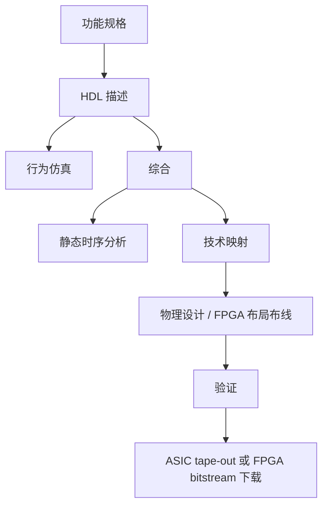
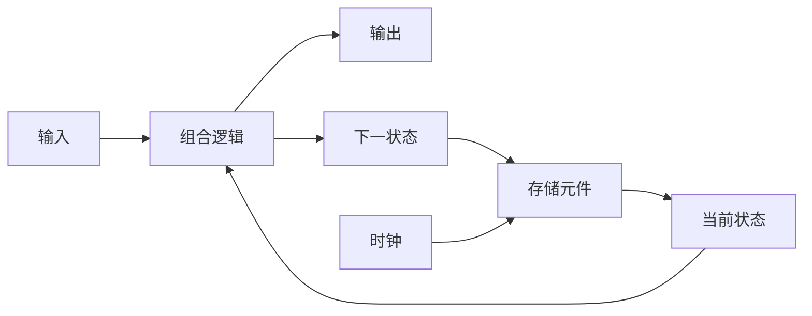
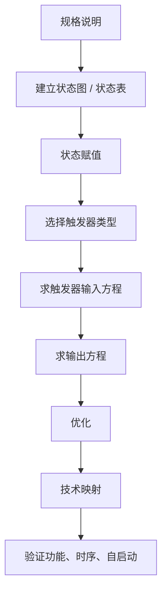
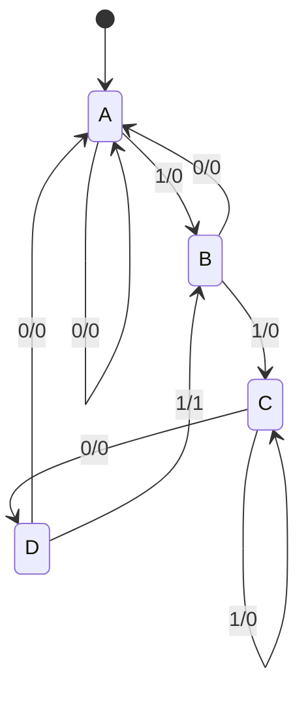
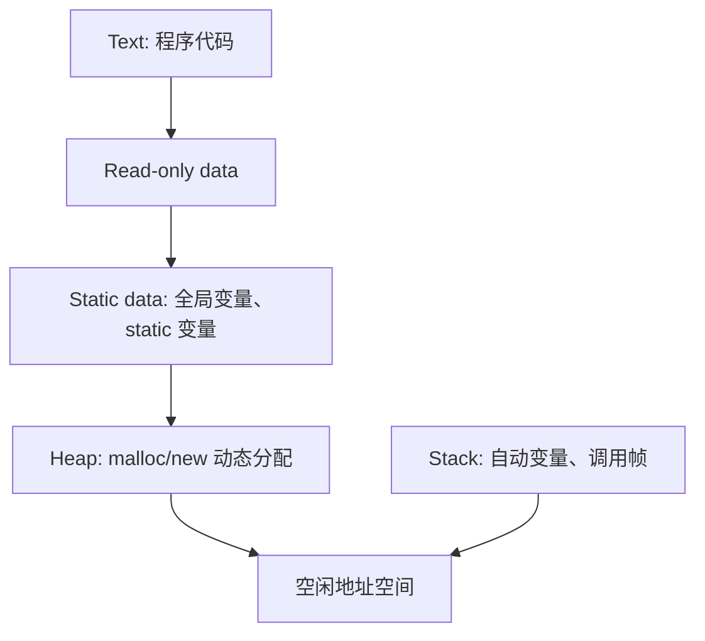

# 计算机系统基础讲义

计算机系统最迷人的地方，是同一个程序既可以被看成一行高级语言，也可以一路向下拆成指令、寄存器、逻辑门和电信号。这篇笔记试着把这些层次重新接回一条连续的链路。

## 这篇笔记写什么 { #note-sec-001 }

这篇笔记从信息表示出发，依次走过布尔代数、组合逻辑、运算部件、时序逻辑、ISA 与 RISC-V，关注的不是单个知识点，而是软件行为怎样逐层落到硬件实现上。

阅读时可以把握三条线索：

1. 数据怎样被编码，程序为什么最终都要落到二进制表示。
2. 逻辑电路怎样逐步组合成能够执行运算和保存状态的部件。
3. 指令集怎样把硬件能力暴露给软件，再通过汇编、链接和装载变成真正运行的程序。

先带着几个问题往下看，会更容易把章节接起来：

- 为什么同一个“数”在不同编码方式下会表现出不同性质？
- 组合逻辑和时序逻辑的分界到底在哪里？
- ISA 为什么既属于软件视角，也属于硬件视角？
- 一段高级语言程序，怎样一步步变成机器真正执行的动作？

## 0. 课程视角：从门电路到系统软件 { #note-sec-002 }

计算机系统可以看成一组层次化抽象。越往下越接近物理实现，越往上越接近程序员和用户看到的行为。系统课程的核心价值，是把这些层次之间的接口讲清楚。

### 0.1 抽象层次 { #note-sec-003 }

典型计算机系统从上到下可以分为：

| 层次 | 主要内容 | 本讲义中的对应章节 |
|---|---|---|
| 应用程序 | 用户可见的软件功能 | 作为背景 |
| 编译器、库、运行时 | 把高级语言程序翻译成机器可执行形式 | 7.6、7.7 |
| 操作系统 | 进程、内存、文件、设备、中断、系统调用 | 与后续系统课程衔接 |
| ISA | 软件和硬件之间的契约，定义指令、寄存器、地址空间、异常等 | 6、7 |
| 微体系结构 | CPU 如何实现 ISA，如单周期、流水线、乱序等 | 本课程略作铺垫 |
| RTL | 寄存器传输级：寄存器、总线、ALU、控制信号 | 4、5 |
| 数字逻辑电路 | 门电路、组合逻辑、时序逻辑 | 2、3、5 |
| 器件技术 | 晶体管、电压、电容、延迟、功耗 | 2.3 |

### 0.2 本课程主线 { #note-sec-004 }

本课程不是单独学习“逻辑门”或“汇编语言”，而是建立一条连贯链路：


理解这条链路后，许多系统问题会变得自然：为什么整数会溢出，为什么浮点加法不满足结合律，为什么 RISC-V 指令字段要固定位置，为什么函数调用要保存寄存器，为什么链接器要重定位符号。

---

## 1. 信息表示 { #note-sec-005 }

### 1.1 信息、信号与二值抽象 { #note-sec-006 }

计算机内部无法直接处理“文字、图像、声音、视频、结构化对象”这些高级信息。它们必须被编码成二进制数据，再由硬件按照 0 和 1 的规则处理。

数字系统中使用二值信号，是因为它把连续物理世界压缩成离散判断：

- 电压可以表示 0/1，例如低电压表示 0，高电压表示 1。
- 磁场方向、光盘坑面反射、DRAM 电荷量等也可以表示 0/1。
- 只要输入电压落在合法低电平或高电平范围内，逻辑电路就能忽略一定程度的噪声。

信号按时间和值域可以粗略分为：

| 信号类型 | 值域 | 时间 | 例子 |
|---|---|---|---|
| 模拟信号 | 连续 | 连续 | 音频电压波形 |
| 异步数字信号 | 离散 | 连续 | 未统一采样的开关信号 |
| 同步数字信号 | 离散 | 离散 | 时钟边沿采样的寄存器输入 |

### 1.2 外部信息与内部数据 { #note-sec-007 }

从用户和高级程序员角度看，信息可以是文本、图像、声音、视频、图、树、链表、队列等；从机器内部看，基本数据主要分成：

- 数值数据：无符号整数、有符号整数、定点数、浮点数。
- 非数值数据：逻辑值、字符、字符串、媒体编码、结构化数据的地址关系。

课程中的关键思想是：**同一串比特没有天然含义，含义来自解释方式**。例如 `11111111` 可以是无符号数 255，也可以是补码整数 -1，也可以是字符、颜色分量或机器指令的一部分。

### 1.3 进位计数制 { #note-sec-008 }

任意正基数 `r` 的位置计数制可以写成：

```text
(A_{n-1} A_{n-2} ... A_1 A_0 . A_{-1} A_{-2} ... A_{-m})_r
```

其数值为：

```text
Σ A_i × r^i
```

其中每一位数字满足 `0 <= A_i < r`。

常见进制：

| 名称 | 基数 | 数字集合 |
|---|---:|---|
| 二进制 | 2 | 0, 1 |
| 八进制 | 8 | 0 至 7 |
| 十进制 | 10 | 0 至 9 |
| 十六进制 | 16 | 0 至 9, A 至 F |

例子：

```text
(100101.01)_2
= 1×2^5 + 0×2^4 + 0×2^3 + 1×2^2 + 0×2^1 + 1×2^0 + 0×2^-1 + 1×2^-2
= (37.25)_10
```

```text
(3A.C)_16
= 3×16^1 + 10×16^0 + 12×16^-1
= (58.75)_10
```

### 1.4 十进制到其他进制 { #note-sec-009 }

整数部分使用“反复除基取余”：

1. 用目标基数反复除整数部分。
2. 每次保存余数。
3. 余数倒序排列就是目标进制的整数部分。

例：`135_10` 转二进制：

```text
135 / 2 = 67 ... 1
67  / 2 = 33 ... 1
33  / 2 = 16 ... 1
16  / 2 = 8  ... 0
8   / 2 = 4  ... 0
4   / 2 = 2  ... 0
2   / 2 = 1  ... 0
1   / 2 = 0  ... 1

135_10 = 10000111_2
```

小数部分使用“反复乘基取整”：

1. 用目标基数反复乘小数部分。
2. 每次保存整数位。
3. 保存顺序就是目标进制的小数部分。

例：`0.6875_10` 转二进制：

```text
0.6875 × 2 = 1.375  -> 1
0.375  × 2 = 0.75   -> 0
0.75   × 2 = 1.5    -> 1
0.5    × 2 = 1.0    -> 1

0.6875_10 = 0.1011_2
135.6875_10 = 10000111.1011_2
```

注意：很多十进制小数无法被有限二进制小数精确表示。例如 `0.65_10` 会产生循环二进制小数；因此机器必须截断或舍入。

### 1.5 二进制、八进制、十六进制互转 { #note-sec-010 }

因为 `8 = 2^3`，`16 = 2^4`，所以：

- 二进制转八进制：从小数点向左右每 3 位分组，不足补 0。
- 二进制转十六进制：从小数点向左右每 4 位分组，不足补 0。
- 八进制或十六进制转二进制：每一位直接展开成 3 位或 4 位二进制。

例：

```text
(2B.5E)_16 = 0010 1011 . 0101 1110_2
(1001101.01101)_2 = 0100 1101 . 0110 1000_2 = (4D.68)_16
```

### 1.6 2 的幂与容量单位 { #note-sec-011 }

计算机容量常用 2 的幂：

| 名称 | 二进制意义 | 数值 |
|---|---:|---:|
| K | `2^10` | 1024 |
| M | `2^20` | 1,048,576 |
| G | `2^30` | 1,073,741,824 |
| T | `2^40` | 1,099,511,627,776 |

注意区分：

- 内存容量常按 `KiB = 2^10 bytes` 的传统语义使用。
- 网络速率常按十进制使用，例如 `1 Mb/s = 10^6 bit/s`。

### 1.7 定点整数表示 { #note-sec-012 }

机器数是计算机内部编码，真值是该编码所表示的数学值。对于 `n` 位无符号整数：

```text
0 <= X <= 2^n - 1
```

有符号整数常见表示方式包括：

| 表示法 | 思想 | 0 的表示 | 运算便利性 |
|---|---|---|---|
| 原码 sign-magnitude | 最高位表示符号，其余位表示绝对值 | +0 和 -0 两种 | 加减复杂 |
| 反码 one's complement | 负数为正数逐位取反 | +0 和 -0 两种 | 比原码好，但仍有双零 |
| 补码 two's complement | 负数为反码加 1 | 只有一个 0 | 最适合硬件加减 |
| 移码 biased notation | 真值加偏置后编码 | 常用于浮点指数 | 便于比较指数 |

补码是现代计算机整数的核心表示。`n` 位补码范围为：

```text
-2^(n-1) <= X <= 2^(n-1)-1
```

例如 32 位补码范围是：

```text
-2,147,483,648 到 2,147,483,647
```

### 1.8 补码求负与符号扩展 { #note-sec-013 }

补码求负的基本公式：

```text
-x = ~x + 1
```

另一种手算方法：

1. 从最低位开始复制所有连续的 0。
2. 复制遇到的第一个 1。
3. 更高位全部取反。

符号扩展用于把较短的有符号数放入较长寄存器：

```text
8 位 +2: 0000 0010
32 位:  0000 0000 0000 0000 0000 0000 0000 0010

8 位 -2: 1111 1110
32 位:  1111 1111 1111 1111 1111 1111 1111 1110
```

扩展和截断规则：

| 操作 | 无符号数 | 有符号补码 |
|---|---|---|
| 扩展 | 高位补 0 | 符号扩展 |
| 截断 | 丢弃高位，相当于模 `2^k` | 丢弃高位后重新解释，可能改变符号和值 |

### 1.9 浮点数表示 { #note-sec-014 }

浮点数用于表示很大、很小或带小数的数。IEEE 754 浮点数的数学形式：

```text
(-1)^s × M × 2^E
```

其中：

- `s` 是符号位。
- `M` 是尾数或有效数，规格化时通常满足 `1.0 <= M < 2.0`。
- `E` 是指数，通常使用移码表示。

单精度和双精度：

| 类型 | 总位数 | 符号位 | 指数位 | fraction 位 | 指数偏置 | 约十进制精度 |
|---|---:|---:|---:|---:|---:|---:|
| float | 32 | 1 | 8 | 23 | 127 | 约 7 位 |
| double | 64 | 1 | 11 | 52 | 1023 | 约 16 位 |

例：表示 `-0.75`：

```text
-0.75 = (-1)^1 × 1.1_2 × 2^-1
s = 1
frac = 1000...
single exponent = -1 + 127 = 126 = 01111110_2
```

### 1.10 IEEE 754 特殊值 { #note-sec-015 }

指数全 0 和全 1 被保留作特殊用途：

| exp | frac | 含义 |
|---|---|---|
| 全 0 | 全 0 | `+0` 或 `-0` |
| 全 0 | 非 0 | 非规格化数，允许逐渐下溢 |
| 非全 0/1 | 任意 | 规格化数 |
| 全 1 | 全 0 | `+∞` 或 `-∞` |
| 全 1 | 非 0 | NaN，表示非法或未定义结果 |

非规格化数的隐藏位是 0，而规格化数的隐藏位是 1。它牺牲精度换取更平滑的接近 0 的范围。

### 1.11 舍入与浮点运算陷阱 { #note-sec-016 }

IEEE 754 的基本思想是：先计算精确结果，再舍入到目标精度。常见舍入模式：

| 模式 | 含义 |
|---|---|
| toward zero | 向 0 截断 |
| round down | 向 `-∞` 舍入 |
| round up | 向 `+∞` 舍入 |
| nearest even | 最接近，正好居中时选最低有效位为偶数的结果 |

默认通常是 round-to-nearest-even，因为它在统计上较少产生系统偏差。

浮点运算不等同于实数运算。例如加法可能不满足结合律：

```text
x = -1.5 × 10^38
y =  1.5 × 10^38
z =  1.0

x + (y + z) = 0.0
(x + y) + z = 1.0
```

原因是 `y + z` 中的 `z` 相对 `y` 太小，可能在对阶和舍入中丢失。

### 1.12 BCD、Gray Code 与 Excess-3 { #note-sec-017 }

十进制数字也可以被二进制编码。常见编码：

| 编码 | 特点 |
|---|---|
| 8421 BCD | 每个十进制数字用 4 位表示，权值为 8、4、2、1 |
| Excess-3 | 在 BCD 值基础上加 3 |
| Gray Code | 相邻编码通常只改变 1 位，可降低转换时的毛刺风险 |

BCD 常用于需要精确十进制显示或金额处理的场景。它比纯二进制整数浪费空间，但更贴近十进制语义。

### 1.13 字符与非数值数据 { #note-sec-018 }

ASCII 使用 7 位编码，包含：

- 10 个数字字符。
- 26 个大写字母。
- 26 个小写字母。
- 特殊可打印字符。
- 控制字符，如回车、退格等。

ASCII 的几个性质：

- 字符 `'0'` 至 `'9'` 编码为 `0x30` 至 `0x39`。
- `'A'` 至 `'Z'` 编码为 `0x41` 至 `0x5A`。
- `'a'` 至 `'z'` 编码为 `0x61` 至 `0x7A`。
- 大小写转换可以通过翻转特定位实现。

Unicode 扩展了字符编码范围，用于表示世界各语言文字。中文信息系统中还会涉及输入码、内码、字形码等层次。

### 1.14 数据宽度、字长与大小端 { #note-sec-019 }

基本单位：

- bit：二进制位。
- byte：8 bit。
- word：机器自然处理的整数或地址大小，常见为 32 位或 64 位。

多字节数据在内存中的排列方式：

| 方式 | 低地址存放 | 高地址存放 | 例子 |
|---|---|---|---|
| Big Endian | 高字节 | 低字节 | 网络字节序、部分 PowerPC |
| Little Endian | 低字节 | 高字节 | x86、RISC-V |

例如 32 位数据 `0x01234567` 从地址 `0x100` 开始存放：

```text
Big Endian:
0x100: 01
0x101: 23
0x102: 45
0x103: 67

Little Endian:
0x100: 67
0x101: 45
0x102: 23
0x103: 01
```

---

## 2. 布尔代数与数字逻辑基础 { #note-sec-020 }

### 2.1 为什么使用数字逻辑 { #note-sec-021 }

数字系统有意限制设计选择：把连续物理量划分为离散的 0 和 1。这种“数字纪律”带来几个好处：

- 抗噪声能力更强。
- 设计、组合、验证更简单。
- 可以构建大规模复杂系统。
- 适合使用自动化设计工具和标准单元库。

### 2.2 逻辑变量与基本逻辑运算 { #note-sec-022 }

二值变量可用多种语义解释：

```text
1 / 0
True / False
On / Off
High / Low
Yes / No
```

三种基本逻辑运算：

| 运算 | 常用符号 | 含义 |
|---|---|---|
| AND | `·` 或省略 | 全为 1 时输出 1 |
| OR | `+` | 至少一个为 1 时输出 1 |
| NOT | 上划线、`'`、`~` | 取反 |

常见门包括 NOT、Buffer、AND、OR、NAND、NOR、XOR、XNOR。NAND 和 NOR 是功能完备门，只用其中一种就能实现任意布尔函数。

### 2.3 晶体管与逻辑门 { #note-sec-023 }

早期计算机使用继电器和真空管作为开关，现代数字电路主要使用晶体管。CMOS 电路由 NMOS 和 PMOS 晶体管组合而成，常用于实现 NAND、NOR、反相器等逻辑门。

数字电路不是理想数学对象，它受到物理参数影响：

| 参数 | 含义 |
|---|---|
| `VCC` / `VDD` | 电源电压 |
| `VIH` | 输入被识别为高电平的最低电压 |
| `VIL` | 输入被识别为低电平的最高电压 |
| `VOH` | 输出高电平保证值 |
| `VOL` | 输出低电平保证值 |
| 噪声容限 | 高/低电平能承受的噪声范围 |
| 传播延迟 | 输入变化到输出稳定变化的时间 |
| 转换时间 | 输出从低到高或高到低所需时间 |
| 功耗 | 静态功耗和动态功耗 |
| 扇入 | 一个门可接受的输入数量 |
| 扇出 | 一个输出可驱动的输入负载数量 |

噪声容限：

```text
NMH = VOH - VIH
NML = VIL - VOL
```

传播延迟可分为：

- `tPLH`：输出从低到高的延迟。
- `tPHL`：输出从高到低的延迟。
- `tpd = max(tPLH, tPHL)`。

延迟模型：

| 模型 | 含义 |
|---|---|
| Transport delay | 输入变化经过固定延迟后体现在输出 |
| Inertial delay | 太窄的脉冲会被电路“过滤”掉，更接近真实电路 |

动态功耗通常与开关活动、电容、电压和频率相关。CMOS 静态功耗低，但随着工艺缩小，泄漏功耗也变得重要。

### 2.4 布尔代数基本律 { #note-sec-024 }

常用恒等式：

| 名称 | 表达式 |
|---|---|
| 恒等律 | `X + 0 = X`，`X·1 = X` |
| 零一律 | `X + 1 = 1`，`X·0 = 0` |
| 幂等律 | `X + X = X`，`X·X = X` |
| 互补律 | `X + X' = 1`，`X·X' = 0` |
| 双重否定 | `(X')' = X` |
| 交换律 | `X + Y = Y + X`，`XY = YX` |
| 结合律 | `(X+Y)+Z = X+(Y+Z)`，`(XY)Z = X(YZ)` |
| 分配律 | `X(Y+Z)=XY+XZ`，`X+YZ=(X+Y)(X+Z)` |
| 吸收律 | `X + XY = X`，`X(X+Y)=X` |
| 合并律 | `XY + XY' = X` |
| 共识定理 | `AB + A'C + BC = AB + A'C` |
| De Morgan | `(XY)' = X' + Y'`，`(X+Y)' = X'Y'` |

运算优先级：

```text
括号 > NOT > AND > OR
```

### 2.5 对偶性 { #note-sec-025 }

对偶表达式通过交换 `+` 与 `·`、交换 `0` 与 `1` 得到。如果一个布尔代数公式成立，则它的对偶公式也成立。对偶性可以减少证明工作。

例：

```text
X + XY = X
```

其对偶为：

```text
X(X + Y) = X
```

### 2.6 逻辑函数表示 { #note-sec-026 }

逻辑函数描述输入变量与输出变量之间的关系。常见表示：

| 表示 | 特点 |
|---|---|
| 真值表 | 唯一、直观，但变量多时指数级增长 |
| 波形图 | 适合描述随时间变化的输入输出 |
| 布尔表达式 | 不唯一，适合代数变换 |
| 电路图 | 对应实际实现 |
| HDL | 适合仿真、综合和工程实现 |

如果两个函数的真值表完全相同，则两个函数等价。

### 2.7 最小项、最大项与标准形式 { #note-sec-027 }

定义：

- Literal：变量或变量的反。
- Product term：若干 literal 通过 AND 连接。
- Sum term：若干 literal 通过 OR 连接。
- Minterm：包含所有变量且每个变量出现一次的乘积项。
- Maxterm：包含所有变量且每个变量出现一次的和项。

最小项 `m_j` 对应真值表中编号为 `j` 的一行，且只在该行取 1。最大项 `M_j` 对应真值表中编号为 `j` 的一行，且只在该行取 0。

规范形式：

```text
F = Σm(函数取 1 的行号)
F = ΠM(函数取 0 的行号)
```

规范形式在变量顺序固定时唯一。标准 SOP/POS 形式不要求每个项都包含所有变量，因此不唯一。

### 2.8 化简目标与代价 { #note-sec-028 }

电路优化目标是以更低成本实现同一逻辑函数。常见代价：

| 代价 | 含义 |
|---|---|
| Literal cost `L` | 表达式中 literal 出现次数 |
| Gate input cost `G` | 门输入数量，不计反相器 |
| Gate input cost with NOTs `GN` | 门输入数量，计入反相器 |

更少的门输入通常意味着更小面积、更低功耗、更短延迟，但实际工程还要考虑扇入、扇出、布线、标准单元库和时序约束。

### 2.9 Karnaugh Map { #note-sec-029 }

K-map 是小变量数布尔函数的图形化化简工具。每个格子对应一个最小项，相邻格子只相差一个变量。

K-map 化简规则：

1. 每个函数值为 1 的格子必须至少被圈一次。
2. 每个圈的格子数必须是 2 的幂。
3. 圈应尽可能大。
4. 圈可以跨越边界，因为 K-map 边界相邻。
5. `don't care` 只在有助于化简时圈入。
6. 最后选择尽量少、尽量大的 prime implicants。

术语：

| 名称 | 含义 |
|---|---|
| Implicant | 能覆盖某些 1 的乘积项 |
| Prime implicant | 不能再扩大的 implicant |
| Essential prime implicant | 覆盖了某些只被它覆盖的 1 |

化简结果可能不唯一。不同结果可能逻辑等价，但成本、延迟、布局效果不同。

### 2.10 Bubble Pushing 与多级优化 { #note-sec-030 }

Bubble pushing 使用 De Morgan 定理在电路图上移动反相气泡：

- 门体类型在 AND 与 OR 之间转换。
- 输入或输出端添加/取消反相气泡。
- 相邻气泡相遇时可以抵消。

它常用于把电路转换成更适合 NAND/NOR 标准单元库的形式。

多级优化不同于两级 SOP/POS。通过提取公共因子、共享中间信号，可以降低门输入成本。例如：

```text
AB + AC = A(B + C)
```

多级电路通常面积更小，但延迟分析和毛刺分析更复杂。

### 2.11 XOR、奇偶校验与三态逻辑 { #note-sec-031 }

XOR 表示“不同为 1”：

```text
X ⊕ Y = X'Y + XY'
```

性质：

```text
X ⊕ 0 = X
X ⊕ 1 = X'
X ⊕ X = 0
X ⊕ X' = 1
```

XOR 常用于：

- 加法器。
- 减法器。
- 乘法器。
- 计数器。
- 奇偶校验生成与检查。

奇偶校验通过添加一位 parity bit，让整个码字中 1 的个数为奇数或偶数。它能检测单比特错误，但不能纠正错误，也不能可靠检测所有多比特错误。

三态输出除了 0 和 1，还有 `Hi-Z` 高阻态。高阻态相当于输出断开，常用于多设备共享总线。三态缓冲器：

| EN | IN | OUT |
|---|---|---|
| 0 | X | Hi-Z |
| 1 | 0 | 0 |
| 1 | 1 | 1 |

传输门也是一种电子开关，可在控制信号作用下连接或断开两个节点。

---

## 3. 组合逻辑设计与 Verilog HDL { #note-sec-032 }

### 3.1 HDL 设计流 { #note-sec-033 }

HDL 是硬件描述语言，用形式化方法描述数字电路与逻辑系统。Verilog 是常用 HDL 之一。

!!! note "图像资源待补充：ASIC 与 FPGA 设计流"
    原始讲义引用了 `./sys_notes_assets/hdl_design_flow.png`，但当前 `note/` 目录没有随附图片资源。后续补充图片后可恢复为 Markdown 图片。


典型流程：



ASIC 和 FPGA 区别：

| 维度 | ASIC | FPGA |
|---|---|---|
| 性能/功耗 | 通常更优 | 通常较弱 |
| 开发成本 | 高 | 低 |
| 修改成本 | 极高 | 可重新配置 |
| 设计周期 | 长 | 短 |
| 适用场景 | 大批量、固定功能 | 教学、原型、低中批量、可重构加速 |

### 3.2 Verilog 基础 { #note-sec-034 }

Verilog 区分大小写，关键字小写。空白通常无意义，但字符串和 token 分隔例外。注释：

```verilog
// single line comment
/* multi-line comment */
```

基本模块：

```verilog
module top(
    input  a,
    input  b,
    output c
);
    assign c = a & b;
endmodule
```

测试平台示意：

```verilog
module sim_top();
    reg a_in, b_in;
    wire c_out;

    top dut(
        .a(a_in),
        .b(b_in),
        .c(c_out)
    );

    initial begin
        a_in = 1'b0; b_in = 1'b0;
        #2 a_in = 1'b1;
        #2 b_in = 1'b1;
    end
endmodule
```

### 3.3 Verilog 数字与数据类型 { #note-sec-035 }

定宽数字语法：

```text
<size>'<base><number>
```

例子：

```verilog
4'b1111
12'habc
16'd255
12'b1111_0000_1010
```

基数：

| 符号 | 基数 |
|---|---|
| `b` | 二进制 |
| `o` | 八进制 |
| `d` | 十进制 |
| `h` | 十六进制 |

特殊值：

- `x`：未知。
- `z`：高阻。
- `?`：在数字中通常等价于 `z`，常用于 casez/casex 或 don't care 表达。

负数要把符号写在 size 前：

```verilog
-6'd3     // 合法
4'd-2     // 不合法
```

常用数据类型：

| 类型 | 含义 |
|---|---|
| `wire` | 连线，通常由连续赋值或模块输出驱动 |
| `reg` | 过程赋值变量，不一定综合为寄存器 |
| vector | 多位信号，如 `wire [7:0] a` |
| array | 数组，如 `reg [15:0] mem [1023:0]` |
| parameter | 模块内常量参数 |

端口习惯：

- input 默认是 wire。
- output 可定义为 wire 或 reg，取决于赋值方式。
- 实例化连接时，模块输出一般接 wire。

### 3.4 运算符与建模方式 { #note-sec-036 }

常见运算符：

| 类别 | 运算符 |
|---|---|
| 一元 | `+ -` |
| 位运算 | `~ & | ^ ^~` |
| 算术 | `+ - * / %` |
| 归约 | `& ~& | ~| ^ ^~` |
| 逻辑 | `&& || !` |
| 等价 | `== !=` |
| 关系 | `< <= > >=` |

建模方式：

| 方式 | 特点 |
|---|---|
| 结构化建模 | 实例化模块、门级连接，接近电路图 |
| 数据流建模 | 使用 `assign` 描述组合逻辑 |
| 行为建模 | 使用 `always`、`case`、`if` 等过程语句 |

组合逻辑行为建模常用：

```verilog
always @(*) begin
    case (sel)
        2'b00: y = a;
        2'b01: y = b;
        2'b10: y = c;
        default: y = d;
    endcase
end
```

组合逻辑中要避免遗漏赋值，否则综合器可能推断锁存器。

### 3.5 组合逻辑电路定义 { #note-sec-037 }

组合逻辑电路有：

- `m` 个布尔输入。
- `n` 个布尔输出。
- `n` 个开关函数，每个函数把当前输入组合映射到当前输出。

核心性质：**输出只依赖当前输入，不依赖历史状态**。

与时序逻辑对比：

| 类型 | 是否有存储 | 输出依赖 |
|---|---|---|
| 组合逻辑 | 无 | 当前输入 |
| 时序逻辑 | 有 | 当前输入和过去状态 |

组合逻辑要求：

- 每个元件本身是组合逻辑。
- 一个节点只能被一个元件输出驱动。
- 不允许形成反馈环路。

### 3.6 组合逻辑设计流程 { #note-sec-038 }


设计步骤：

1. 规格说明：明确输入、输出、编码方式和约束。
2. 形式化：列真值表或初始布尔方程。
3. 优化：降低 literal cost、gate input cost 或关键路径延迟。
4. 技术映射：映射到目标门库、NAND/NOR、MUX、FPGA LUT 等。
5. 验证：功能仿真、等价检查、时序分析。

### 3.7 例：三开关控制单灯 { #note-sec-039 }

需求：房间只有一盏灯，由三个开关控制，每个开关单独拨动都能改变灯的亮灭。

这实际是奇偶函数。若开关闭合记为 1，灯亮记为 1，则灯亮当且仅当闭合开关数为奇数：

```text
F = S1 ⊕ S2 ⊕ S3
```

SOP 写法：

```text
F = S3'S2'S1 + S3'S2S1' + S3S2'S1' + S3S2S1
```

Verilog：

```verilog
module lamp_control(
    input s1,
    input s2,
    input s3,
    output F
);
    assign F = s1 ^ s2 ^ s3;
endmodule
```

如果只按最小项写 `assign`，结果正确但不如 XOR 表达简洁。

### 3.8 常用组合功能块 { #note-sec-040 }

#### 3.8.1 基本功能 { #note-sec-041 }

| 功能 | 方程 | 含义 |
|---|---|---|
| 固定 0 | `F = 0` | 输出常 0 |
| 固定 1 | `F = 1` | 输出常 1 |
| 传送 | `F = X` | 直接传递 |
| 反相 | `F = X'` | 取反 |
| 使能传递 | `F = X·EN` 或 `F = X + EN` | 控制通过或阻断 |

多位总线可以看成一组并行 bit。宽线表示 vector signal，必要时可拆分为单 bit 或子字段。

#### 3.8.2 Decoder { #note-sec-042 }

Decoder 把 `n` 位输入码转换为最多 `2^n` 个输出，其中每个有效输入激活唯一输出。典型 3-to-8 decoder：

```text
000 -> 00000001
001 -> 00000010
...
111 -> 10000000
```

Decoder 可用于生成最小项，因此可与 OR 门一起实现任意 SOP 函数：

```text
F(X,Y,Z) = Σm(1,2,4,7)
```

实现方式：3-to-8 decoder 输出 `m0` 到 `m7`，把 `m1、m2、m4、m7` 接入 OR。

#### 3.8.3 七段数码管译码器 { #note-sec-043 }

BCD-to-seven-segment decoder 把 4 位 BCD 输入转换为 `a` 到 `g` 七段控制信号。

| 类型 | 公共端 | 点亮条件 |
|---|---|---|
| 共阳极 | 阳极接 1 | 段信号为 0 点亮，active low |
| 共阴极 | 阴极接 0 | 段信号为 1 点亮，active high |

设计时必须先确认数码管类型，否则输出极性会反。

#### 3.8.4 Encoder 与 Priority Encoder { #note-sec-044 }

Encoder 与 decoder 方向相反，把 one-hot 输入编码成二进制输出。普通 encoder 假设同时只有一个输入为 1。

Priority encoder 允许多个输入同时为 1，并输出最高优先级输入的编号，通常还带一个 valid 位。

#### 3.8.5 Multiplexer { #note-sec-045 }

MUX 从多个输入中选一个输出。`2^n`-to-1 MUX 有 `n` 个选择信号。

2-to-1 MUX：

```text
Y = S' I0 + S I1
```

4-to-1 MUX：

```text
Y = S1'S0'I0 + S1'S0I1 + S1S0'I2 + S1S0I3
```

MUX 也能实现逻辑函数：把函数变量接到选择输入，把真值表每行输出值固定到数据输入。

### 3.9 时序分析、关键路径与毛刺 { #note-sec-046 }

传播延迟：

```text
Tpd = 输入变化到输出稳定变化的最大时间
```

污染延迟：

```text
Tcd = 输入变化到输出可能开始变化的最小时间
```

组合电路最大延迟由关键路径决定：

```text
Tpd_circuit = Σ Tpd(elements on critical path)
```

最短路径影响污染延迟：

```text
Tcd_circuit = Σ Tcd(elements on shortest path)
```

毛刺 glitch 通常由不同路径延迟不一致引起。当单个输入变化通过多条路径到达输出，输出可能短暂错误翻转。

分析组合逻辑的步骤：

1. 从输入开始给每个中间节点写布尔函数。
2. 得到输出函数。
3. 化简或等价变换。
4. 列真值表验证功能。
5. 画时序图，检查延迟、毛刺和关键路径。

---

## 4. 运算部件与 ALU { #note-sec-047 }

### 4.1 迭代组合电路 { #note-sec-048 }

很多算术运算作用于二进制向量，并在每一位重复类似结构。例如加法器、乘法器、除法器都可以看成由多个 cell 组成的迭代阵列。

| 概念 | 含义 |
|---|---|
| Cell | 单个位或局部子功能模块 |
| Iterative array | 多个 cell 按位连接形成整体功能 |
| 1D array | 如串行进位加法器 |
| 2D array | 如阵列乘法器 |

### 4.2 半加器与全加器 { #note-sec-049 }

半加器输入 `A, B`，输出和位 `S` 与进位 `Cout`：

```text
S = A ⊕ B
Cout = A B
```

全加器输入 `A, B, Cin`，输出：

```text
S = A ⊕ B ⊕ Cin
Cout = AB + ACin + BCin
```

也可用 generate/propagate 表示：

```text
Gi = Ai Bi
Pi = Ai ⊕ Bi
Ci+1 = Gi + Pi Ci
Si = Pi ⊕ Ci
```

### 4.3 多位加法器 { #note-sec-050 }

常见 CPA（carry propagate adder）：

| 类型 | 思想 | 优点 | 缺点 |
|---|---|---|---|
| RCA | 进位逐位传播 | 硬件简单 | 慢，延迟随位数线性增长 |
| Carry Skip | 某些块整体传播时跳过 | 比 RCA 快 | 控制和分块复杂 |
| Carry Select | 同时计算 Cin=0/1，最后选择 | 快 | 硬件重复 |
| CLA | 直接推导多位进位 | 快 | 扇入和布线复杂 |
| Prefix Adder | 用前缀树计算进位 | `log N` 级 | 面积和布线开销较大 |

Ripple-carry adder 延迟近似：

```text
t_RCA = N × t_FA
```

Carry lookahead 展开：

```text
C1 = G0 + P0 C0
C2 = G1 + P1 G0 + P1 P0 C0
C3 = G2 + P2 G1 + P2 P1 G0 + P2 P1 P0 C0
C4 = G3 + P3 G2 + P3 P2 G1 + P3 P2 P1 G0 + P3 P2 P1 P0 C0
```

当位数很大时，直接展开会导致门扇入过大，因此使用分组 generate/propagate 或 prefix tree。

Prefix adder 的核心递推：

```text
G_{i:j} = G_{i:k} + P_{i:k} G_{k-1:j}
P_{i:j} = P_{i:k} P_{k-1:j}
```

延迟近似：

```text
t_PA = t_pg + log2(N) × t_prefix + t_XOR
```

### 4.4 减法与溢出 { #note-sec-051 }

无符号减法可通过补码加法实现：

```text
M - N = M + (2^n - N)
```

硬件上：

```text
A - B = A + (~B) + 1
```

4 位加减器可用控制信号 `S`：

- `S=0`：执行 `A + B`。
- `S=1`：执行 `A + ~B + 1`。

Carry 和 overflow 区别：

| 标志 | 用于 | 含义 |
|---|---|---|
| Carry / Borrow | 无符号运算 | 结果超出无符号范围 |
| Overflow | 有符号补码运算 | 结果超出补码范围 |

有符号溢出发生于：

- 两个正数相加得到负数。
- 两个负数相加得到正数。

检测方式：

```text
OF = Cn ⊕ Cn-1
```

其中 `Cn` 是最高位的进位输出，`Cn-1` 是进入符号位的进位。

常见标志：

| 标志 | 含义 |
|---|---|
| ZF | 结果为 0 |
| SF / NF | 结果符号位 |
| CF | 无符号进位或借位 |
| OF | 有符号溢出 |

### 4.5 ALU { #note-sec-052 }

ALU 是处理器数据通路的核心，执行算术和逻辑操作。

!!! note "图像资源待补充：ALU 符号"
    原始讲义引用了 `./sys_notes_assets/alu_symbol.png`，但当前 `note/` 目录没有随附图片资源。后续补充图片后可恢复为 Markdown 图片。


典型 ALU 操作：

| 控制 | 功能 |
|---|---|
| AND | 按位与 |
| OR | 按位或 |
| ADD | 加法 |
| SUB | 减法 |
| SLT | set less than |
| NOT | 取反 |
| SRL/SRA/SLL | 移位 |
| XOR | 按位异或 |

SLT 的基本思路：

```text
if rs < rt then rd = 1 else rd = 0
```

硬件常通过计算 `rs - rt`，再根据符号与溢出判断大小。对于有符号比较，不能只看减法结果符号位，还要结合 overflow。

### 4.6 移位器 { #note-sec-053 }

移位类型：

| 类型 | 右移填充 | 用途 |
|---|---|---|
| 逻辑左移/右移 | 0 | 无符号位操作 |
| 算术右移 | 原符号位 | 有符号除以 2 的幂 |
| 循环移位 | 移出的位绕回 | 加密、校验、位操作 |

关系：

```text
A << N  = A × 2^N
A >>> N ≈ A / 2^N   // 算术右移，适用于补码有符号数的某些场景
```

Barrel shifter 可以在组合逻辑中一次完成多位移位，避免多周期逐位移动。

!!! note "图像资源待补充：4 位 barrel shifter 功能表"
    原始讲义引用了 `./sys_notes_assets/barrel_shifter_table.png`，但当前 `note/` 目录没有随附图片资源。后续补充图片后可恢复为 Markdown 图片。


### 4.7 乘法 { #note-sec-054 }

二进制乘法类似十进制竖式：

1. 根据乘数每一位生成部分积。
2. 部分积按位移位。
3. 将部分积相加。

最直接的 shift-add 算法：

```text
product = 0
for each bit i of multiplier:
    if multiplier[i] == 1:
        product += multiplicand << i
```

硬件实现可以逐步优化：

| 实现 | 特点 |
|---|---|
| 实现 1 | ALU 和寄存器较宽，直接但浪费 |
| 实现 2 | 被乘数固定，乘数右移，部分积右移 |
| 实现 3 | 乘数放在部分积寄存器右半部，减少寄存器 |
| 阵列乘法器 | 并行加部分积，速度快但面积大 |

有符号乘法的简单方法：

1. 记录两个操作数符号。
2. 转成非负数做无符号乘法。
3. 根据符号决定结果正负。

更高效方法：Booth 算法。

### 4.8 Booth 算法 { #note-sec-055 }

Booth 算法利用乘数中连续的 1：

```text
01111000 = 10000000 - 00001000
```

一长串连续 1 可以用一次加和一次减代替多次加。

规则可用当前位和右侧前一位判断：

| 当前位 | 右侧位 | 含义 | 操作 |
|---|---|---|---|
| 0 | 0 | 0 串中间 | 无操作 |
| 0 | 1 | 1 串结束 | 加 |
| 1 | 0 | 1 串开始 | 减 |
| 1 | 1 | 1 串中间 | 无操作 |

Booth 编码也可扩展到每周期处理 2 位：

| 编码效果 | 操作 |
|---|---|
| `-2` | 左移被乘数 1 位后减 |
| `-1` | 减 |
| `0` | 无操作 |
| `+1` | 加 |
| `+2` | 左移被乘数 1 位后加 |

优点是减少部分积数量，缺点是控制逻辑更复杂。

### 4.9 除法 { #note-sec-056 }

无符号除法的硬件思想来自长除法：

1. 比较当前余数与除数。
2. 若余数大于等于除数，则减去除数，商位为 1。
3. 否则商位为 0，并恢复余数。

Restoring division：

```text
R = R - D
if R < 0:
    R = R + D
    Q_i = 0
else:
    Q_i = 1
```

Non-restoring division 避免失败后立即恢复：

- 如果上一步余数为负，下一步用加除数代替减除数。
- 可以达到每位约 1 个周期的吞吐。

有符号除法：

- 商的符号由被除数和除数符号是否相同决定。
- 非零余数的符号应与被除数一致。

### 4.10 浮点加法与乘法 { #note-sec-057 }

浮点加法步骤：

1. 对阶：把较小指数的尾数右移，使指数相同。
2. 尾数相加或相减。
3. 规格化结果。
4. 检查溢出或下溢。
5. 舍入。

例：

```text
0.5 + (-0.4375)
0.5     =  1.000_2 × 2^-1
-0.4375 = -1.110_2 × 2^-2
对阶: -1.110_2 × 2^-2 = -0.111_2 × 2^-1
相加: 1.000_2 - 0.111_2 = 0.001_2
规格化: 0.001_2 × 2^-1 = 1.000_2 × 2^-4
结果: 0.0625
```

浮点乘法步骤：

1. 符号位异或。
2. 指数相加，若使用偏置指数则要减去 bias。
3. 尾数相乘。
4. 规格化。
5. 检查溢出/下溢。
6. 舍入。

浮点硬件通常比整数加法器复杂得多，常采用多周期或流水线实现。

### 4.11 数据通路中的 ALU { #note-sec-058 }

数据通路由寄存器、ALU、移位器、总线/多路选择器组成。控制器产生选择信号和写使能，决定：

- 哪些寄存器作为源操作数。
- ALU 执行哪种操作。
- 结果写回哪个目的寄存器。

寄存器传输级描述常写成：

```text
R3 <- R1 + R2
```

如果有控制条件：

```text
K1: R1 <- R1 + R2
K2: R1 <- R1 - R2
```

---

## 5. 时序逻辑设计 { #note-sec-059 }

### 5.1 时序逻辑模型 { #note-sec-060 }

时序电路由组合逻辑和存储元件组成：



状态转移：

```text
NextState = f(Inputs, PresentState)
```

输出函数：

```text
Mealy: Output = g(Inputs, State)
Moore: Output = h(State)
```

同步时序电路只在时钟边沿附近观察输入并改变状态。异步电路行为取决于输入在连续时间中的变化顺序，分析更困难。

### 5.2 反馈、稳定与存储 { #note-sec-061 }

组合逻辑如果引入反馈，就可能形成存储或振荡：

- 反馈路径保持原输出时，电路可“记住”状态。
- 反馈路径中有反相器时，可能不稳定并振荡。

锁存器和触发器就是受控反馈结构，用来可靠存储状态。

### 5.3 SR Latch、D Latch 与 Flip-Flop { #note-sec-062 }

SR latch 可由交叉耦合 NAND 或 NOR 构成。它有 set、reset、hold 行为，但存在非法输入组合。

D latch 通过把 SR 输入约束为互补，避免非法状态：

```text
Q(t+1) = D    // 当控制 C 有效时
Q(t+1) = Q(t) // 当控制 C 无效时
```

Latch 是电平敏感，可能在时钟有效电平期间多次透传。Flip-flop 是边沿触发，只在时钟边沿采样输入，更适合同步设计。

常见触发器：

| 类型 | 输入 | 行为 |
|---|---|---|
| D FF | D | 边沿到来时 `Q <- D` |
| JK FF | J,K | `00` 保持，`01` reset，`10` set，`11` 翻转 |
| T FF | T | `0` 保持，`1` 翻转 |

### 5.4 触发器时序参数 { #note-sec-063 }

| 参数 | 含义 |
|---|---|
| setup time `ts` | 时钟边沿前输入必须稳定的时间 |
| hold time `th` | 时钟边沿后输入必须继续稳定的时间 |
| clock-to-Q delay `tpd,FF` | 时钟边沿到输出变化的延迟 |
| pulse width `tw` | 时钟脉冲宽度 |

对于从一个触发器到另一个触发器的路径：

```text
Tclk >= tpd,FF + tpd,COMB + ts + tskew
```

课件中使用 slack 写法：

```text
tp = tslack + (tpd,FF + tpd,COMB + ts)
```

要正确工作，所有路径都应满足 `tslack >= 0`。

例：时钟 250 MHz，则周期 `tp = 4 ns`。若 `tpd,FF = 1.0 ns`，边沿触发器 `ts = 0.3 ns`：

```text
tpd,COMB <= 4.0 - 1.0 - 0.3 = 2.7 ns
```

### 5.5 时序电路分析流程 { #note-sec-064 }

给定时序电路，分析步骤：

1. 写出输出方程、触发器输入方程和下一状态方程。
2. 列带状态的真值表：输入为外部输入和当前状态，输出为外部输出和下一状态。
3. 列出电路状态。
4. 画状态图。
5. 分析外部行为。
6. 验证正确性、自启动能力和时序约束。

状态表包含：

| 区域 | 含义 |
|---|---|
| Present State | 当前状态变量 |
| Input | 外部输入组合 |
| Next State | 下一拍状态 |
| Output | 当前输出 |

### 5.6 Moore 与 Mealy { #note-sec-065 }

| 模型 | 输出依赖 | 状态图标注 | 特点 |
|---|---|---|---|
| Moore | 仅状态 | 标在状态内 | 输出稳定，常需要更多状态 |
| Mealy | 状态和输入 | 标在边上 | 状态少，输出可能更快但更易受输入毛刺影响 |

记忆技巧：**Moore is More**，Moore 机通常状态更多。

### 5.7 状态等价与化简 { #note-sec-066 }

两个状态等价，当且仅当对于每个可能输入序列，它们产生完全相同的输出序列。等价状态可以合并，减少状态数和触发器/逻辑成本。

判定思路：

1. 对每个输入符号，输出必须相同。
2. 对每个输入符号，下一状态必须相同或等价。

### 5.8 时序逻辑设计流程 { #note-sec-067 }



状态赋值需要给每个抽象状态分配唯一二进制码。若有 `m` 个状态，最少需要：

```text
n = ceil(log2 m)
```

未使用状态数：

```text
2^n - m
```

状态赋值会影响下一状态方程、输出方程和电路复杂度。经验规则：

- 相同输入下有相同下一状态的当前状态，尽量赋相邻码。
- 同一当前状态在相邻输入下的下一状态，尽量赋相邻码。
- 相同输出的状态，尽量赋相邻码。
- 初始状态或最常用状态可赋 0。

### 5.9 例：序列检测器 1101 { #note-sec-068 }

需求：输入串中每出现一次 `1101`，输出 1，允许重叠。

Mealy 状态含义：

| 状态 | 已识别的最长前缀 |
|---|---|
| A | 无有效前缀 |
| B | `1` |
| C | `11` |
| D | `110` |

状态转移：



`D --1/1--> B` 的原因：识别到 `1101` 后，最后一个 `1` 同时也是下一次匹配的前缀 `1`。

若使用 Moore 机，需要额外状态 E 表示“完整序列已发生且输出 1”。

### 5.10 未使用状态与自启动 { #note-sec-069 }

当状态编码数量大于实际状态数，会出现 unused states。电路上电、复位异常或噪声可能让 FSM 进入未使用状态。

处理策略：

| 策略 | 含义 |
|---|---|
| reset | 上电或错误时强制进入初始状态 |
| self-starting | 所有非法状态最终回到合法状态 |
| error state | 进入非法状态后停在错误状态并报告 |
| don't care 优化 | 面积小，但需验证非法状态行为 |

若非法状态互相循环，机器可能“卡死”。工程中不能只看合法状态图，还要检查完整编码空间。

### 5.11 寄存器与寄存器传输 { #note-sec-070 }

寄存器是一组触发器，用于存储多位二进制值。寄存器常用于处理器中的临时数据保存，比主存更快。

带使能的触发器和寄存器：

!!! note "图像资源待补充：带 EN 的 D 触发器与 4 位寄存器"
    原始讲义引用了 `./sys_notes_assets/register_enable.png`，但当前 `note/` 目录没有随附图片资源。后续补充图片后可恢复为 Markdown 图片。


寄存器传输操作由三部分描述：

1. 系统中的寄存器集合。
2. 对寄存器数据执行的微操作。
3. 控制这些操作发生顺序的控制信号。

常见微操作：

| 类型 | 例子 |
|---|---|
| Transfer | `R2 <- R1` |
| Arithmetic | `R3 <- R1 + R2` |
| Logic | `R3 <- R1 XOR R2` |
| Shift | `R1 <- R1 << 1` |

控制表达式写在左侧：

```text
K1: R1 <- R1 + R2
```

含义：当 `K1 = 1` 时执行该传输。

### 5.12 总线结构 { #note-sec-071 }

寄存器之间传输数据可使用：

| 结构 | 特点 |
|---|---|
| 专用 MUX | 每个寄存器输入有自己的选择器 |
| 单总线 | 多个源通过共享 MUX 或三态驱动连接总线 |
| 三态总线 | 同一时刻只能一个源驱动总线 |
| 多总线 | 支持更多并行传输，硬件更复杂 |

三态总线必须保证不会有多个输出同时驱动，否则会造成总线冲突。

### 5.13 移位寄存器 { #note-sec-072 }

移位寄存器可以把存储位向左或向右移动。基本串行右移寄存器：

```text
In -> [DFF A] -> [DFF B] -> [DFF C] -> Out
```

加入 MUX 后可支持：

- 保持。
- 左移。
- 右移。
- 并行装载。

典型模式表：

| S1 | S0 | 操作 |
|---|---|---|
| 0 | 0 | 保持 |
| 0 | 1 | 右移 |
| 1 | 0 | 左移 |
| 1 | 1 | 并行装载 |

### 5.14 计数器 { #note-sec-073 }

计数器按固定状态序列前进。用途包括：

- 时间基准。
- 事件计数。
- 位数/步骤计数。
- 程序计数器 PC。

类型：

| 类型 | 特点 |
|---|---|
| Ripple counter | 低位触发高位，非真正同步，低功耗但延迟逐级累加 |
| Synchronous counter | 所有触发器共用时钟，组合逻辑产生下一状态 |
| Modulo-N counter | 按 N 个状态循环 |
| BCD counter | 十进制 0 到 9 循环 |

Ripple counter 最坏延迟约为：

```text
n × tPHL
```

同步计数器可用 incrementer 生成下一状态，但 carry chain 也可能变成长路径；可用并行 gating 或 lookahead 优化。

设计 modulo-N counter 时应避免“suicide counter”：异步检测终止状态后立即清零可能产生窄脉冲和时序风险。更稳妥方法是在终止状态前一拍同步 load/clear。

---

## 6. 指令集体系结构 ISA { #note-sec-074 }

### 6.1 ISA 是什么 { #note-sec-075 }

ISA 是软件与硬件之间的契约。它定义程序员可见的机器接口，包括：

- 指令集合。
- 寄存器数量、宽度和用途。
- 内存组织与地址空间。
- 数据类型。
- 寻址方式。
- 异常、中断、特权行为。

ISA 与微体系结构不同。同一个 ISA 可以有多个实现，例如不同 x86 处理器共享相似 ISA，但内部流水线、缓存、乱序执行实现不同。

### 6.2 指令的组成 { #note-sec-076 }

一条指令通常包含：

| 部分 | 含义 |
|---|---|
| opcode | 做什么操作 |
| source operands | 从哪里取操作数 |
| result operand | 结果放到哪里 |
| next instruction reference | 下一条指令在哪里，通常隐式为 `PC + instruction_length` |

操作数可能在：

- 主存。
- CPU 寄存器。
- I/O 设备。
- 指令立即数字段中。

### 6.3 指令格式设计因素 { #note-sec-077 }

设计 ISA 时要考虑：

- 指令长度：定长、变长、混合。
- 操作数个数：3、2、1、0 地址。
- 可寻址寄存器数量。
- 内存是按字节还是按字寻址。
- 支持哪些寻址方式。
- opcode 是否预留扩展空间。
- 字段位置是否规则。
- 指令对齐要求。

Hennessy 和 Patterson 的设计原则：

1. Simplicity favors regularity：简单源于规则。
2. Make the common case fast：让常见情况更快。
3. Smaller is faster：更小通常更快。
4. Good design demands good compromises：好设计需要折中。

### 6.4 操作数个数 { #note-sec-078 }

以：

```text
Y = (A - B) / (C + D × E)
```

为例。

三地址指令：

```asm
SUB R1, A, B
MUL R2, D, E
ADD R2, R2, C
DIV R1, R1, R2
```

优点是表达清晰且不破坏原操作数；缺点是指令较长。

二地址指令：

```asm
SUB A, B
MUL D, E
ADD D, C
DIV A, D
```

结果覆盖第一个操作数，可能需要额外 MOV 保存原值。

一地址指令常使用累加器：

```asm
LDA D
MUL E
ADD C
STO R1
LDA A
SUB B
DIV R1
```

零地址指令使用栈：

```asm
PUSH B
PUSH A
SUB
PUSH E
PUSH D
MUL
PUSH C
ADD
DIV
POP Y
```

权衡：

| 更多操作数 | 更少操作数 |
|---|---|
| 指令数少，表达灵活 | 指令短，CPU 可能更简单 |
| 指令编码更长 | 程序可能更长 |
| 寄存器需求更明显 | 隐式操作数可能成为瓶颈 |

### 6.5 寻址方式 { #note-sec-079 }

有效地址是实际访问操作数的位置。常见寻址方式：

| 方式 | 示例 | 含义 |
|---|---|---|
| Immediate | `ADD #5` | 操作数就是常数 5 |
| Direct | `ADD 100` | 访问内存地址 100 的内容 |
| Indirect | `ADD [100]` | 地址 100 中存着真正地址 |
| Register direct | `ADD R5` | 操作数在寄存器 R5 |
| Register indirect | `ADD [R3]` | R3 中存着内存地址 |
| Relative | `PC + offset` | 常用于分支 |
| Indexed | `base + index` | 常用于数组 |
| Based | `base register + displacement` | 常用于结构体、栈帧 |

寻址方式越丰富，编程越方便，但解码和执行硬件越复杂。

### 6.6 操作类型 { #note-sec-080 }

典型 ISA 操作几十年来变化不大：

- 数据移动：load、store、move、push、pop、I/O。
- 算术：add、sub、mul、div。
- 逻辑：and、or、xor、not、set、clear。
- 移位：shift、rotate。
- 控制流：jump、branch、call、return。
- 系统：halt、interrupt、mode switch。
- 字符串或向量操作。

### 6.7 编码方式：定长、变长、混合 { #note-sec-081 }

| 编码 | 优点 | 缺点 |
|---|---|---|
| 定长 | 解码简单、便于流水线 | 代码密度较低 |
| 变长 | 代码密度高 | 解码复杂 |
| 混合 | 兼顾性能和密度 | 设计复杂 |

嵌入式 ISA 常引入 16 位压缩指令模式，以改善代码密度。

### 6.8 CISC 与 RISC { #note-sec-082 }

CISC 动机：

- 缩小高级语言与机器指令之间的语义差距。
- 降低代码大小。
- 在内存昂贵的时代减少程序体积。
- 常用微码实现复杂指令。

RISC 动机：

- 实际常用指令较少。
- 复杂指令会拖慢整体解码和实现。
- 简化指令格式和寻址方式，方便流水线。
- 把更多优化责任交给编译器。

典型对比：

| CISC | RISC |
|---|---|
| 变长指令 | 固定长度指令 |
| 指令和寻址方式多 | 指令和寻址方式少 |
| 解码复杂 | 解码简单 |
| 支持内存到内存操作 | load/store 架构 |
| 常用微码 | 通常硬连线控制 |
| 代码密度较好 | 易流水线、易超标量 |

现实中 CISC/RISC 不是绝对二分。现代 x86 外部是 CISC ISA，内部常把复杂指令解码为类似 RISC 的 micro-ops。

### 6.9 ISA 分类 { #note-sec-083 }

按操作数位置分类：

| 类型 | 示例 | 特点 |
|---|---|---|
| Accumulator | `add A`，`acc <- acc + mem[A]` | 硬件简单，累加器瓶颈明显 |
| Stack | `add`，操作栈顶 | 指令短，难并行优化 |
| Memory-Memory | `add A,B,C` | 指令数少，内存流量大 |
| Register-Memory | `add R1,A` | 代码密度好，操作数不对称 |
| Load-Store | `add R1,R2,R3` | 算术只用寄存器，访存只用 load/store |

现代新 ISA 几乎都采用 load-store，因为：

- 寄存器比内存快。
- 固定长度编码简单。
- 指令周期更一致。
- 易流水线和超标量。
- 寄存器字段比内存地址字段短。

缺点是：

- 指令条数可能更多。
- 编译器必须更好地分配寄存器。
- 函数调用和上下文切换要保存/恢复寄存器。

---

## 7. RISC-V ISA、汇编与程序运行 { #note-sec-084 }

### 7.1 RISC-V 概览 { #note-sec-085 }

RISC-V 是开放的 RISC 指令集标准，起源于 UC Berkeley。目标是：

- 完全开放，可用于学术界和工业界。
- 适合真实硬件实现，而不只是模拟。
- 不绑定特定微体系结构或实现技术。
- 使用小型基础整数 ISA，加标准扩展和自定义扩展。
- 支持 IEEE 754 浮点扩展。

RISC-V 命名：

```text
RV + word width + extensions
```

例：

| 名称 | 含义 |
|---|---|
| RV32I | 32 位地址/寄存器，基础整数 ISA |
| RV64I | 64 位基础整数 ISA |
| RV32IM | RV32I + 乘除扩展 |
| RV32G | IMAFD 通用组合 |

标准扩展：

| 扩展 | 含义 |
|---|---|
| I | Integer base |
| M | Integer multiply/divide |
| A | Atomic |
| F | Single precision floating point |
| D | Double precision floating point |
| C | Compressed 16-bit instructions |

### 7.2 RISC-V 处理器状态 { #note-sec-086 }

用户级可见状态：

- PC：程序计数器。
- 32 个整数寄存器 `x0` 到 `x31`。
- `x0` 恒为 0。
- `x1` 常作返回地址 `ra`。
- `x2` 常作栈指针 `sp`。
- 32 个浮点寄存器 `f0` 到 `f31`。
- 浮点状态寄存器。

### 7.3 指令格式 { #note-sec-087 }

RISC-V 基础指令通常是 32 位，字段位置尽量固定，便于解码。最低两位为 `11` 表示 32 位基础指令；压缩指令使用其他低位编码。

!!! note "图像资源待补充：RISC-V 核心指令格式"
    原始讲义引用了 `./sys_notes_assets/riscv_formats.png`，但当前 `note/` 目录没有随附图片资源。后续补充图片后可恢复为 Markdown 图片。


核心格式：

| 格式 | 用途 | 主要字段 |
|---|---|---|
| R-type | 寄存器-寄存器 ALU | `funct7 rs2 rs1 funct3 rd opcode` |
| I-type | 立即数 ALU、load、jalr | `imm[11:0] rs1 funct3 rd opcode` |
| S-type | store | `imm[11:5] rs2 rs1 funct3 imm[4:0] opcode` |
| B-type | conditional branch | 分散 immediate + `rs2 rs1 funct3 opcode` |
| U-type | lui、auipc | `imm[31:12] rd opcode` |
| J-type | jal | 分散 immediate + `rd opcode` |

重要设计点：

- `rd`、`rs1`、`rs2` 位置尽量固定。
- 立即数符号位总在 instruction bit 31。
- branch/jump 偏移按 2 字节粒度编码，以兼容压缩指令。

### 7.4 基础整数指令 { #note-sec-088 }

#### R-type ALU { #note-sec-089 }

格式：

```asm
add rd, rs1, rs2
sub rd, rs1, rs2
and rd, rs1, rs2
or  rd, rs1, rs2
xor rd, rs1, rs2
sll rd, rs1, rs2
srl rd, rs1, rs2
sra rd, rs1, rs2
slt rd, rs1, rs2
sltu rd, rs1, rs2
```

例：

```asm
add x9, x20, x21
```

字段：

```text
funct7 = 0000000
rs2    = 10101  // x21
rs1    = 10100  // x20
funct3 = 000
rd     = 01001  // x9
opcode = 0110011
```

机器码：

```text
0000000 10101 10100 000 01001 0110011 = 0x015A04B3
```

#### I-type ALU { #note-sec-090 }

```asm
addi rd, rs1, imm
andi rd, rs1, imm
ori  rd, rs1, imm
xori rd, rs1, imm
slti rd, rs1, imm
sltiu rd, rs1, imm
slli rd, rs1, shamt
srli rd, rs1, shamt
srai rd, rs1, shamt
```

所有立即数会符号扩展。12 位立即数够处理常见小常数；大常数用 `lui` + `addi` 构造。

#### Load/Store { #note-sec-091 }

RISC-V 是 load-store ISA，算术逻辑操作只在寄存器间进行。

```asm
ld rd, offset(rs1)     // rd = MEM[rs1 + offset]
sd rs2, offset(rs1)    // MEM[rs1 + offset] = rs2
```

RV32 常用 `lw/sw`，RV64 可用 `ld/sd`。

例：数组访问：

```c
g = h + A[i];   // A 是 doubleword 数组
```

假设 `g,h,i` 分别在 `x1,x2,x4`，数组基址在 `x3`：

```asm
add x5, x4, x4      # x5 = 2*i
add x5, x5, x5      # x5 = 4*i
add x5, x5, x5      # x5 = 8*i
add x5, x5, x3      # x5 = &A[i]
ld  x6, 0(x5)       # x6 = A[i]
add x1, x2, x6      # g = h + A[i]
```

更自然的写法可用移位：

```asm
slli x5, x4, 3
add  x5, x5, x3
ld   x6, 0(x5)
add  x1, x2, x6
```

### 7.5 控制流 { #note-sec-092 }

#### 条件分支 { #note-sec-093 }

```asm
beq  rs1, rs2, label
bne  rs1, rs2, label
blt  rs1, rs2, label
bge  rs1, rs2, label
bltu rs1, rs2, label
bgeu rs1, rs2, label
```

分支目标：

```text
target = PC + sign_extend(offset << 1)
```

编译 if-else：

```c
if (i == j) f = g + h;
else        f = g - h;
```

假设 `f~j` 对应 `x19~x23`：

```asm
bne x22, x23, ELSE
add x19, x20, x21
beq x0, x0, EXIT
ELSE:
sub x19, x20, x21
EXIT:
```

远距离分支可通过反转条件并插入无条件跳转：

```asm
# 原始
beq x10, x0, L1

# 改写
bne x10, x0, L2
jal x0, L1
L2:
```

#### 循环 { #note-sec-094 }

```c
while (save[i] == k) i = i + 1;
```

假设 `i,k,base(save)` 分别为 `x22,x24,x25`：

```asm
Loop:
    slli x10, x22, 3
    add  x10, x10, x25
    ld   x9, 0(x10)
    bne  x9, x24, Exit
    addi x22, x22, 1
    beq  x0, x0, Loop
Exit:
```

#### Jump { #note-sec-095 }

```asm
jal  rd, label       # rd = PC+4, PC = label
jalr rd, imm(rs1)    # rd = PC+4, PC = rs1 + imm
```

函数调用通常用：

```asm
jal x1, ProcedureLabel
```

函数返回：

```asm
jalr x0, 0(x1)
```

`nop` 可编码为：

```asm
addi x0, x0, 0
```

### 7.6 RISC-V 调用约定 { #note-sec-096 }

函数调用六步：

1. 把参数放到被调函数能访问的位置。
2. 跳转到函数。
3. 分配局部存储，按约定保存必要寄存器。
4. 执行函数主体。
5. 放置返回值，恢复寄存器，释放栈帧。
6. 返回调用点。

常用寄存器约定：

| ABI 名称 | 编号 | 用途 | 调用后是否保持 |
|---|---|---|---|
| zero | x0 | 常数 0 | n/a |
| ra | x1 | 返回地址 | 否；非叶子函数若还要返回原调用者，需保存 |
| sp | x2 | 栈指针 | 是 |
| gp | x3 | 全局指针 | 通常固定 |
| tp | x4 | 线程指针 | 通常固定 |
| t0-t2 | x5-x7 | 临时寄存器 | 否 |
| s0/fp | x8 | 保存寄存器/帧指针 | 是 |
| s1 | x9 | 保存寄存器 | 是 |
| a0-a7 | x10-x17 | 参数/返回值 | 否 |
| s2-s11 | x18-x27 | 保存寄存器 | 是 |
| t3-t6 | x28-x31 | 临时寄存器 | 否 |

课件中使用 RV64 风格示例，栈以 8 字节为单位保存 `sd/ld`。

叶子函数例：

```c
long long leaf_example(long long g, long long h, long long i, long long j) {
    long long f;
    f = (g + h) - (i + j);
    return f;
}
```

可能的汇编：

```asm
addi sp, sp, -24
sd   x5, 16(sp)
sd   x6, 8(sp)
sd   x20, 0(sp)

add  x5, x10, x11
add  x6, x12, x13
sub  x20, x5, x6
addi x10, x20, 0

ld   x20, 0(sp)
ld   x6, 8(sp)
ld   x5, 16(sp)
addi sp, sp, 24
jalr x0, 0(x1)
```

### 7.7 栈帧与内存布局 { #note-sec-097 }

栈通常从高地址向低地址增长：

```text
push: sp = sp - size
pop:  sp = sp + size
```

栈帧保存：

- 返回地址。
- 旧帧指针。
- callee-saved registers。
- 局部变量。
- 溢出到栈上的参数。

!!! note "图像资源待补充：栈帧结构"
    原始讲义引用了 `./sys_notes_assets/stack_frame.png`，但当前 `note/` 目录没有随附图片资源。后续补充图片后可恢复为 Markdown 图片。


典型进程内存布局：



递归函数必须保存返回地址和调用后仍要使用的参数/临时值。递归过深会造成栈溢出。尾递归或循环可减少栈消耗。

### 7.8 特权模式 { #note-sec-098 }

RISC-V privileged spec 定义多个特权模式。常见：

| 模式 | 含义 |
|---|---|
| U-mode | 用户模式 |
| S-mode | 监管者模式，操作系统内核常用 |
| M-mode | 机器模式，最高特权且唯一必需 |

中断、异常和 I/O 等通常需要更高特权模式处理。处理器大部分时间运行在最低可用特权模式，事件发生时陷入高特权模式。

### 7.9 从 C 源码到运行程序 { #note-sec-099 }

逻辑流程：


预处理器：

- 展开 `#include`。
- 展开宏定义。
- 处理条件编译。

编译器：

- 把预处理后的 C 转换成汇编。
- 进行优化、寄存器分配、指令选择。

汇编器：

- 把汇编转换成目标文件。
- 处理伪指令。
- 生成机器码、重定位信息、符号表。

### 7.10 ELF 目标文件 { #note-sec-100 }

ELF 是 Unix-like 系统常见目标文件、可执行文件、共享库格式。

目标文件类型：

| 类型 | 含义 |
|---|---|
| relocatable file | 可重定位目标文件，用于链接 |
| executable file | 可执行程序 |
| shared object file | 共享库，可被动态链接 |

可重定位目标文件包含：

- ELF header：文件结构、入口等元信息。
- `.text`：机器指令。
- `.data`：已初始化静态数据。
- `.bss`：未初始化静态数据，装载时清零。
- relocation information：哪些位置需要链接器修正地址。
- symbol table：定义和引用的符号。
- debug information：调试信息。

### 7.11 链接器 { #note-sec-101 }

分离编译的意义：

- 修改一个源文件后只需重编译该模块。
- 多个目标文件可以组合为完整程序。
- 库函数可在链接时接入。

链接器主要任务：

1. 合并各目标文件的同类段，如 text、data、rodata。
2. 为符号分配最终地址。
3. 解析未定义外部符号。
4. 根据重定位信息修正代码和数据中的地址引用。
5. 记录程序入口点。

符号解析例：

- 模块 B 定义全局符号 `x`。
- 模块 A 引用 `x`。
- 链接器确定合并后 `x` 的地址，并修补 A 中引用 `x` 的机器码或数据。

### 7.12 静态链接与动态链接 { #note-sec-102 }

静态链接：

- 所需库代码在链接时复制进可执行文件。
- 启动时简单，运行时开销低。
- 多个程序可能重复包含同一库代码。
- 库修复 bug 后，程序需重新链接才能使用新版。

动态链接：

- 程序启动或首次调用时解析共享库符号。
- 多个程序可共享内存中的同一库代码。
- 更新库后程序可使用新版本。
- 首次调用有解析开销。

静态库类似对象文件集合，例如 `libc.a` 中有 `printf.o`、`read.o` 等。链接器只选取需要解析未定义符号的对象文件。

共享库依赖装载器和动态链接器完成最终绑定，常涉及 GOT 和 PLT。

### 7.13 装载器、PIC 与 Lazy Binding { #note-sec-103 }

装载器的任务：

1. 读取可执行文件头，确定地址空间需求。
2. 分配地址空间。
3. 把 text/data 等段读入内存。
4. 清零 `.bss`。
5. 创建栈。
6. 设置参数、环境变量和初始寄存器。
7. 跳转到入口点。

动态链接程序启动时，操作系统可能先启动动态链接器，由它完成共享库映射和符号解析。

位置无关代码 PIC：

- 代码不依赖固定装载地址。
- 常用 PC-relative addressing。
- 共享库可被映射到不同进程地址空间的不同位置。
- ELF 中可通过 GOT 访问全局数据。

Lazy binding：

- 第一次调用动态库函数时进入 stub。
- 动态链接器解析真实地址并修补跳转表。
- 后续调用直接跳到真实函数。

### 7.14 程序真正入口：`_start` 与 `crt0` { #note-sec-104 }

C/C++ 程序的真正入口通常不是 `main`，而是 `_start`。启动代码负责：

- 建立运行时环境。
- 初始化栈和参数。
- 初始化 C runtime。
- 调用 `main`。
- 处理 `main` 返回值并调用退出逻辑。

传统上这部分启动例程叫 `crt0`，常作为 `crt0.o` 自动链接进程序。

---

## 8. 快速查表 { #note-sec-105 }

### 8.1 常用 2 的幂 { #note-sec-106 }

| 指数 | 值 |
|---:|---:|
| `2^8` | 256 |
| `2^10` | 1024 |
| `2^16` | 65,536 |
| `2^20` | 1,048,576 |
| `2^30` | 1,073,741,824 |
| `2^32` | 4,294,967,296 |
| `2^40` | 1,099,511,627,776 |
| `2^64` | 18,446,744,073,709,551,616 |

### 8.2 n 位整数范围 { #note-sec-107 }

| 类型 | 范围 |
|---|---|
| 无符号 | `0` 到 `2^n - 1` |
| 补码有符号 | `-2^(n-1)` 到 `2^(n-1)-1` |

### 8.3 补码常用结论 { #note-sec-108 }

```text
-x = ~x + 1
x + ~x = -1
符号扩展：复制最高位
截断：保留低 k 位后重新解释
```

### 8.4 浮点特殊编码 { #note-sec-109 }

| exp | frac | 含义 |
|---|---|---|
| 0 | 0 | signed zero |
| 0 | 非 0 | denormal |
| 1 到 max-1 | 任意 | normalized |
| max | 0 | infinity |
| max | 非 0 | NaN |

### 8.5 常用布尔定理 { #note-sec-110 }

```text
X + 0 = X
X · 1 = X
X + 1 = 1
X · 0 = 0
X + X = X
X · X = X
X + X' = 1
X · X' = 0
X + XY = X
X(X + Y) = X
XY + XY' = X
(XY)' = X' + Y'
(X + Y)' = X'Y'
```

### 8.6 常用 RISC-V 寄存器 { #note-sec-111 }

| ABI | 编号 | 用途 |
|---|---|---|
| zero | x0 | 常数 0 |
| ra | x1 | 返回地址 |
| sp | x2 | 栈指针 |
| gp | x3 | 全局指针 |
| tp | x4 | 线程指针 |
| t0-t2 | x5-x7 | 临时 |
| s0/fp | x8 | 保存寄存器/帧指针 |
| s1 | x9 | 保存寄存器 |
| a0-a7 | x10-x17 | 参数/返回值 |
| s2-s11 | x18-x27 | 保存寄存器 |
| t3-t6 | x28-x31 | 临时 |

### 8.7 RISC-V 指令格式速记 { #note-sec-112 }

```text
R: funct7 | rs2 | rs1 | funct3 | rd | opcode
I: imm[11:0] | rs1 | funct3 | rd | opcode
S: imm[11:5] | rs2 | rs1 | funct3 | imm[4:0] | opcode
B: imm[12|10:5] | rs2 | rs1 | funct3 | imm[4:1|11] | opcode
U: imm[31:12] | rd | opcode
J: imm[20|10:1|11|19:12] | rd | opcode
```

---

## 9. 增量补充区 { #note-sec-113 }

### 9.1 后续新增资料的写入规则 { #note-sec-114 }

为了后续继续添加课件或 PDF，建议保持以下规则：

1. 新文件仍放入 `SYS/`。
2. 新章节不要重排已有编号，直接追加为 `10.x`、`11.x` 等，或在对应主题下增加小节。
3. 每次更新“资料来源”表，记录文件名、主题、页数和新增日期。
4. 图片统一放入 `sys_notes_assets/`，Markdown 中使用相对路径引用。
5. 如果新增内容属于已有章节，例如流水线、Cache、虚拟内存，可在当前章节末尾加“扩展：xxx”。

### 9.2 建议预留章节 { #note-sec-115 }

后续系统课件很可能继续覆盖：

- 单周期 CPU。
- 多周期 CPU。
- 流水线数据通路与控制。
- 流水线冒险：结构冒险、数据冒险、控制冒险。
- Forwarding 与 stall。
- Cache 结构与性能分析。
- 虚拟内存、TLB、MMU。
- 中断、异常、系统调用。
- 操作系统装载与上下文切换。

### 9.3 更新日志 { #note-sec-116 }

| 日期 | 更新 |
|---|---|
| 2026-05-13 | 根据 `SYS/` 当前 8 份 PPTX 生成第一版讲义，加入 7 张稳定配图。 |
