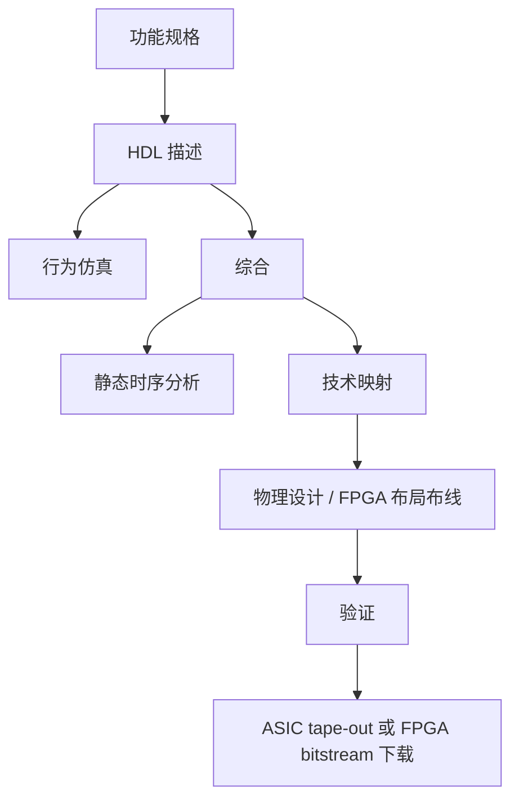

# 3. 组合逻辑设计与 Verilog HDL { #note-sec-032 }

!!! info "章节导引"
    本页从《计算机系统基础讲义》拆分而来，保留原章节锚点，方便从旧总览页和旧链接跳转。

## 学习目标

能从规格说明出发写出组合逻辑表达或 Verilog 描述，并理解 decoder、encoder、MUX 等模块。

## 前置知识

第 2 章布尔代数、基础编程语法和二进制编码。

## 建议用时

建议 6–8 小时：Verilog 基础 2–3 小时，组合模块 2–3 小时，延迟/毛刺 1–2 小时。

## 练习建议

写一个 3 开关控制灯的表达式；用 MUX 实现一个小真值表；检查一个组合逻辑是否遗漏赋值。

## 参考资料与引用边界

- 整理者：Lumner。
- 课程来源：根据 `SYS/` 目录下的课件整理；本章对应课件：`SYS/Lec03_Combinational Logic.pptx`。
- 原始讲义文件：`note/SYS_计算机系统基础讲义.md`。
- 引用边界：这是公开学习笔记，不替代课程正式教材、教师课件或考试要求；外部引用时请注明来自本网站整理版。

### 3.1 HDL 设计流 { #note-sec-033 }

HDL 是硬件描述语言，用形式化方法描述数字电路与逻辑系统。Verilog 是常用 HDL 之一。

!!! note "图像说明：ASIC 与 FPGA 设计流"
    原课件包含 `./sys_notes_assets/hdl_design_flow.png`。公开仓库当前不附带这张图片；本节保留文字化说明，阅读时可把它理解为“ASIC 与 FPGA 设计流”的结构示意。


典型流程：



ASIC 和 FPGA 区别：

| 维度 | ASIC | FPGA |
|---|---|---|
| 性能/功耗 | 通常更优 | 通常较弱 |
| 开发成本 | 高 | 低 |
| 修改成本 | 极高 | 可重新配置 |
| 设计周期 | 长 | 短 |
| 适用场景 | 大批量、固定功能 | 教学、原型、低中批量、可重构加速 |

### 3.2 Verilog 基础 { #note-sec-034 }

Verilog 区分大小写，关键字小写。空白通常无意义，但字符串和 token 分隔例外。注释：

```verilog
// single line comment
/* multi-line comment */
```

基本模块：

```verilog
module top(
    input  a,
    input  b,
    output c
);
    assign c = a & b;
endmodule
```

测试平台示意：

```verilog
module sim_top();
    reg a_in, b_in;
    wire c_out;

    top dut(
        .a(a_in),
        .b(b_in),
        .c(c_out)
    );

    initial begin
        a_in = 1'b0; b_in = 1'b0;
        #2 a_in = 1'b1;
        #2 b_in = 1'b1;
    end
endmodule
```

### 3.3 Verilog 数字与数据类型 { #note-sec-035 }

定宽数字语法：

```text
<size>'<base><number>
```

例子：

```verilog
4'b1111
12'habc
16'd255
12'b1111_0000_1010
```

基数：

| 符号 | 基数 |
|---|---|
| `b` | 二进制 |
| `o` | 八进制 |
| `d` | 十进制 |
| `h` | 十六进制 |

特殊值：

- `x`：未知。
- `z`：高阻。
- `?`：在数字中通常等价于 `z`，常用于 casez/casex 或 don't care 表达。

负数要把符号写在 size 前：

```verilog
-6'd3     // 合法
4'd-2     // 不合法
```

常用数据类型：

| 类型 | 含义 |
|---|---|
| `wire` | 连线，通常由连续赋值或模块输出驱动 |
| `reg` | 过程赋值变量，不一定综合为寄存器 |
| vector | 多位信号，如 `wire [7:0] a` |
| array | 数组，如 `reg [15:0] mem [1023:0]` |
| parameter | 模块内常量参数 |

端口习惯：

- input 默认是 wire。
- output 可定义为 wire 或 reg，取决于赋值方式。
- 实例化连接时，模块输出一般接 wire。

### 3.4 运算符与建模方式 { #note-sec-036 }

常见运算符：

| 类别 | 运算符 |
|---|---|
| 一元 | `+ -` |
| 位运算 | `~ & | ^ ^~` |
| 算术 | `+ - * / %` |
| 归约 | `& ~& | ~| ^ ^~` |
| 逻辑 | `&& || !` |
| 等价 | `== !=` |
| 关系 | `< <= > >=` |

建模方式：

| 方式 | 特点 |
|---|---|
| 结构化建模 | 实例化模块、门级连接，接近电路图 |
| 数据流建模 | 使用 `assign` 描述组合逻辑 |
| 行为建模 | 使用 `always`、`case`、`if` 等过程语句 |

组合逻辑行为建模常用：

```verilog
always @(*) begin
    case (sel)
        2'b00: y = a;
        2'b01: y = b;
        2'b10: y = c;
        default: y = d;
    endcase
end
```

组合逻辑中要避免遗漏赋值，否则综合器可能推断锁存器。

### 3.5 组合逻辑电路定义 { #note-sec-037 }

组合逻辑电路有：

- `m` 个布尔输入。
- `n` 个布尔输出。
- `n` 个开关函数，每个函数把当前输入组合映射到当前输出。

核心性质：**输出只依赖当前输入，不依赖历史状态**。

与时序逻辑对比：

| 类型 | 是否有存储 | 输出依赖 |
|---|---|---|
| 组合逻辑 | 无 | 当前输入 |
| 时序逻辑 | 有 | 当前输入和过去状态 |

组合逻辑要求：

- 每个元件本身是组合逻辑。
- 一个节点只能被一个元件输出驱动。
- 不允许形成反馈环路。

### 3.6 组合逻辑设计流程 { #note-sec-038 }


设计步骤：

1. 规格说明：明确输入、输出、编码方式和约束。
2. 形式化：列真值表或初始布尔方程。
3. 优化：降低 literal cost、gate input cost 或关键路径延迟。
4. 技术映射：映射到目标门库、NAND/NOR、MUX、FPGA LUT 等。
5. 验证：功能仿真、等价检查、时序分析。

### 3.7 例：三开关控制单灯 { #note-sec-039 }

需求：房间只有一盏灯，由三个开关控制，每个开关单独拨动都能改变灯的亮灭。

这实际是奇偶函数。若开关闭合记为 1，灯亮记为 1，则灯亮当且仅当闭合开关数为奇数：

```text
F = S1 ⊕ S2 ⊕ S3
```

SOP 写法：

```text
F = S3'S2'S1 + S3'S2S1' + S3S2'S1' + S3S2S1
```

Verilog：

```verilog
module lamp_control(
    input s1,
    input s2,
    input s3,
    output F
);
    assign F = s1 ^ s2 ^ s3;
endmodule
```

如果只按最小项写 `assign`，结果正确但不如 XOR 表达简洁。

### 3.8 常用组合功能块 { #note-sec-040 }

#### 3.8.1 基本功能 { #note-sec-041 }

| 功能 | 方程 | 含义 |
|---|---|---|
| 固定 0 | `F = 0` | 输出常 0 |
| 固定 1 | `F = 1` | 输出常 1 |
| 传送 | `F = X` | 直接传递 |
| 反相 | `F = X'` | 取反 |
| 使能传递 | `F = X·EN` 或 `F = X + EN` | 控制通过或阻断 |

多位总线可以看成一组并行 bit。宽线表示 vector signal，必要时可拆分为单 bit 或子字段。

#### 3.8.2 Decoder { #note-sec-042 }

Decoder 把 `n` 位输入码转换为最多 `2^n` 个输出，其中每个有效输入激活唯一输出。典型 3-to-8 decoder：

```text
000 -> 00000001
001 -> 00000010
...
111 -> 10000000
```

Decoder 可用于生成最小项，因此可与 OR 门一起实现任意 SOP 函数：

```text
F(X,Y,Z) = Σm(1,2,4,7)
```

实现方式：3-to-8 decoder 输出 `m0` 到 `m7`，把 `m1、m2、m4、m7` 接入 OR。

#### 3.8.3 七段数码管译码器 { #note-sec-043 }

BCD-to-seven-segment decoder 把 4 位 BCD 输入转换为 `a` 到 `g` 七段控制信号。

| 类型 | 公共端 | 点亮条件 |
|---|---|---|
| 共阳极 | 阳极接 1 | 段信号为 0 点亮，active low |
| 共阴极 | 阴极接 0 | 段信号为 1 点亮，active high |

设计时必须先确认数码管类型，否则输出极性会反。

#### 3.8.4 Encoder 与 Priority Encoder { #note-sec-044 }

Encoder 与 decoder 方向相反，把 one-hot 输入编码成二进制输出。普通 encoder 假设同时只有一个输入为 1。

Priority encoder 允许多个输入同时为 1，并输出最高优先级输入的编号，通常还带一个 valid 位。

#### 3.8.5 Multiplexer { #note-sec-045 }

MUX 从多个输入中选一个输出。`2^n`-to-1 MUX 有 `n` 个选择信号。

2-to-1 MUX：

```text
Y = S' I0 + S I1
```

4-to-1 MUX：

```text
Y = S1'S0'I0 + S1'S0I1 + S1S0'I2 + S1S0I3
```

MUX 也能实现逻辑函数：把函数变量接到选择输入，把真值表每行输出值固定到数据输入。

### 3.9 时序分析、关键路径与毛刺 { #note-sec-046 }

传播延迟：

```text
Tpd = 输入变化到输出稳定变化的最大时间
```

污染延迟：

```text
Tcd = 输入变化到输出可能开始变化的最小时间
```

组合电路最大延迟由关键路径决定：

```text
Tpd_circuit = Σ Tpd(elements on critical path)
```

最短路径影响污染延迟：

```text
Tcd_circuit = Σ Tcd(elements on shortest path)
```

毛刺 glitch 通常由不同路径延迟不一致引起。当单个输入变化通过多条路径到达输出，输出可能短暂错误翻转。

分析组合逻辑的步骤：

1. 从输入开始给每个中间节点写布尔函数。
2. 得到输出函数。
3. 化简或等价变换。
4. 列真值表验证功能。
5. 画时序图，检查延迟、毛刺和关键路径。

---
