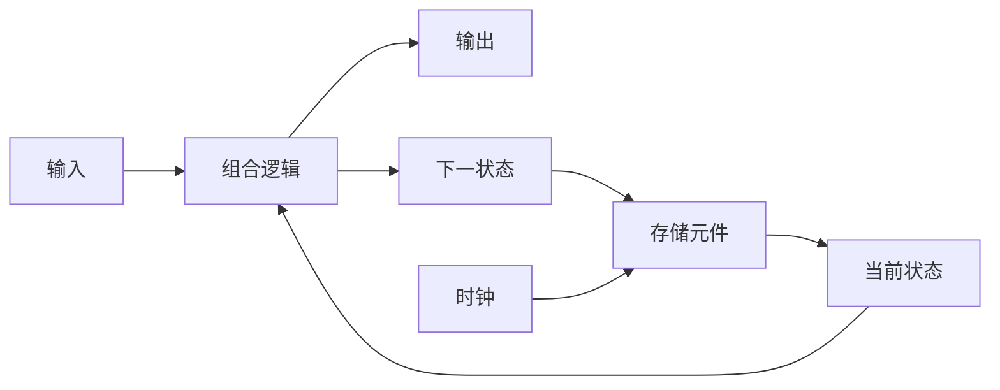
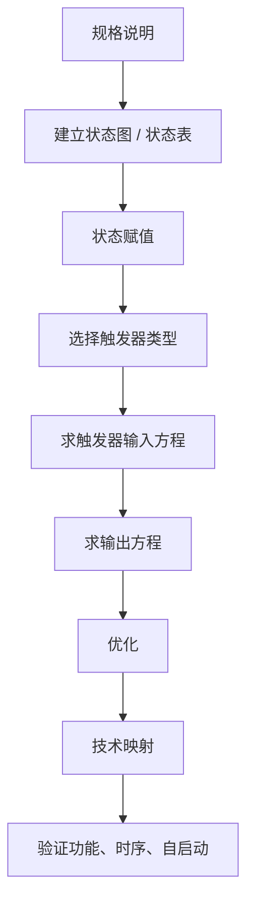
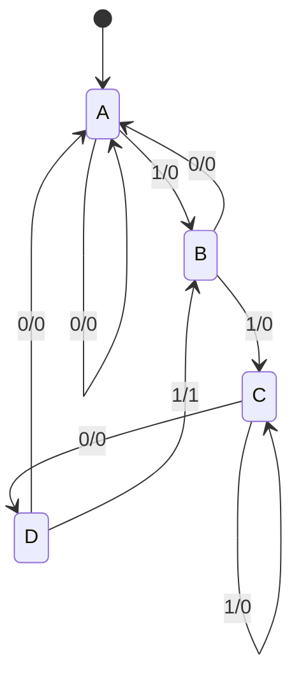

# 5. 时序逻辑设计 { #note-sec-059 }

!!! info "章节导引"
    本页从《计算机系统基础讲义》拆分而来，保留原章节锚点，方便从旧总览页和旧链接跳转。

## 学习目标

理解带状态电路如何存储历史，并能把简单需求建模成 FSM 或寄存器传输。

## 前置知识

组合逻辑、基本时钟概念和有限状态机直觉。

## 建议用时

建议 6–8 小时：存储元件 2 小时，FSM 2–3 小时，寄存器/计数器 2–3 小时。

## 练习建议

设计一个小序列检测器；列出状态转移表；解释 setup/hold 违例的后果。

## 参考资料与引用边界

- 整理者：Lumner。
- 课程来源：根据 `SYS/` 目录下的课件整理；本章对应课件：`SYS/Lec05_Sequential Logic.pptx`。
- 原始讲义文件：`note/SYS_计算机系统基础讲义.md`。
- 引用边界：这是公开学习笔记，不替代课程正式教材、教师课件或考试要求；外部引用时请注明来自本网站整理版。

### 5.1 时序逻辑模型 { #note-sec-060 }

时序电路由组合逻辑和存储元件组成：



状态转移：

```text
NextState = f(Inputs, PresentState)
```

输出函数：

```text
Mealy: Output = g(Inputs, State)
Moore: Output = h(State)
```

同步时序电路只在时钟边沿附近观察输入并改变状态。异步电路行为取决于输入在连续时间中的变化顺序，分析更困难。

### 5.2 反馈、稳定与存储 { #note-sec-061 }

组合逻辑如果引入反馈，就可能形成存储或振荡：

- 反馈路径保持原输出时，电路可“记住”状态。
- 反馈路径中有反相器时，可能不稳定并振荡。

锁存器和触发器就是受控反馈结构，用来可靠存储状态。

### 5.3 SR Latch、D Latch 与 Flip-Flop { #note-sec-062 }

SR latch 可由交叉耦合 NAND 或 NOR 构成。它有 set、reset、hold 行为，但存在非法输入组合。

D latch 通过把 SR 输入约束为互补，避免非法状态：

```text
Q(t+1) = D    // 当控制 C 有效时
Q(t+1) = Q(t) // 当控制 C 无效时
```

Latch 是电平敏感，可能在时钟有效电平期间多次透传。Flip-flop 是边沿触发，只在时钟边沿采样输入，更适合同步设计。

常见触发器：

| 类型 | 输入 | 行为 |
|---|---|---|
| D FF | D | 边沿到来时 `Q <- D` |
| JK FF | J,K | `00` 保持，`01` reset，`10` set，`11` 翻转 |
| T FF | T | `0` 保持，`1` 翻转 |

### 5.4 触发器时序参数 { #note-sec-063 }

| 参数 | 含义 |
|---|---|
| setup time `ts` | 时钟边沿前输入必须稳定的时间 |
| hold time `th` | 时钟边沿后输入必须继续稳定的时间 |
| clock-to-Q delay `tpd,FF` | 时钟边沿到输出变化的延迟 |
| pulse width `tw` | 时钟脉冲宽度 |

对于从一个触发器到另一个触发器的路径：

```text
Tclk >= tpd,FF + tpd,COMB + ts + tskew
```

课件中使用 slack 写法：

```text
tp = tslack + (tpd,FF + tpd,COMB + ts)
```

要正确工作，所有路径都应满足 `tslack >= 0`。

例：时钟 250 MHz，则周期 `tp = 4 ns`。若 `tpd,FF = 1.0 ns`，边沿触发器 `ts = 0.3 ns`：

```text
tpd,COMB <= 4.0 - 1.0 - 0.3 = 2.7 ns
```

### 5.5 时序电路分析流程 { #note-sec-064 }

给定时序电路，分析步骤：

1. 写出输出方程、触发器输入方程和下一状态方程。
2. 列带状态的真值表：输入为外部输入和当前状态，输出为外部输出和下一状态。
3. 列出电路状态。
4. 画状态图。
5. 分析外部行为。
6. 验证正确性、自启动能力和时序约束。

状态表包含：

| 区域 | 含义 |
|---|---|
| Present State | 当前状态变量 |
| Input | 外部输入组合 |
| Next State | 下一拍状态 |
| Output | 当前输出 |

### 5.6 Moore 与 Mealy { #note-sec-065 }

| 模型 | 输出依赖 | 状态图标注 | 特点 |
|---|---|---|---|
| Moore | 仅状态 | 标在状态内 | 输出稳定，常需要更多状态 |
| Mealy | 状态和输入 | 标在边上 | 状态少，输出可能更快但更易受输入毛刺影响 |

记忆技巧：**Moore is More**，Moore 机通常状态更多。

### 5.7 状态等价与化简 { #note-sec-066 }

两个状态等价，当且仅当对于每个可能输入序列，它们产生完全相同的输出序列。等价状态可以合并，减少状态数和触发器/逻辑成本。

判定思路：

1. 对每个输入符号，输出必须相同。
2. 对每个输入符号，下一状态必须相同或等价。

### 5.8 时序逻辑设计流程 { #note-sec-067 }



状态赋值需要给每个抽象状态分配唯一二进制码。若有 `m` 个状态，最少需要：

```text
n = ceil(log2 m)
```

未使用状态数：

```text
2^n - m
```

状态赋值会影响下一状态方程、输出方程和电路复杂度。经验规则：

- 相同输入下有相同下一状态的当前状态，尽量赋相邻码。
- 同一当前状态在相邻输入下的下一状态，尽量赋相邻码。
- 相同输出的状态，尽量赋相邻码。
- 初始状态或最常用状态可赋 0。

### 5.9 例：序列检测器 1101 { #note-sec-068 }

需求：输入串中每出现一次 `1101`，输出 1，允许重叠。

Mealy 状态含义：

| 状态 | 已识别的最长前缀 |
|---|---|
| A | 无有效前缀 |
| B | `1` |
| C | `11` |
| D | `110` |

状态转移：



`D --1/1--> B` 的原因：识别到 `1101` 后，最后一个 `1` 同时也是下一次匹配的前缀 `1`。

若使用 Moore 机，需要额外状态 E 表示“完整序列已发生且输出 1”。

### 5.10 未使用状态与自启动 { #note-sec-069 }

当状态编码数量大于实际状态数，会出现 unused states。电路上电、复位异常或噪声可能让 FSM 进入未使用状态。

处理策略：

| 策略 | 含义 |
|---|---|
| reset | 上电或错误时强制进入初始状态 |
| self-starting | 所有非法状态最终回到合法状态 |
| error state | 进入非法状态后停在错误状态并报告 |
| don't care 优化 | 面积小，但需验证非法状态行为 |

若非法状态互相循环，机器可能“卡死”。工程中不能只看合法状态图，还要检查完整编码空间。

### 5.11 寄存器与寄存器传输 { #note-sec-070 }

寄存器是一组触发器，用于存储多位二进制值。寄存器常用于处理器中的临时数据保存，比主存更快。

带使能的触发器和寄存器：

!!! note "图像说明：带 EN 的 D 触发器与 4 位寄存器"
    原课件包含 `./sys_notes_assets/register_enable.png`。公开仓库当前不附带这张图片；本节保留文字化说明，阅读时可把它理解为“带 EN 的 D 触发器与 4 位寄存器”的结构示意。


寄存器传输操作由三部分描述：

1. 系统中的寄存器集合。
2. 对寄存器数据执行的微操作。
3. 控制这些操作发生顺序的控制信号。

常见微操作：

| 类型 | 例子 |
|---|---|
| Transfer | `R2 <- R1` |
| Arithmetic | `R3 <- R1 + R2` |
| Logic | `R3 <- R1 XOR R2` |
| Shift | `R1 <- R1 << 1` |

控制表达式写在左侧：

```text
K1: R1 <- R1 + R2
```

含义：当 `K1 = 1` 时执行该传输。

### 5.12 总线结构 { #note-sec-071 }

寄存器之间传输数据可使用：

| 结构 | 特点 |
|---|---|
| 专用 MUX | 每个寄存器输入有自己的选择器 |
| 单总线 | 多个源通过共享 MUX 或三态驱动连接总线 |
| 三态总线 | 同一时刻只能一个源驱动总线 |
| 多总线 | 支持更多并行传输，硬件更复杂 |

三态总线必须保证不会有多个输出同时驱动，否则会造成总线冲突。

### 5.13 移位寄存器 { #note-sec-072 }

移位寄存器可以把存储位向左或向右移动。基本串行右移寄存器：

```text
In -> [DFF A] -> [DFF B] -> [DFF C] -> Out
```

加入 MUX 后可支持：

- 保持。
- 左移。
- 右移。
- 并行装载。

典型模式表：

| S1 | S0 | 操作 |
|---|---|---|
| 0 | 0 | 保持 |
| 0 | 1 | 右移 |
| 1 | 0 | 左移 |
| 1 | 1 | 并行装载 |

### 5.14 计数器 { #note-sec-073 }

计数器按固定状态序列前进。用途包括：

- 时间基准。
- 事件计数。
- 位数/步骤计数。
- 程序计数器 PC。

类型：

| 类型 | 特点 |
|---|---|
| Ripple counter | 低位触发高位，非真正同步，低功耗但延迟逐级累加 |
| Synchronous counter | 所有触发器共用时钟，组合逻辑产生下一状态 |
| Modulo-N counter | 按 N 个状态循环 |
| BCD counter | 十进制 0 到 9 循环 |

Ripple counter 最坏延迟约为：

```text
n × tPHL
```

同步计数器可用 incrementer 生成下一状态，但 carry chain 也可能变成长路径；可用并行 gating 或 lookahead 优化。

设计 modulo-N counter 时应避免“suicide counter”：异步检测终止状态后立即清零可能产生窄脉冲和时序风险。更稳妥方法是在终止状态前一拍同步 load/clear。

---
