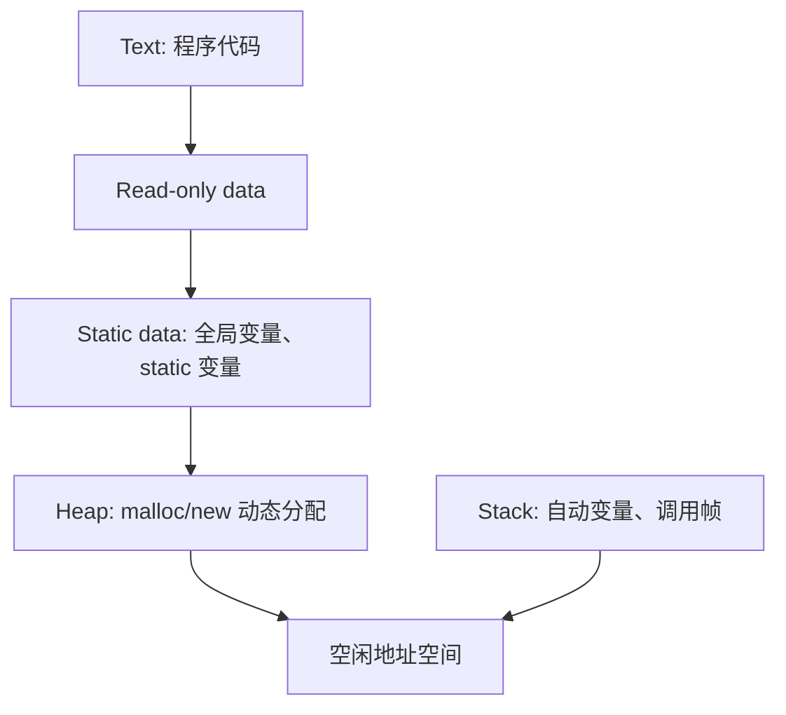

# 7. RISC-V ISA、汇编与程序运行 { #note-sec-084 }

!!! info "章节导引"
    本页从《计算机系统基础讲义》拆分而来，保留原章节锚点，方便从旧总览页和旧链接跳转。

## 学习目标

把 ISA、汇编、调用约定、目标文件和装载过程连成程序运行链路。

## 前置知识

第 6 章 ISA、基础 C/汇编概念、栈和函数调用直觉。

## 建议用时

建议 7–10 小时：指令与控制流 3 小时，调用约定/栈 2 小时，ELF/链接/装载 2–5 小时。

## 练习建议

手写一段简单 RISC-V 函数调用；标出栈帧内容；解释静态链接和动态链接差异。

## 参考资料与引用边界

- 整理者：Lumner。
- 课程来源：根据 `SYS/` 目录下的课件整理；本章对应课件：`SYS/Lec06-2_RISCV.pptx`。
- 原始讲义文件：`note/SYS_计算机系统基础讲义.md`。
- 引用边界：这是公开学习笔记，不替代课程正式教材、教师课件或考试要求；外部引用时请注明来自本网站整理版。

### 7.1 RISC-V 概览 { #note-sec-085 }

RISC-V 是开放的 RISC 指令集标准，起源于 UC Berkeley。目标是：

- 完全开放，可用于学术界和工业界。
- 适合真实硬件实现，而不只是模拟。
- 不绑定特定微体系结构或实现技术。
- 使用小型基础整数 ISA，加标准扩展和自定义扩展。
- 支持 IEEE 754 浮点扩展。

RISC-V 命名：

```text
RV + word width + extensions
```

例：

| 名称 | 含义 |
|---|---|
| RV32I | 32 位地址/寄存器，基础整数 ISA |
| RV64I | 64 位基础整数 ISA |
| RV32IM | RV32I + 乘除扩展 |
| RV32G | IMAFD 通用组合 |

标准扩展：

| 扩展 | 含义 |
|---|---|
| I | Integer base |
| M | Integer multiply/divide |
| A | Atomic |
| F | Single precision floating point |
| D | Double precision floating point |
| C | Compressed 16-bit instructions |

### 7.2 RISC-V 处理器状态 { #note-sec-086 }

用户级可见状态：

- PC：程序计数器。
- 32 个整数寄存器 `x0` 到 `x31`。
- `x0` 恒为 0。
- `x1` 常作返回地址 `ra`。
- `x2` 常作栈指针 `sp`。
- 32 个浮点寄存器 `f0` 到 `f31`。
- 浮点状态寄存器。

### 7.3 指令格式 { #note-sec-087 }

RISC-V 基础指令通常是 32 位，字段位置尽量固定，便于解码。最低两位为 `11` 表示 32 位基础指令；压缩指令使用其他低位编码。

!!! note "图像说明：RISC-V 核心指令格式"
    原课件包含 `./sys_notes_assets/riscv_formats.png`。公开仓库当前不附带这张图片；本节保留文字化说明，阅读时可把它理解为“RISC-V 核心指令格式”的结构示意。


核心格式：

| 格式 | 用途 | 主要字段 |
|---|---|---|
| R-type | 寄存器-寄存器 ALU | `funct7 rs2 rs1 funct3 rd opcode` |
| I-type | 立即数 ALU、load、jalr | `imm[11:0] rs1 funct3 rd opcode` |
| S-type | store | `imm[11:5] rs2 rs1 funct3 imm[4:0] opcode` |
| B-type | conditional branch | 分散 immediate + `rs2 rs1 funct3 opcode` |
| U-type | lui、auipc | `imm[31:12] rd opcode` |
| J-type | jal | 分散 immediate + `rd opcode` |

重要设计点：

- `rd`、`rs1`、`rs2` 位置尽量固定。
- 立即数符号位总在 instruction bit 31。
- branch/jump 偏移按 2 字节粒度编码，以兼容压缩指令。

### 7.4 基础整数指令 { #note-sec-088 }

#### R-type ALU { #note-sec-089 }

格式：

```asm
add rd, rs1, rs2
sub rd, rs1, rs2
and rd, rs1, rs2
or  rd, rs1, rs2
xor rd, rs1, rs2
sll rd, rs1, rs2
srl rd, rs1, rs2
sra rd, rs1, rs2
slt rd, rs1, rs2
sltu rd, rs1, rs2
```

例：

```asm
add x9, x20, x21
```

字段：

```text
funct7 = 0000000
rs2    = 10101  // x21
rs1    = 10100  // x20
funct3 = 000
rd     = 01001  // x9
opcode = 0110011
```

机器码：

```text
0000000 10101 10100 000 01001 0110011 = 0x015A04B3
```

#### I-type ALU { #note-sec-090 }

```asm
addi rd, rs1, imm
andi rd, rs1, imm
ori  rd, rs1, imm
xori rd, rs1, imm
slti rd, rs1, imm
sltiu rd, rs1, imm
slli rd, rs1, shamt
srli rd, rs1, shamt
srai rd, rs1, shamt
```

所有立即数会符号扩展。12 位立即数够处理常见小常数；大常数用 `lui` + `addi` 构造。

#### Load/Store { #note-sec-091 }

RISC-V 是 load-store ISA，算术逻辑操作只在寄存器间进行。

```asm
ld rd, offset(rs1)     // rd = MEM[rs1 + offset]
sd rs2, offset(rs1)    // MEM[rs1 + offset] = rs2
```

RV32 常用 `lw/sw`，RV64 可用 `ld/sd`。

例：数组访问：

```c
g = h + A[i];   // A 是 doubleword 数组
```

假设 `g,h,i` 分别在 `x1,x2,x4`，数组基址在 `x3`：

```asm
add x5, x4, x4      # x5 = 2*i
add x5, x5, x5      # x5 = 4*i
add x5, x5, x5      # x5 = 8*i
add x5, x5, x3      # x5 = &A[i]
ld  x6, 0(x5)       # x6 = A[i]
add x1, x2, x6      # g = h + A[i]
```

更自然的写法可用移位：

```asm
slli x5, x4, 3
add  x5, x5, x3
ld   x6, 0(x5)
add  x1, x2, x6
```

### 7.5 控制流 { #note-sec-092 }

#### 条件分支 { #note-sec-093 }

```asm
beq  rs1, rs2, label
bne  rs1, rs2, label
blt  rs1, rs2, label
bge  rs1, rs2, label
bltu rs1, rs2, label
bgeu rs1, rs2, label
```

分支目标：

```text
target = PC + sign_extend(offset << 1)
```

编译 if-else：

```c
if (i == j) f = g + h;
else        f = g - h;
```

假设 `f~j` 对应 `x19~x23`：

```asm
bne x22, x23, ELSE
add x19, x20, x21
beq x0, x0, EXIT
ELSE:
sub x19, x20, x21
EXIT:
```

远距离分支可通过反转条件并插入无条件跳转：

```asm
# 原始
beq x10, x0, L1

# 改写
bne x10, x0, L2
jal x0, L1
L2:
```

#### 循环 { #note-sec-094 }

```c
while (save[i] == k) i = i + 1;
```

假设 `i,k,base(save)` 分别为 `x22,x24,x25`：

```asm
Loop:
    slli x10, x22, 3
    add  x10, x10, x25
    ld   x9, 0(x10)
    bne  x9, x24, Exit
    addi x22, x22, 1
    beq  x0, x0, Loop
Exit:
```

#### Jump { #note-sec-095 }

```asm
jal  rd, label       # rd = PC+4, PC = label
jalr rd, imm(rs1)    # rd = PC+4, PC = rs1 + imm
```

函数调用通常用：

```asm
jal x1, ProcedureLabel
```

函数返回：

```asm
jalr x0, 0(x1)
```

`nop` 可编码为：

```asm
addi x0, x0, 0
```

### 7.6 RISC-V 调用约定 { #note-sec-096 }

函数调用六步：

1. 把参数放到被调函数能访问的位置。
2. 跳转到函数。
3. 分配局部存储，按约定保存必要寄存器。
4. 执行函数主体。
5. 放置返回值，恢复寄存器，释放栈帧。
6. 返回调用点。

常用寄存器约定：

| ABI 名称 | 编号 | 用途 | 调用后是否保持 |
|---|---|---|---|
| zero | x0 | 常数 0 | n/a |
| ra | x1 | 返回地址 | 否；非叶子函数若还要返回原调用者，需保存 |
| sp | x2 | 栈指针 | 是 |
| gp | x3 | 全局指针 | 通常固定 |
| tp | x4 | 线程指针 | 通常固定 |
| t0-t2 | x5-x7 | 临时寄存器 | 否 |
| s0/fp | x8 | 保存寄存器/帧指针 | 是 |
| s1 | x9 | 保存寄存器 | 是 |
| a0-a7 | x10-x17 | 参数/返回值 | 否 |
| s2-s11 | x18-x27 | 保存寄存器 | 是 |
| t3-t6 | x28-x31 | 临时寄存器 | 否 |

课件中使用 RV64 风格示例，栈以 8 字节为单位保存 `sd/ld`。

叶子函数例：

```c
long long leaf_example(long long g, long long h, long long i, long long j) {
    long long f;
    f = (g + h) - (i + j);
    return f;
}
```

可能的汇编：

```asm
addi sp, sp, -24
sd   x5, 16(sp)
sd   x6, 8(sp)
sd   x20, 0(sp)

add  x5, x10, x11
add  x6, x12, x13
sub  x20, x5, x6
addi x10, x20, 0

ld   x20, 0(sp)
ld   x6, 8(sp)
ld   x5, 16(sp)
addi sp, sp, 24
jalr x0, 0(x1)
```

### 7.7 栈帧与内存布局 { #note-sec-097 }

栈通常从高地址向低地址增长：

```text
push: sp = sp - size
pop:  sp = sp + size
```

栈帧保存：

- 返回地址。
- 旧帧指针。
- callee-saved registers。
- 局部变量。
- 溢出到栈上的参数。

!!! note "图像说明：栈帧结构"
    原课件包含 `./sys_notes_assets/stack_frame.png`。公开仓库当前不附带这张图片；本节保留文字化说明，阅读时可把它理解为“栈帧结构”的结构示意。


典型进程内存布局：



递归函数必须保存返回地址和调用后仍要使用的参数/临时值。递归过深会造成栈溢出。尾递归或循环可减少栈消耗。

### 7.8 特权模式 { #note-sec-098 }

RISC-V privileged spec 定义多个特权模式。常见：

| 模式 | 含义 |
|---|---|
| U-mode | 用户模式 |
| S-mode | 监管者模式，操作系统内核常用 |
| M-mode | 机器模式，最高特权且唯一必需 |

中断、异常和 I/O 等通常需要更高特权模式处理。处理器大部分时间运行在最低可用特权模式，事件发生时陷入高特权模式。

### 7.9 从 C 源码到运行程序 { #note-sec-099 }

逻辑流程：


预处理器：

- 展开 `#include`。
- 展开宏定义。
- 处理条件编译。

编译器：

- 把预处理后的 C 转换成汇编。
- 进行优化、寄存器分配、指令选择。

汇编器：

- 把汇编转换成目标文件。
- 处理伪指令。
- 生成机器码、重定位信息、符号表。

### 7.10 ELF 目标文件 { #note-sec-100 }

ELF 是 Unix-like 系统常见目标文件、可执行文件、共享库格式。

目标文件类型：

| 类型 | 含义 |
|---|---|
| relocatable file | 可重定位目标文件，用于链接 |
| executable file | 可执行程序 |
| shared object file | 共享库，可被动态链接 |

可重定位目标文件包含：

- ELF header：文件结构、入口等元信息。
- `.text`：机器指令。
- `.data`：已初始化静态数据。
- `.bss`：未初始化静态数据，装载时清零。
- relocation information：哪些位置需要链接器修正地址。
- symbol table：定义和引用的符号。
- debug information：调试信息。

### 7.11 链接器 { #note-sec-101 }

分离编译的意义：

- 修改一个源文件后只需重编译该模块。
- 多个目标文件可以组合为完整程序。
- 库函数可在链接时接入。

链接器主要任务：

1. 合并各目标文件的同类段，如 text、data、rodata。
2. 为符号分配最终地址。
3. 解析未定义外部符号。
4. 根据重定位信息修正代码和数据中的地址引用。
5. 记录程序入口点。

符号解析例：

- 模块 B 定义全局符号 `x`。
- 模块 A 引用 `x`。
- 链接器确定合并后 `x` 的地址，并修补 A 中引用 `x` 的机器码或数据。

### 7.12 静态链接与动态链接 { #note-sec-102 }

静态链接：

- 所需库代码在链接时复制进可执行文件。
- 启动时简单，运行时开销低。
- 多个程序可能重复包含同一库代码。
- 库修复 bug 后，程序需重新链接才能使用新版。

动态链接：

- 程序启动或首次调用时解析共享库符号。
- 多个程序可共享内存中的同一库代码。
- 更新库后程序可使用新版本。
- 首次调用有解析开销。

静态库类似对象文件集合，例如 `libc.a` 中有 `printf.o`、`read.o` 等。链接器只选取需要解析未定义符号的对象文件。

共享库依赖装载器和动态链接器完成最终绑定，常涉及 GOT 和 PLT。

### 7.13 装载器、PIC 与 Lazy Binding { #note-sec-103 }

装载器的任务：

1. 读取可执行文件头，确定地址空间需求。
2. 分配地址空间。
3. 把 text/data 等段读入内存。
4. 清零 `.bss`。
5. 创建栈。
6. 设置参数、环境变量和初始寄存器。
7. 跳转到入口点。

动态链接程序启动时，操作系统可能先启动动态链接器，由它完成共享库映射和符号解析。

位置无关代码 PIC：

- 代码不依赖固定装载地址。
- 常用 PC-relative addressing。
- 共享库可被映射到不同进程地址空间的不同位置。
- ELF 中可通过 GOT 访问全局数据。

Lazy binding：

- 第一次调用动态库函数时进入 stub。
- 动态链接器解析真实地址并修补跳转表。
- 后续调用直接跳到真实函数。

### 7.14 程序真正入口：`_start` 与 `crt0` { #note-sec-104 }

C/C++ 程序的真正入口通常不是 `main`，而是 `_start`。启动代码负责：

- 建立运行时环境。
- 初始化栈和参数。
- 初始化 C runtime。
- 调用 `main`。
- 处理 `main` 返回值并调用退出逻辑。

传统上这部分启动例程叫 `crt0`，常作为 `crt0.o` 自动链接进程序。

---
