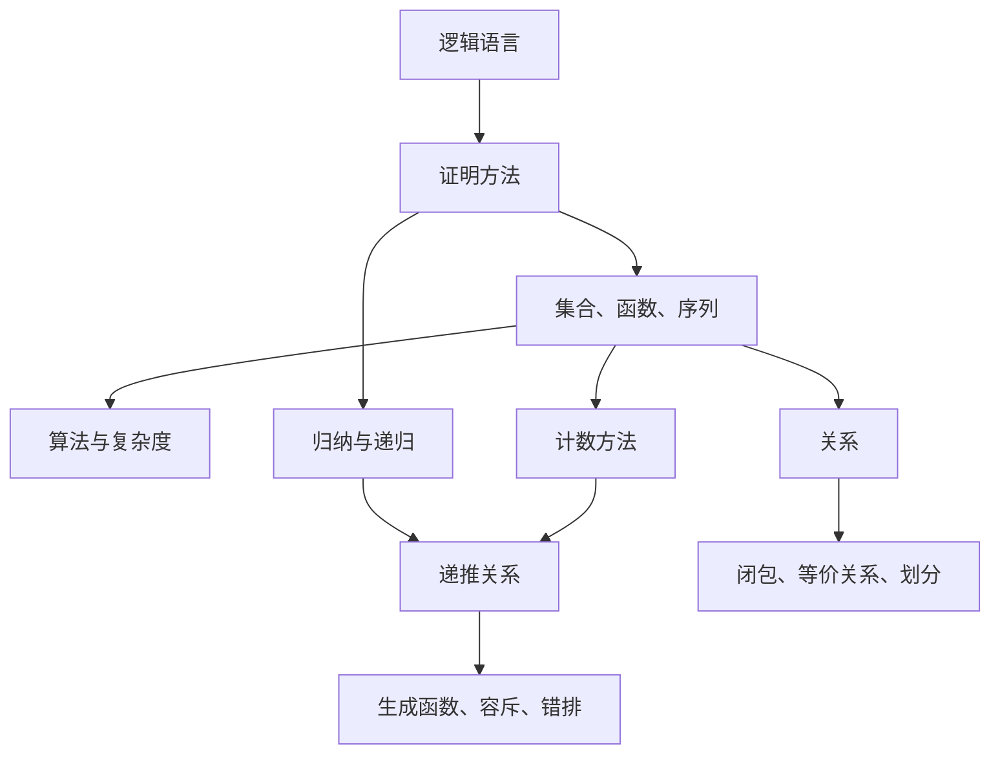

# 离散数学讲义

> 版本：2026-05-13  
> 来源：根据 `DM/` 目录下现有离散数学课件整理。  
> 维护方式：后续新增 PPT/PDF 时，优先补充到对应章节；若新增内容属于未覆盖章节，则在“待补充章节”中扩展为正式章节。

## 使用说明 { #note-sec-001 }

这份讲义按章节组织，目标不是逐页复述课件，而是把课件中的定义、定理、方法、例题类型和解题套路整理成可复习、可发布到笔记网站的 Markdown 文档。

每一章建议按以下顺序学习：

1. 先看“核心目标”，明确本章要解决的问题。
2. 再看定义和定理，注意每个符号的含义。
3. 通过例题类型掌握建模和证明套路。
4. 最后用“小结与补充位”检查是否还有新课件需要补充。

本文使用 LaTeX 公式语法，例如 $p \to q$、$\forall x P(x)$、$O(n\log n)$。上传到笔记网站时，请确认网站支持 Markdown 数学公式渲染。

## 现有课件索引 { #note-sec-002 }

| 讲义章节 | 对应课件 |
| --- | --- |
| 第 1 章 逻辑与证明 | `DM1.1(8).pdf`, `DM1.2-1.3(5).pdf`, `DM1.4(6).pdf`, `DM1.5(5).pdf`, `DM1.6(6).pdf`, `DM1.7-1.8(6).pdf` |
| 第 2 章 基本结构 | `DM2.1.pdf`, `DM2.2.pdf`, `DM2.3.pdf`, `DM2.4.pdf`, `DM2.5-2.6(5).pdf` |
| 第 3 章 算法 | `DM3.1-3.3(4).pdf` |
| 第 4 章 待补充 | 当前未提供对应课件 |
| 第 5 章 归纳与递归 | `DM5.1-5.4(7).pdf` |
| 第 6 章 计数 | `DM6.1(3).pdf`, `DM6.2(3).pdf`, `DM6.3-6.4(6).pdf`, `DM6.5(3).pdf` |
| 第 7 章 待补充 | 当前未提供对应课件 |
| 第 8 章 高级计数技术 | `DM8.1-8.2(6).pdf`, `DM8.3.pdf`, `DM8.4(6).pdf`, `DM8.5-8.6(9).pdf` |
| 第 9 章 关系 | `DM9.1-9.3(8).pdf`, `DM9.4(6).pdf`, `DM9.5(3).pdf` |

## 全书知识结构 { #note-sec-003 }



## 第 1 章 逻辑与证明 { #note-sec-004 }

## 1.0 核心目标 { #note-sec-005 }

本章要建立离散数学的语言基础。命题逻辑用于刻画“真或假”的陈述，谓词逻辑用于刻画带变量的数学语句，推理规则和证明方法用于把前提严谨地推到结论。

学完本章应能做到：

- 判断一句话是否为命题，并写出复合命题的形式。
- 使用真值表、逻辑等价式、范式分析命题。
- 把自然语言翻译成谓词逻辑表达式。
- 正确使用全称量词、存在量词和嵌套量词。
- 使用推理规则构造有效论证。
- 区分直接证明、逆否证明、反证法、分情况证明、存在性证明和反例证明。

## 1.1 命题逻辑 { #note-sec-006 }

### 命题 { #note-sec-007 }

命题是一个具有确定真值的陈述句。它要么为真，要么为假，不能二者同时成立。

常见判断：

| 句子 | 是否为命题 | 原因 |
| --- | --- | --- |
| “2022 年冬奥会在北京举行。” | 是 | 有确定真值 |
| “9 是素数。” | 是 | 有确定真值，且为假 |
| “请打开书。” | 否 | 命令句，没有真假 |
| “现在几点？” | 否 | 疑问句，没有真假 |
| $x+1=4$ | 通常不是 | 未指定 $x$ 时没有确定真值 |

通常用 $p,q,r,\ldots$ 表示命题变量。真值可记为 `T/F`，也可记为 `1/0`。

### 复合命题和联结词 { #note-sec-008 }

复合命题由命题变量和逻辑联结词构成。

| 名称 | 符号 | 读法 | 为真的条件 |
| --- | --- | --- | --- |
| 否定 | $\neg p$ | 非 $p$ | $p$ 为假 |
| 合取 | $p \land q$ | $p$ 且 $q$ | $p,q$ 都真 |
| 析取 | $p \lor q$ | $p$ 或 $q$ | 至少一个真 |
| 异或 | $p \oplus q$ | 要么 $p$ 要么 $q$ | 恰好一个真 |
| 条件 | $p \to q$ | 若 $p$ 则 $q$ | 只有 $p$ 真、$q$ 假时为假 |
| 双条件 | $p \leftrightarrow q$ | $p$ 当且仅当 $q$ | $p,q$ 真值相同 |

条件命题 $p \to q$ 中，$p$ 称为前件，$q$ 称为后件。它的真假只由前件和后件的真值决定，不要求二者存在因果关系。课件中把它类比为“承诺”：只有承诺条件发生而结果没有发生时，承诺才被违反。

### 条件命题的相关形式 { #note-sec-009 }

从 $p \to q$ 可构造：

| 名称 | 形式 | 与原命题的关系 |
| --- | --- | --- |
| 逆命题 | $q \to p$ | 不一定等价 |
| 否命题 | $\neg p \to \neg q$ | 不一定等价 |
| 逆否命题 | $\neg q \to \neg p$ | 与原命题等价 |

因此证明 $p \to q$ 时，经常改证 $\neg q \to \neg p$。

### 真值表 { #note-sec-010 }

真值表列出命题变量的全部可能赋值。若有 $n$ 个命题变量，则真值表有 $2^n$ 行。

例：证明 $p \to q$ 与 $\neg p \lor q$ 等价。

| $p$ | $q$ | $p \to q$ | $\neg p \lor q$ |
| --- | --- | --- | --- |
| T | T | T | T |
| T | F | F | F |
| F | T | T | T |
| F | F | T | T |

两列完全相同，所以 $p \to q \equiv \neg p \lor q$。

### 运算优先级 { #note-sec-011 }

常用优先级从高到低为：

1. 括号。
2. 否定 $\neg$。
3. 合取 $\land$。
4. 析取 $\lor$。
5. 条件 $\to$。
6. 双条件 $\leftrightarrow$。

表达复杂公式时应尽量加括号，避免歧义。

### 位运算 { #note-sec-012 }

计算机中比特 `0/1` 可看作假/真。位串上的按位运算是把逻辑运算逐位推广。

例：设两个位串为 `0110110110` 与 `1100011101`。

- 按位 OR：对应位至少一个为 `1` 时为 `1`。
- 按位 AND：对应位都为 `1` 时为 `1`。
- 按位 XOR：对应位恰好一个为 `1` 时为 `1`。

这说明命题逻辑不仅是证明语言，也是数字系统和程序判断的基础。

## 1.2 命题逻辑的应用 { #note-sec-013 }

### 自然语言翻译 { #note-sec-014 }

把自然语言翻译成命题逻辑的目的，是消除自然语言中的歧义，使推理可以形式化。

步骤：

1. 找出原子命题。
2. 给每个原子命题命名。
3. 判断关键词对应的联结词。
4. 注意“only if”“unless”“necessary”“sufficient”等短语。

例：“You can access the Internet from campus only if you are a computer science major or you are not a freshman.”

设：

- $a$：你可以从校园访问互联网。
- $c$：你是计算机科学专业学生。
- $f$：你是一年级学生。

“$p$ only if $q$” 表示 $p \to q$。所以原句翻译为：

$a \to (c \lor \neg f)$

### 系统规格说明 { #note-sec-015 }

软件和系统工程中，经常把自然语言需求翻译成逻辑公式。

若一组规格说明可以同时为真，则称其一致；若不存在任何赋值能让所有公式同时为真，则不一致。

例：

$p \to q$、$p$、$\neg q$ 三条规格不一致，因为由前两条可推出 $q$，与第三条矛盾。

### 逻辑谜题 { #note-sec-016 }

骑士与骗子问题、宝箱问题等都可以通过命题变量建模。基本套路：

1. 用命题变量描述“某人说真话”“某箱有宝物”等事实。
2. 把每句话翻译为逻辑表达式。
3. 加入题目约束，例如“骑士总说真话，骗子总说假话”。
4. 用真值表、等价变形或反证排除不可能情况。

## 1.3 命题等价式与范式 { #note-sec-017 }

### 重言式、矛盾式、可满足式 { #note-sec-018 }

| 名称 | 定义 | 例子 |
| --- | --- | --- |
| 重言式 | 在所有赋值下都为真 | $p \lor \neg p$ |
| 矛盾式 | 在所有赋值下都为假 | $p \land \neg p$ |
| 偶然式 | 有时真、有时假 | $p \to q$ |
| 可满足式 | 至少存在一个赋值使其为真 | $p \lor q$ |
| 不可满足式 | 没有赋值使其为真 | $p \land \neg p$ |

两个命题公式 $P,Q$ 逻辑等价，当且仅当 $P \leftrightarrow Q$ 是重言式，记作 $P \equiv Q$。

### 常用逻辑等价式 { #note-sec-019 }

| 名称 | 等价式 |
| --- | --- |
| 恒等律 | $p \land T \equiv p$, $p \lor F \equiv p$ |
| 支配律 | $p \lor T \equiv T$, $p \land F \equiv F$ |
| 幂等律 | $p \lor p \equiv p$, $p \land p \equiv p$ |
| 双重否定律 | $\neg(\neg p) \equiv p$ |
| 交换律 | $p \lor q \equiv q \lor p$, $p \land q \equiv q \land p$ |
| 结合律 | $(p\lor q)\lor r \equiv p\lor(q\lor r)$, $(p\land q)\land r \equiv p\land(q\land r)$ |
| 分配律 | $p\lor(q\land r)\equiv(p\lor q)\land(p\lor r)$ |
| 分配律 | $p\land(q\lor r)\equiv(p\land q)\lor(p\land r)$ |
| 德摩根律 | $\neg(p\land q)\equiv \neg p\lor \neg q$ |
| 德摩根律 | $\neg(p\lor q)\equiv \neg p\land \neg q$ |
| 吸收律 | $p\lor(p\land q)\equiv p$, $p\land(p\lor q)\equiv p$ |
| 条件等价 | $p\to q\equiv \neg p\lor q$ |
| 双条件等价 | $p\leftrightarrow q\equiv(p\to q)\land(q\to p)$ |

扩展德摩根律：

$\neg(p_1\lor p_2\lor\cdots\lor p_n)\equiv \neg p_1\land\neg p_2\land\cdots\land\neg p_n$

$\neg(p_1\land p_2\land\cdots\land p_n)\equiv \neg p_1\lor\neg p_2\lor\cdots\lor\neg p_n$

### 用等价式化简 { #note-sec-020 }

例：证明 $\neg(p\lor(\neg p\land q))\equiv \neg p\land\neg q$。

推导：

$p\lor(\neg p\land q)$

$\equiv (p\lor\neg p)\land(p\lor q)$

$\equiv T\land(p\lor q)$

$\equiv p\lor q$

所以：

$\neg(p\lor(\neg p\land q))\equiv \neg(p\lor q)\equiv \neg p\land\neg q$

### 其他逻辑算子和函数完备性 { #note-sec-021 }

Sheffer stroke：

$p|q\equiv\neg(p\land q)$

它就是 NAND。仅用 NAND 可以表示所有命题公式，因此 `{NAND}` 是函数完备的。

类似地，NOR：

$p\downarrow q\equiv\neg(p\lor q)$

仅用 NOR 也能表示所有命题公式。

### 对偶 { #note-sec-022 }

只含 $\land,\lor,T,F$ 的公式，把 $\land$ 与 $\lor$ 互换，把 $T$ 与 $F$ 互换，得到其对偶式。

若某个等价式成立，则它的对偶式也成立。例如：

$p\lor F\equiv p$ 的对偶为 $p\land T\equiv p$。

### 析取范式和合取范式 { #note-sec-023 }

文字是命题变量或其否定，如 $p$、$\neg q$。

析取范式 DNF 是若干合取项的析取，例如：

$(p\land \neg q)\lor(\neg p\land r)$

合取范式 CNF 是若干析取项的合取，例如：

$(p\lor q)\land(\neg p\lor r)$

任何命题公式都可转化为 DNF，也可转化为 CNF。常用步骤：

1. 消去 $\to,\leftrightarrow$。
2. 用德摩根律把否定推进到变量前。
3. 使用分配律整理成 DNF 或 CNF。

### 主析取范式和主合取范式 { #note-sec-024 }

极小项是包含每个变量一次的合取项，例如变量为 $p,q,r$ 时：

$p\land \neg q\land r$

主析取范式是由极小项组成的析取式。可由真值表中使公式为真的行得到。

极大项是包含每个变量一次的析取项。主合取范式可由真值表中使公式为假的行得到。

### SAT 和 n 皇后建模 { #note-sec-025 }

可满足性问题 SAT 问的是：是否存在变量赋值使公式为真。

n 皇后问题可建模为 SAT：

- 用 $p_{i,j}$ 表示第 $i$ 行第 $j$ 列放置皇后。
- 每一行至少一个皇后。
- 每一行至多一个皇后。
- 每一列至多一个皇后。
- 每一条对角线至多一个皇后。

这类建模体现了逻辑在人工智能、软件测试、自动证明、排程和电路设计中的应用。

## 1.4 谓词与量词 { #note-sec-026 }

### 为什么需要谓词逻辑 { #note-sec-027 }

命题逻辑无法表达内部结构。例如：

“所有人都会死。苏格拉底是人。所以苏格拉底会死。”

若只用命题逻辑，会看不出“人”和“会死”之间的普遍关系。谓词逻辑引入变量、谓词和量词。

### 谓词和命题函数 { #note-sec-028 }

谓词是带变量的陈述，如 $P(x)$。当变量取具体值后，命题函数变成命题。

例：设 $P(x)$ 表示 $x>0$，论域为整数。

- $P(3)$ 为真。
- $P(-2)$ 为假。
- $P(x)$ 本身不是命题，因为 $x$ 未确定。

多元谓词如 $R(x,y,z)$ 可表示 $x+y=z$。

### 量词 { #note-sec-029 }

全称量词：

$\forall x P(x)$

读作“对所有 $x$，$P(x)$ 成立”。

存在量词：

$\exists x P(x)$

读作“存在某个 $x$，使 $P(x)$ 成立”。

唯一存在量词：

$\exists!x P(x)$

表示恰有一个 $x$ 使 $P(x)$ 成立。

若论域有限：

$\forall x P(x)$ 相当于所有实例的合取。

$\exists x P(x)$ 相当于所有实例的析取。

### 论域的重要性 { #note-sec-030 }

量词命题的真假依赖论域。

命题 $\forall x(x^2\ge 0)$：

- 若论域为实数，真。
- 若论域为复数，表达式中的大小关系未必适用，需要重新定义。

写谓词逻辑表达式时必须明确论域，或在公式中限制变量范围。

### 限制量词 { #note-sec-031 }

$\forall x\in S\,P(x)$ 等价于：

$\forall x(x\in S\to P(x))$

$\exists x\in S\,P(x)$ 等价于：

$\exists x(x\in S\land P(x))$

注意：全称限制通常用条件，存在限制通常用合取。

### 自然语言翻译 { #note-sec-032 }

例：“Every student in this class has taken a course in Java.”

设：

- $S(x)$：$x$ 是本班学生。
- $J(x)$：$x$ 学过 Java 课程。

公式：

$\forall x(S(x)\to J(x))$

例：“Some student in this class has taken a course in Java.”

公式：

$\exists x(S(x)\land J(x))$

### 量词否定 { #note-sec-033 }

德摩根律在量词中的形式：

$\neg\forall x P(x)\equiv \exists x\neg P(x)$

$\neg\exists x P(x)\equiv \forall x\neg P(x)$

自然语言中：

- “并非所有学生都学过 Java”等价于“至少有一个学生没学过 Java”。
- “不存在学生学过 Java”等价于“所有学生都没学过 Java”。

### 程序正确性中的前置条件和后置条件 { #note-sec-034 }

谓词可描述程序执行前后应满足的性质。

- 前置条件：程序开始前必须满足。
- 后置条件：程序结束后应满足。

例如交换变量 $x,y$ 的程序，前置条件可设为 $x=a\land y=b$，后置条件应为 $x=b\land y=a$。程序正确性证明就是说明：若前置条件成立，执行程序后后置条件一定成立。

## 1.5 嵌套量词与前束范式 { #note-sec-035 }

### 嵌套量词 { #note-sec-036 }

多个量词嵌套时，量词顺序通常很重要。

$\forall x\exists y P(x,y)$ 表示：对每个 $x$，都能找到一个可能依赖于 $x$ 的 $y$。

$\exists y\forall x P(x,y)$ 表示：存在同一个 $y$，对所有 $x$ 都成立。

第二个通常比第一个强。

### 同类量词可交换 { #note-sec-037 }

$\forall x\forall y P(x,y)\equiv \forall y\forall x P(x,y)$

$\exists x\exists y P(x,y)\equiv \exists y\exists x P(x,y)$

但不同类量词一般不能交换：

$\forall x\exists y P(x,y)$ 与 $\exists y\forall x P(x,y)$ 不等价。

### 例：实数乘积 { #note-sec-038 }

设论域为实数，$P(x,y)$ 表示 $xy=0$。

- $\forall x\exists y P(x,y)$ 为真。对任意 $x$，取 $y=0$。
- $\exists y\forall x P(x,y)$ 为真。取 $y=0$，任意 $x$ 都有 $xy=0$。

若 $P(x,y)$ 表示 $x/y=1$，则要注意 $y\ne 0$ 的隐含条件，且不同量词顺序会产生不同真假。

### 唯一性表达 { #note-sec-039 }

“每个人恰有一个最好的朋友”可写为：

$\forall x\exists y(B(x,y)\land \forall z(B(x,z)\to z=y))$

也可使用唯一存在量词：

$\forall x\exists!y B(x,y)$

展开唯一存在的常见格式：

$\exists x(P(x)\land \forall y(P(y)\to y=x))$

### 极限定义的逻辑结构 { #note-sec-040 }

函数 $f(x)$ 在 $a$ 处极限为 $L$ 的定义可写为：

$\forall \varepsilon>0\,\exists \delta>0\,\forall x(0<|x-a|<\delta\to |f(x)-L|<\varepsilon)$

此例体现嵌套量词的依赖关系：$\delta$ 可以依赖 $\varepsilon$，而 $x$ 是在给定 $\delta$ 后任取的。

### 前束范式 { #note-sec-041 }

前束范式是把所有量词放到公式最前面，其后跟不含量词的公式：

$Q_1x_1Q_2x_2\cdots Q_nx_n\,M$

其中 $Q_i$ 是 $\forall$ 或 $\exists$，$M$ 不含量词。

转换思路：

1. 消去 $\to,\leftrightarrow$。
2. 把否定推进到谓词前。
3. 变量必要时改名，避免变量捕获。
4. 利用量词与逻辑联结词的等价式，把量词移到前面。

前束范式常用于自动定理证明和逻辑标准化。

## 1.6 推理规则 { #note-sec-042 }

### 论证和有效性 { #note-sec-043 }

论证由一列命题组成，最后一个是结论，前面的为前提。若所有前提为真时结论必真，则论证有效。

形式化地，前提 $p_1,p_2,\ldots,p_n$ 推出结论 $q$，等价于：

$(p_1\land p_2\land\cdots\land p_n)\to q$

是重言式。

### 命题逻辑推理规则 { #note-sec-044 }

| 名称 | 形式 |
| --- | --- |
| 假言推理 Modus Ponens | $p,\ p\to q\ \therefore q$ |
| 拒取式 Modus Tollens | $\neg q,\ p\to q\ \therefore \neg p$ |
| 假言三段论 | $p\to q,\ q\to r\ \therefore p\to r$ |
| 析取三段论 | $p\lor q,\ \neg p\ \therefore q$ |
| 合取引入 | $p,\ q\ \therefore p\land q$ |
| 简化 | $p\land q\ \therefore p$ |
| 附加 | $p\ \therefore p\lor q$ |
| 消解 | $p\lor q,\ \neg p\lor r\ \therefore q\lor r$ |

消解法适合自动推理。若把公式化为子句集合，反复使用消解可检查结论是否由前提推出。

### 常见谬误 { #note-sec-045 }

肯定后件：

$p\to q,\ q\ \therefore p$

这是无效推理。

否定前件：

$p\to q,\ \neg p\ \therefore \neg q$

这也是无效推理。

### 量词推理规则 { #note-sec-046 }

| 名称 | 形式 | 说明 |
| --- | --- | --- |
| 全称实例化 UI | $\forall xP(x)\ \therefore P(c)$ | 从所有对象成立推出某个对象成立 |
| 全称推广 UG | $P(c)\ \therefore \forall xP(x)$ | $c$ 必须是任意对象 |
| 存在实例化 EI | $\exists xP(x)\ \therefore P(c)$ | $c$ 是新的代表元 |
| 存在推广 EG | $P(c)\ \therefore \exists xP(x)$ | 某个对象成立则存在对象成立 |

综合规则：

全称假言推理：

$\forall x(P(x)\to Q(x)),\ P(a)\ \therefore Q(a)$

全称拒取式：

$\forall x(P(x)\to Q(x)),\ \neg Q(a)\ \therefore \neg P(a)$

### 苏格拉底论证 { #note-sec-047 }

前提：

1. 所有人都会死。
2. 苏格拉底是人。

设 $M(x)$ 表示 $x$ 是人，$D(x)$ 表示 $x$ 会死，$s$ 表示苏格拉底。

形式化：

1. $\forall x(M(x)\to D(x))$
2. $M(s)$

由全称实例化得 $M(s)\to D(s)$，再由假言推理得 $D(s)$。

## 1.7 证明导论 { #note-sec-048 }

### 定理、命题、引理和推论 { #note-sec-049 }

| 名称 | 含义 |
| --- | --- |
| 定理 theorem | 被证明为真的重要命题 |
| 命题 proposition | 重要性较低的定理 |
| 引理 lemma | 为证明其他结论服务的辅助定理 |
| 推论 corollary | 可由定理直接推出的结果 |
| 证明 proof | 由前提到结论的有效论证 |

### 直接证明 { #note-sec-050 }

证明 $p\to q$ 时，假设 $p$ 为真，通过定义和已知定理推出 $q$。

例：若 $n$ 为奇数，则 $n^2$ 为奇数。

证明：设 $n=2k+1$，其中 $k$ 为整数。则：

$n^2=(2k+1)^2=4k^2+4k+1=2(2k^2+2k)+1$

所以 $n^2$ 是奇数。

### 逆否证明 { #note-sec-051 }

证明 $p\to q$ 可等价地证明 $\neg q\to \neg p$。

适用情况：结论的否定更容易使用，或目标与奇偶、整除等定义有关。

例：若 $n^2$ 为偶数，则 $n$ 为偶数。可证逆否命题：若 $n$ 为奇数，则 $n^2$ 为奇数。

### 空证明和显然证明 { #note-sec-052 }

空证明：若前件 $p$ 永假，则 $p\to q$ 为真。

显然证明：若后件 $q$ 永真，则 $p\to q$ 为真。

它们在形式逻辑中有效，但在写数学证明时应说明原因，避免看起来像跳步。

### 反证法 { #note-sec-053 }

证明命题 $p$ 时，假设 $\neg p$ 为真，然后推出矛盾，因此 $p$ 为真。

经典例：素数有无穷多个。

证明思路：假设只有有限多个素数 $p_1,p_2,\ldots,p_n$。令：

$N=p_1p_2\cdots p_n+1$

任一 $p_i$ 都不能整除 $N$。因此 $N$ 要么是新素数，要么有不在列表中的素因子，矛盾。

### 充要条件证明 { #note-sec-054 }

证明 $p\leftrightarrow q$，通常分两步：

1. 证明 $p\to q$。
2. 证明 $q\to p$。

若要证明多个命题 $p_1,p_2,\ldots,p_n$ 等价，可以证明循环链：

$p_1\to p_2\to\cdots\to p_n\to p_1$

## 1.8 证明方法与策略 { #note-sec-055 }

### 分情况证明 { #note-sec-056 }

要证明：

$(p_1\lor p_2\lor\cdots\lor p_n)\to q$

可分别证明每个 $p_i\to q$。

例：若整数 $n$ 不被 3 整除，则 $n^2\equiv 1\pmod 3$。

证明：不被 3 整除时，$n\equiv 1$ 或 $n\equiv 2\pmod 3$。

- 若 $n\equiv1$，则 $n^2\equiv1$。
- 若 $n\equiv2$，则 $n^2\equiv4\equiv1$。

所以结论成立。

### 存在性证明 { #note-sec-057 }

构造性存在证明：给出一个具体对象 $c$，并验证 $P(c)$。

非构造性存在证明：证明对象存在，但不明确给出对象。常通过反证法、鸽巢原理或中间值思想完成。

### 唯一性证明 { #note-sec-058 }

证明“存在唯一”通常分两步：

1. 存在性：证明至少有一个对象满足性质。
2. 唯一性：假设 $a,b$ 都满足该性质，推出 $a=b$。

### 反例证明 { #note-sec-059 }

要否定全称命题 $\forall xP(x)$，只需找到一个 $c$ 使 $P(c)$ 为假。即：

$\neg\forall xP(x)\equiv \exists x\neg P(x)$

反例必须满足原命题的前提，且使结论失败。

### 前向推理和后向推理 { #note-sec-060 }

前向推理：从已知前提出发，逐步推出目标。

后向推理：从目标出发，思考要证明它需要什么条件，再回到前提寻找这些条件。

写正式证明时，常用前向形式呈现；寻找证明时，后向推理很有用。

### 本章小结与补充位 { #note-sec-061 }

本章现有材料已经覆盖命题逻辑、谓词逻辑、推理规则和基础证明策略。后续若新增课件，可优先补充：

- 更多自然语言翻译例题。
- 范式转换的完整步骤题。
- 一阶逻辑推理的复杂例题。
- 证明题常见错误整理。

## 第 2 章 基本结构：集合、函数、序列、基数和矩阵 { #note-sec-062 }

## 2.0 核心目标 { #note-sec-063 }

本章提供离散结构的基本对象：集合描述对象范围，函数描述映射关系，序列描述有序对象，矩阵可表示关系和计算结构，基数用于比较集合大小。

## 2.1 集合 { #note-sec-064 }

### 集合和元素 { #note-sec-065 }

集合是对象的无序汇集。对象称为元素或成员。

常用记号：

- $x\in A$：$x$ 是集合 $A$ 的元素。
- $x\notin A$：$x$ 不是集合 $A$ 的元素。
- $\varnothing$ 或 `{}`：空集。
- $U$：全集，即当前讨论范围内所有对象的集合。

集合可用列举法：

$A=\{1,2,3,4\}$

也可用描述法：

$A=\{x\mid x\text{ 是小于 }10\text{ 的正奇数}\}$

### 常见数集 { #note-sec-066 }

| 记号 | 含义 |
| --- | --- |
| $\mathbb N$ | 自然数集，课件中采用 $\{0,1,2,\ldots\}$ |
| $\mathbb Z$ | 整数集 |
| $\mathbb Z^+$ | 正整数集 |
| $\mathbb Q$ | 有理数集 |
| $\mathbb R$ | 实数集 |

注意：不同教材对 $\mathbb N$ 是否包含 0 可能不同，使用时应说明。

### 子集和真子集 { #note-sec-067 }

$A\subseteq B$ 表示 $A$ 是 $B$ 的子集：

$A\subseteq B\iff \forall x(x\in A\to x\in B)$

集合相等：

$A=B\iff A\subseteq B\land B\subseteq A$

真子集：

$A\subset B\iff A\subseteq B\land A\ne B$

等价地：

$A\subset B\iff \forall x(x\in A\to x\in B)\land \exists x(x\in B\land x\notin A)$

### 有限集和基数 { #note-sec-068 }

若集合 $S$ 恰有 $n$ 个不同元素，称 $S$ 为有限集，记：

$|S|=n$

例：$A=\{1,3,5,7,9\}$，则 $|A|=5$。

### 幂集 { #note-sec-069 }

集合 $S$ 的幂集是 $S$ 所有子集构成的集合，记为 $\mathcal P(S)$。

若 $|S|=n$，则：

$|\mathcal P(S)|=2^n$

例：若 $S=\{a,b\}$，则：

$\mathcal P(S)=\{\varnothing,\{a\},\{b\},\{a,b\}\}$

### 有序 n 元组和笛卡尔积 { #note-sec-070 }

有序 n 元组：

$(a_1,a_2,\ldots,a_n)$

顺序重要。

笛卡尔积：

$A\times B=\{(a,b)\mid a\in A,\ b\in B\}$

若 $|A|=m$、$|B|=n$，则：

$|A\times B|=mn$

## 2.2 集合运算 { #note-sec-071 }

### 基本运算 { #note-sec-072 }

| 运算 | 记号 | 定义 |
| --- | --- | --- |
| 并集 | $A\cup B$ | $\{x\mid x\in A\lor x\in B\}$ |
| 交集 | $A\cap B$ | $\{x\mid x\in A\land x\in B\}$ |
| 差集 | $A-B$ | $\{x\mid x\in A\land x\notin B\}$ |
| 补集 | $\overline A$ 或 $A^c$ | $\{x\in U\mid x\notin A\}$ |
| 对称差 | $A\oplus B$ | $(A-B)\cup(B-A)$ |

### 集合恒等式 { #note-sec-073 }

集合恒等式与逻辑等价式高度对应。

| 名称 | 恒等式 |
| --- | --- |
| 恒等律 | $A\cup\varnothing=A$, $A\cap U=A$ |
| 支配律 | $A\cup U=U$, $A\cap\varnothing=\varnothing$ |
| 幂等律 | $A\cup A=A$, $A\cap A=A$ |
| 补元律 | $A\cup A^c=U$, $A\cap A^c=\varnothing$ |
| 交换律 | $A\cup B=B\cup A$, $A\cap B=B\cap A$ |
| 结合律 | $(A\cup B)\cup C=A\cup(B\cup C)$ |
| 分配律 | $A\cup(B\cap C)=(A\cup B)\cap(A\cup C)$ |
| 德摩根律 | $(A\cup B)^c=A^c\cap B^c$ |
| 德摩根律 | $(A\cap B)^c=A^c\cup B^c$ |
| 吸收律 | $A\cup(A\cap B)=A$, $A\cap(A\cup B)=A$ |

### 证明集合恒等式的方法 { #note-sec-074 }

子集法：

1. 证明左边是右边的子集。
2. 证明右边是左边的子集。

成员法：

对任意 $x$，把 $x\in$ 左边逐步等价变形为 $x\in$ 右边。

成员表：

类似真值表，用 0/1 表示元素是否属于各集合。

### 容斥思想的初步形式 { #note-sec-075 }

两个有限集合：

$|A\cup B|=|A|+|B|-|A\cap B|$

三个有限集合：

$|A\cup B\cup C|=|A|+|B|+|C|-|A\cap B|-|A\cap C|-|B\cap C|+|A\cap B\cap C|$

容斥原理会在第 8 章进一步系统展开。

### 广义并与广义交 { #note-sec-076 }

对集合族 $A_1,A_2,\ldots,A_n$：

$\bigcup_{i=1}^nA_i=\{x\mid \exists i,\ x\in A_i\}$

$\bigcap_{i=1}^nA_i=\{x\mid \forall i,\ x\in A_i\}$

无限集合族也可类似定义。

### 用位串表示集合 { #note-sec-077 }

若全集有限，例如 $U=\{u_1,u_2,\ldots,u_n\}$，集合 $A$ 可用长度 $n$ 的位串表示：

第 $i$ 位为 1 当且仅当 $u_i\in A$。

这样：

- 并集对应按位 OR。
- 交集对应按位 AND。
- 补集对应按位 NOT。

## 2.3 函数 { #note-sec-078 }

### 函数定义 { #note-sec-079 }

设 $A,B$ 为非空集合。函数 $f:A\to B$ 是把 $A$ 中每个元素都指定到 $B$ 中唯一一个元素的规则。

其中：

- $A$ 是定义域。
- $B$ 是陪域。
- $f(a)$ 是 $a$ 的像。
- 值域或像集为 $f(A)=\{f(a)\mid a\in A\}$。
- $b$ 的原像集合为 $f^{-1}(b)=\{a\in A\mid f(a)=b\}$。

函数也可看作关系，但必须满足：每个定义域元素恰好对应一个陪域元素。

### 单射、满射、双射 { #note-sec-080 }

单射 injective：

$f(a_1)=f(a_2)\to a_1=a_2$

不同输入不会有相同输出。

满射 surjective：

$\forall b\in B\,\exists a\in A(f(a)=b)$

陪域中每个元素都被命中。

双射 bijective：

既单射又满射。

双射用于说明两个集合“大小相同”，在无限集合的基数比较中尤其重要。

### 判断技巧 { #note-sec-081 }

证明单射：从 $f(x_1)=f(x_2)$ 出发，推出 $x_1=x_2$。

证明非单射：找 $x_1\ne x_2$，但 $f(x_1)=f(x_2)$。

证明满射：任取 $y\in B$，构造 $x\in A$ 使 $f(x)=y$。

证明非满射：找一个 $y\in B$ 不可能作为函数值。

### 反函数 { #note-sec-082 }

若 $f:A\to B$ 是双射，则存在反函数 $f^{-1}:B\to A$，满足：

$f^{-1}(b)=a\iff f(a)=b$

只有双射一定有双侧意义上的反函数。

### 函数组合 { #note-sec-083 }

若 $f:A\to B$，$g:B\to C$，则组合函数：

$(g\circ f)(a)=g(f(a))$

组合顺序很重要，通常 $g\circ f\ne f\circ g$。

### 函数图像 { #note-sec-084 }

函数 $f:A\to B$ 的图像是：

$\{(a,b)\mid a\in A,\ b=f(a)\}$

这是 $A\times B$ 的一个子集。

### 取整函数 { #note-sec-085 }

下取整：

$\lfloor x\rfloor$ 是不超过 $x$ 的最大整数。

上取整：

$\lceil x\rceil$ 是不小于 $x$ 的最小整数。

基本性质：

$\lfloor x\rfloor=n\iff n\le x<n+1$

$\lceil x\rceil=n\iff n-1<x\le n$

若 $m$ 为整数：

$\lfloor x+m\rfloor=\lfloor x\rfloor+m$

$\lceil x+m\rceil=\lceil x\rceil+m$

常见恒等式：

$\lfloor 2x\rfloor=\lfloor x\rfloor+\lfloor x+\frac12\rfloor$

证明可令 $x=n+\varepsilon$，其中 $n$ 为整数且 $0\le\varepsilon<1$，再分 $0\le\varepsilon<1/2$ 和 $1/2\le\varepsilon<1$ 两种情况。

## 2.4 序列与递推 { #note-sec-086 }

### 序列 { #note-sec-087 }

序列是从整数子集到某个集合 $S$ 的函数。常记为：

$a_0,a_1,a_2,\ldots$

或：

$\{a_n\}$

几何数列：

$a,ar,ar^2,\ldots,ar^n,\ldots$

其中 $a$ 是首项，$r$ 是公比。

### 字符串 { #note-sec-088 }

字符串是来自有限字母表的有限序列。空字符串常记为 $\lambda$。字符串思想会在递归定义中继续出现。

### 递推关系 { #note-sec-089 }

递推关系用前面的项定义后面的项。

例：

$a_n=a_{n-1}+3,\quad a_0=2$

则：

$a_1=5,\ a_2=8,\ a_3=11$

斐波那契数列：

$f_0=0,\quad f_1=1,\quad f_n=f_{n-1}+f_{n-2}\ (n\ge2)$

### 解递推关系 { #note-sec-090 }

找到 $a_n$ 的闭式公式，称为解递推关系。

对 $a_n=a_{n-1}+3,\ a_1=2$：

向前展开：

$a_2=5,\ a_3=8$

可猜测：

$a_n=2+3(n-1)=3n-1$

向后代换：

$a_n=a_{n-1}+3=a_{n-2}+6=\cdots=a_1+3(n-1)=3n-1$

更系统的线性递推解法在第 8 章讨论。

## 2.5 集合的基数 { #note-sec-091 }

### 有限集合的基数 { #note-sec-092 }

有限集合的基数就是元素个数。

无限集合需要新的比较方式：通过是否存在双射、单射比较大小。

### 相同基数 { #note-sec-093 }

集合 $A,B$ 有相同基数，当且仅当存在双射 $f:A\to B$，记：

$|A|=|B|$

例：正整数集 $\mathbb Z^+$ 与正偶数集 $E=\{2,4,6,\ldots\}$ 有相同基数，因为：

$f(n)=2n$

是从 $\mathbb Z^+$ 到 $E$ 的双射。

### 可数集 { #note-sec-094 }

集合若是有限集，或与正整数集有相同基数，则称为可数。无限且可数的集合称为可数无限。

判断无限集合可数的一种方式：能否把所有元素排成一个序列。

### 整数集可数 { #note-sec-095 }

可按如下顺序列出整数：

$0,1,-1,2,-2,3,-3,\ldots$

因此 $\mathbb Z$ 可数。

### 正有理数可数 { #note-sec-096 }

每个正有理数可写为 $p/q$，其中 $p,q\in\mathbb Z^+$。将所有正整数对 $(p,q)$ 放入网格，按对角线枚举并跳过重复分数，可列出所有正有理数。因此 $\mathbb Q^+$ 可数。

进一步可推出 $\mathbb Q$ 可数。

### 有限字母表上的有限字符串可数 { #note-sec-097 }

若字母表有限，则所有长度为 0 的字符串有限个，长度为 1 的字符串有限个，依此类推。按长度从小到大、同长度按字典序排列，可以列出所有有限字符串。

因此所有 Java 程序可看作某个有限字符集上的有限字符串集合的子集，所以 Java 程序集合可数。

### 不可数集 { #note-sec-098 }

实数区间 $(0,1)$ 不可数。康托尔对角线法证明思路：

假设 $(0,1)$ 中所有实数可列为：

$r_1,r_2,r_3,\ldots$

把它们写成小数。构造新实数 $r$，使 $r$ 的第 $i$ 位小数不同于 $r_i$ 的第 $i$ 位。则 $r$ 与列表中每个 $r_i$ 至少一位不同，矛盾。

因此 $(0,1)$ 不可数，进而 $\mathbb R$ 不可数。

### 不可计算函数的存在 { #note-sec-099 }

程序集合可数，但从正整数到正整数的函数集合不可数。因此存在无法由任何程序计算的函数。这是计算理论的重要起点。

### 幂集基数 { #note-sec-100 }

对任意集合 $A$：

$|A|<|\mathcal P(A)|$

这说明不存在“最大的无限基数”，无限大小有层级。

连续统假设 CH 断言：不存在基数严格介于 $\aleph_0$ 与实数基数之间。该命题在通常集合论公理系统中既不能被证明，也不能被否定。

## 2.6 矩阵 { #note-sec-101 }

课件当前只给出了矩阵章节的入口，后续内容需要补充。为了便于后续扩展，这里先保留基础框架。

### 矩阵定义 { #note-sec-102 }

一个 $m\times n$ 矩阵是按 $m$ 行 $n$ 列排列的元素表：

$A=[a_{ij}]$

其中 $a_{ij}$ 表示第 $i$ 行第 $j$ 列元素。

### 常见运算 { #note-sec-103 }

后续可补充：

- 矩阵加法。
- 标量乘法。
- 矩阵乘法。
- 转置。
- 矩阵幂。
- 0-1 矩阵的布尔运算。

### 与离散数学的关系 { #note-sec-104 }

矩阵可用于表示：

- 有向图的邻接矩阵。
- 关系的连接矩阵。
- 状态转移。
- 线性变换。

第 9 章关系会大量使用 0-1 矩阵。

## 本章小结与补充位 { #note-sec-105 }

本章已覆盖集合、集合运算、函数、序列和基数。矩阵部分课件目前较少，后续应优先补充矩阵运算和 0-1 矩阵运算的例题。

## 第 3 章 算法 { #note-sec-106 }

## 3.0 核心目标 { #note-sec-107 }

算法章节关注三个问题：

- 如何精确定义一个算法。
- 如何描述常见算法范式。
- 如何分析算法效率，尤其是时间复杂度。

## 3.1 算法 { #note-sec-108 }

### 算法定义 { #note-sec-109 }

算法是用于执行计算或解决问题的一组有限、精确指令。

算法应满足：

| 性质 | 含义 |
| --- | --- |
| 输入 | 从指定集合获得输入值 |
| 输出 | 产生问题所需的输出 |
| 确定性 | 每一步必须清楚明确 |
| 正确性 | 对合法输入产生正确输出 |
| 有限性 | 对任意合法输入都在有限步后停止 |
| 有效性 | 每一步都能实际执行 |
| 通用性 | 能处理一类问题，而非单个样例 |

### 伪代码 { #note-sec-110 }

伪代码介于自然语言和程序语言之间，用于清晰描述算法而不依赖具体语言。

求有限整数序列最大值：

```text
procedure max(a1, a2, ..., an: integers)
    max := a1
    for i := 2 to n
        if max < ai then max := ai
    return max
```

### 搜索问题 { #note-sec-111 }

一般搜索问题：给定列表 $a_1,a_2,\ldots,a_n$ 和目标 $x$，找出 $x$ 在列表中的位置；若不存在则返回 0 或其他失败标记。

线性搜索：

```text
procedure linear_search(x, a1, a2, ..., an)
    i := 1
    while i <= n and x != ai
        i := i + 1
    if i <= n then location := i
    else location := 0
    return location
```

适用于无序列表，最坏情况下要检查 $n$ 个元素。

二分搜索适用于递增有序列表：

```text
procedure binary_search(x, a1, a2, ..., an)
    i := 1
    j := n
    while i < j
        m := floor((i + j) / 2)
        if x > am then i := m + 1
        else j := m
    if x = ai then location := i
    else location := 0
    return location
```

每次将搜索区间约减为约一半，效率远高于线性搜索。

### 排序问题 { #note-sec-112 }

排序是把列表元素按升序、字典序等规则排列。排序重要，因为大量计算任务依赖有序数据，例如搜索、数据库索引和数据展示。

课件当前主要提到排序问题本身，具体排序算法可在后续补充。

### 贪心算法 { #note-sec-113 }

贪心算法每一步都选择当前看起来最优的局部选择。它不一定总能得到全局最优，但在某些问题上可以证明正确。

找零问题：对于美国硬币面值 25、10、5、1 美分，贪心策略每次选择不超过剩余金额的最大硬币。该策略能得到最少硬币数。

证明贪心正确通常需要：

1. 找出最优解的结构性质。
2. 证明存在一个最优解包含贪心第一步选择。
3. 把问题缩小为子问题。

## 3.2 函数增长 { #note-sec-114 }

### 为什么关心增长率 { #note-sec-115 }

算法实际运行时间不仅取决于机器速度，也取决于输入规模。增长率描述输入变大时，运行时间如何变化。

例如：

$30n+8$ 在小规模时可能比 $n^2+1$ 大，但当 $n$ 足够大时，二次函数会超过线性函数。

### Big-O { #note-sec-116 }

设 $f,g$ 是从整数或实数到实数的函数。若存在常数 $C>0$ 和 $k$，使得当 $x>k$ 时：

$|f(x)|\le C|g(x)|$

则称 $f(x)$ 是 $O(g(x))$。

Big-O 给出渐近上界。

例：$x^2+2x+1$ 是 $O(x^2)$。

当 $x>1$ 时：

$x^2+2x+1\le x^2+2x^2+x^2=4x^2$

可取 $C=4,k=1$。

### 多项式增长 { #note-sec-117 }

若：

$f(x)=a_nx^n+a_{n-1}x^{n-1}+\cdots+a_1x+a_0$

且 $a_n\ne0$，则：

$f(x)=O(x^n)$

事实上 $f(x)=\Theta(x^n)$。

### 常见增长顺序 { #note-sec-118 }

从慢到快大致为：

$1,\ \log n,\ n,\ n\log n,\ n^2,\ n^3,\ 2^n,\ n!$

重要关系：

- 任意正幂的对数都比任意正幂的多项式慢。
- 任意固定次数多项式都比指数函数慢。
- 指数函数通常比阶乘慢。

### Big-Omega 和 Big-Theta { #note-sec-119 }

若存在 $C>0,k$，当 $x>k$ 时：

$|f(x)|\ge C|g(x)|$

则 $f(x)=\Omega(g(x))$。Big-Omega 给出渐近下界。

若：

$f(x)=O(g(x))$ 且 $f(x)=\Omega(g(x))$

则：

$f(x)=\Theta(g(x))$

Big-Theta 表示同阶增长。

例：$3x^2+8x\log x=\Theta(x^2)$，因为 $x\log x=O(x^2)$，且主导项为 $x^2$。

### 组合函数的增长 { #note-sec-120 }

若 $f_1=O(g_1)$ 且 $f_2=O(g_2)$，则：

$f_1+f_2=O(\max(g_1,g_2))$

$f_1f_2=O(g_1g_2)$

例：$n^2+\log(n!)$。

由于 $\log(n!)=O(n\log n)$，所以整体为 $O(n^2)$，因为 $n\log n=O(n^2)$。

## 3.3 算法复杂度 { #note-sec-121 }

### 时间复杂度 { #note-sec-122 }

时间复杂度估计算法所需基本操作次数随输入规模增长的情况。本课程主要关注时间复杂度。

类型：

- 最坏情况复杂度：所有输入中最多需要多少操作。
- 最好情况复杂度：最有利输入下需要多少操作。
- 平均情况复杂度：按某种输入分布的平均操作次数。

### 最大值算法复杂度 { #note-sec-123 }

求 $n$ 个数最大值需要比较 $n-1$ 次，因此时间复杂度为：

$\Theta(n)$

### 线性搜索复杂度 { #note-sec-124 }

最坏情况：目标在最后一个位置或不存在，需要 $n$ 次比较，所以为：

$\Theta(n)$

若目标一定在列表中且位置等可能，则平均比较次数：

$\frac{1+2+\cdots+n}{n}=\frac{n+1}{2}$

仍为 $\Theta(n)$。

### 二分搜索复杂度 { #note-sec-125 }

每次比较后，候选区间约减半。最坏情况下比较次数约为：

$\lceil\log_2 n\rceil+1$

所以二分搜索为：

$\Theta(\log n)$

### 可处理、不可处理、不可解 { #note-sec-126 }

课件提到算法问题的更高层次分类：

- tractable：通常指多项式时间可解。
- intractable：可能可解，但没有已知高效算法。
- unsolvable：不存在算法能解决所有实例。
- P 与 NP：计算复杂性理论的核心问题。

这些内容当前只作引入，后续若有复杂性理论课件可继续补充。

## 本章小结与补充位 { #note-sec-127 }

本章已覆盖算法定义、搜索、贪心、渐近记号和复杂度分析。后续可补充：

- 常见排序算法。
- 图算法中的 BFS、DFS、最短路。
- 贪心算法正确性证明模板。
- P、NP、NP-complete 基础。

## 第 4 章 待补充章节 { #note-sec-128 }

当前 `DM/` 目录中没有第 4 章课件。若课程采用 Rosen 教材，第 4 章通常可能涉及整数、数论、同余、最大公约数、模运算、密码学等内容。

后续新增课件后，可按以下结构补充：

## 4.1 整除与模运算 { #note-sec-129 }

待补充。

## 4.2 整数表示和算法 { #note-sec-130 }

待补充。

## 4.3 素数与最大公约数 { #note-sec-131 }

待补充。

## 4.4 同余 { #note-sec-132 }

待补充。

## 4.5 密码学应用 { #note-sec-133 }

待补充。

## 第 5 章 归纳与递归 { #note-sec-134 }

## 5.0 核心目标 { #note-sec-135 }

归纳法用于证明关于整数的无限命题；递归用于定义对象、函数和算法。二者相互支撑：递归结构通常用归纳证明性质，递归算法常用归纳证明正确性。

## 5.1 数学归纳法 { #note-sec-136 }

### 第一数学归纳原理 { #note-sec-137 }

若：

1. $P(1)$ 为真。
2. 对任意 $k\ge1$，$P(k)\to P(k+1)$ 为真。

则：

$\forall n\in\mathbb Z^+\,P(n)$

更一般地，若从 $n_0$ 开始证明，则基例为 $P(n_0)$，归纳步证明 $P(k)\to P(k+1)$ 对所有 $k\ge n_0$ 成立。

### 归纳证明模板 { #note-sec-138 }

要证明对所有 $n\ge b$，$P(n)$ 成立：

1. 明确写出命题 $P(n)$。
2. 基础步：证明 $P(b)$。
3. 归纳假设：假设 $P(k)$ 对某个任意 $k\ge b$ 成立。
4. 归纳步：在归纳假设下证明 $P(k+1)$。
5. 结论：由数学归纳法，命题对所有 $n\ge b$ 成立。

### 为什么归纳法有效 { #note-sec-139 }

归纳法基于良序性质：每个非空正整数集合都有最小元素。

若存在反例，则反例集合非空，设最小反例为 $m$。由于基例成立，$m>b$。则 $m-1$ 不是反例，$P(m-1)$ 成立。由归纳步推出 $P(m)$ 成立，矛盾。

### 例：有限集子集个数 { #note-sec-140 }

命题：若 $S$ 有 $n$ 个元素，则 $S$ 有 $2^n$ 个子集。

基例：$n=0$ 时，$S=\varnothing$，只有一个子集，$1=2^0$。

归纳步：假设任意 $k$ 元集合有 $2^k$ 个子集。设 $S$ 有 $k+1$ 个元素，取出一个元素 $a$，令 $T=S-\{a\}$。$T$ 有 $k$ 个元素。

$S$ 的子集分两类：

- 不含 $a$：对应 $T$ 的子集，有 $2^k$ 个。
- 含 $a$：由 $T$ 的每个子集加上 $a$ 得到，有 $2^k$ 个。

总数为 $2^k+2^k=2^{k+1}$。

## 5.2 强归纳与良序性 { #note-sec-141 }

### 强归纳原理 { #note-sec-142 }

若：

1. $P(n_0)$ 为真。
2. 对任意 $k\ge n_0$，若 $P(n_0),P(n_0+1),\ldots,P(k)$ 全部为真，则 $P(k+1)$ 为真。

则 $P(n)$ 对所有 $n\ge n_0$ 成立。

强归纳适用于当前结论依赖多个较小情形的证明。

### 例：整数的素因子分解存在性 { #note-sec-143 }

命题：每个大于 1 的整数都可写为素数或若干素数的乘积。

用强归纳。对 $n=2$ 成立。假设 $2,3,\ldots,k$ 都可分解。考虑 $k+1$：

- 若 $k+1$ 是素数，结论成立。
- 若 $k+1$ 是合数，则 $k+1=ab$，其中 $2\le a,b\le k$。由强归纳假设，$a,b$ 都可分解为素数乘积，所以 $k+1$ 也可。

### 良序性 { #note-sec-144 }

良序性质：每个非空的非负整数集合都有最小元素。

数学归纳、强归纳和良序性在逻辑上等价，常根据问题选择最方便的形式。

### 例：除法算法 { #note-sec-145 }

除法算法：对整数 $a$ 和正整数 $d$，存在唯一整数 $q,r$，使：

$a=dq+r,\quad 0\le r<d$

存在性证明可用良序性：考虑集合 $S=\{a-dq\mid q\in\mathbb Z,\ a-dq\ge0\}$。该集合非空，有最小元素 $r$。证明 $r<d$，否则 $r-d$ 也是非负且更小，矛盾。

唯一性可假设：

$a=dq+r=dq'+r'$

其中 $0\le r,r'<d$。则 $d(q-q')=r'-r$。右边绝对值小于 $d$，而左边是 $d$ 的倍数，只能为 0，所以 $r=r'$ 且 $q=q'$。

## 5.3 递归定义与结构归纳 { #note-sec-146 }

### 递归定义函数 { #note-sec-147 }

递归定义通常包括：

- 基础步：给出初始值。
- 递归步：用较小输入的值定义当前值。

阶乘：

$0!=1$

$n!=n(n-1)!$，$n\ge1$

斐波那契数：

$f_0=0,\ f_1=1$

$f_n=f_{n-1}+f_{n-2}$，$n\ge2$

### 欧几里得算法的递归思想 { #note-sec-148 }

若 $a=bq+r$，则：

$\gcd(a,b)=\gcd(b,r)$

反复把较大问题转化为较小问题，直到余数为 0。

例：

$662=414\cdot1+248$

$414=248\cdot1+166$

$248=166\cdot1+82$

$166=82\cdot2+2$

$82=2\cdot41+0$

所以 $\gcd(662,414)=2$。

### 递归定义集合 { #note-sec-149 }

递归定义集合也包含基础步和递归步。

例：集合 $S$：

- 基础步：$3\in S$。
- 递归步：若 $x\in S$ 且 $y\in S$，则 $x+y\in S$。

可以证明 $S$ 是所有 3 的正倍数集合。

### 字符串集合 { #note-sec-150 }

设字母表为 $\Sigma$。所有有限字符串集合 $\Sigma^*$ 可递归定义：

- 基础步：空串 $\lambda\in\Sigma^*$。
- 递归步：若 $w\in\Sigma^*$ 且 $x\in\Sigma$，则 $wx\in\Sigma^*$。

字符串连接也可递归定义。

### 合式公式 { #note-sec-151 }

命题逻辑合式公式可递归定义：

- 基础步：$T,F$ 和命题变量是合式公式。
- 递归步：若 $A,B$ 是合式公式，则 $\neg A$、$(A\land B)$、$(A\lor B)$、$(A\to B)$、$(A\leftrightarrow B)$ 是合式公式。

由此可用结构归纳证明：每个合式公式左右括号数量相等。

### 结构归纳 { #note-sec-152 }

对递归定义的对象集合证明性质：

1. 基础步：证明初始对象满足性质。
2. 递归步：假设用于构造新对象的已有对象满足性质，证明新对象也满足性质。

结构归纳是数学归纳在递归结构上的推广。

### 树的递归定义 { #note-sec-153 }

有根树可递归定义：

- 基础步：单个顶点是一棵有根树。
- 递归步：把若干棵互不相交的有根树接到一个新根下，得到新有根树。

满二叉树可递归定义：

- 基础步：单个顶点是一棵满二叉树。
- 递归步：若 $T_1,T_2$ 是互不相交的满二叉树，则以新根连接 $T_1,T_2$ 得到满二叉树。

树的高度、顶点数等性质常用结构归纳证明。

## 5.4 递归算法 { #note-sec-154 }

### 递归算法定义 { #note-sec-155 }

递归算法通过把问题化为更小规模的同类问题来求解。为了终止，必须最终到达已知解的基础情形。

阶乘递归算法：

```text
procedure factorial(n: nonnegative integer)
    if n = 0 then return 1
    else return n * factorial(n - 1)
```

最大公约数递归算法：

```text
procedure gcd(a, b: nonnegative integers, a < b)
    if a = 0 then return b
    else return gcd(b mod a, a)
```

### 递归算法正确性 { #note-sec-156 }

证明递归算法正确常用归纳法：

1. 证明基础输入上算法正确。
2. 假设较小输入上算法正确。
3. 证明当前输入调用较小输入后也正确。

### 递归与迭代 { #note-sec-157 }

递归：不断把计算约化为较小实例。

迭代：通过循环重复更新状态。

递归表达更贴近数学定义，但可能有额外调用栈开销；迭代通常更直接控制资源。

### 递归斐波那契算法 { #note-sec-158 }

```text
procedure fibo(n: nonnegative integer)
    if n = 0 then return 0
    if n = 1 then return 1
    return fibo(n - 1) + fibo(n - 2)
```

该算法形式简单，但会重复计算大量子问题。后续算法课程可用动态规划优化。

## 本章小结与补充位 { #note-sec-159 }

本章已覆盖数学归纳、强归纳、良序性、递归定义、结构归纳和递归算法。后续可补充更多递归算法复杂度分析，以及动态规划与递归的联系。

## 第 6 章 计数 { #note-sec-160 }

## 6.0 核心目标 { #note-sec-161 }

计数研究“有多少种可能”。它是概率、算法分析、组合优化和离散结构枚举的基础。

本章重点：

- 乘法法则、加法法则、减法法则、除法法则。
- 鸽巢原理。
- 排列、组合和二项式系数。
- 允许重复、不可区分对象、盒子模型。

## 6.1 计数基础 { #note-sec-162 }

### 乘法法则 { #note-sec-163 }

若一个过程分为两个任务：

- 第一个任务有 $n_1$ 种方式。
- 对每种第一任务的完成方式，第二个任务有 $n_2$ 种方式。

则整个过程有 $n_1n_2$ 种方式。

推广到 $m$ 个阶段：

$n_1n_2\cdots n_m$

例：从 $m$ 元集合到 $n$ 元集合的函数数目为：

$n^m$

因为定义域中每个元素都有 $n$ 种像的选择。

### 单射函数计数 { #note-sec-164 }

从 $m$ 元集合到 $n$ 元集合的单射数目：

$n(n-1)(n-2)\cdots(n-m+1)$

前提是 $m\le n$。若 $m>n$，单射不存在。

### 幂集大小 { #note-sec-165 }

若 $|A|=n$，则 $|\mathcal P(A)|=2^n$。

计数解释：每个元素都有“选入子集”和“不选入子集”两种选择，总共 $2^n$ 种。

### 加法法则 { #note-sec-166 }

若一个任务可以通过互不重叠的方式 A 或方式 B 完成，A 有 $n_1$ 种，B 有 $n_2$ 种，则总数为：

$n_1+n_2$

集合形式：若 $A\cap B=\varnothing$，则：

$|A\cup B|=|A|+|B|$

### 减法法则 { #note-sec-167 }

若直接计数一个大集合容易，而坏情况也容易计数，则：

目标数 = 总数 - 不合法数。

例：长度 6 到 8 的密码，每位为大写字母或数字，且至少包含一个数字。

可按长度分别计数。长度为 $k$ 时：

总数：$36^k$

全为字母：$26^k$

至少一个数字：$36^k-26^k$

所以总数：

$\sum_{k=6}^8(36^k-26^k)$

### 包含重叠时的加法 { #note-sec-168 }

若两类方式有重叠：

$|A\cup B|=|A|+|B|-|A\cap B|$

例：不超过 100 且既不被 4 也不被 6 整除的正整数个数：

总数 100。

被 4 整除：$\lfloor100/4\rfloor=25$。

被 6 整除：$\lfloor100/6\rfloor=16$。

同时被 4 和 6 整除，即被 $\operatorname{lcm}(4,6)=12$ 整除：$\lfloor100/12\rfloor=8$。

被 4 或 6 整除的数有 $25+16-8=33$ 个。

目标为 $100-33=67$。

### 除法法则 { #note-sec-169 }

若某个过程有 $n$ 种执行方式，但每个最终结果都被重复计数了恰好 $d$ 次，则不同结果数为：

$n/d$

除法法则常用于从排列推导组合。

### 树图 { #note-sec-170 }

树图把每一步选择画成分支，叶子对应最终结果。它适合小规模分类计数，也能帮助检查分类是否遗漏或重叠。

## 6.2 鸽巢原理 { #note-sec-171 }

### 基本鸽巢原理 { #note-sec-172 }

若把 $n+1$ 个对象放入 $n$ 个盒子，则至少有一个盒子包含至少两个对象。

函数形式：若 $|A|>|B|$，则任意函数 $f:A\to B$ 都不是单射。

### 例：同余 { #note-sec-173 }

任取 11 个整数。它们除以 10 的余数只有 10 种。由鸽巢原理，至少有两个整数余数相同，所以它们的差能被 10 整除。

### 广义鸽巢原理 { #note-sec-174 }

若 $N$ 个对象放入 $k$ 个盒子，则至少有一个盒子包含不少于：

$\left\lceil\frac Nk\right\rceil$

个对象。

等价地，若想保证某个盒子至少有 $r$ 个对象，需要至少：

$k(r-1)+1$

个对象。

### 例：抽球 { #note-sec-175 }

盒中有 10 个红球和 10 个蓝球。要保证至少抽到 3 个同色球，最多可先抽到 2 红 2 蓝而没有 3 个同色。再抽 1 个必然出现 3 个同色。

答案为 5。

### 整除链例题 { #note-sec-176 }

在任意 $n+1$ 个不超过 $2n$ 的正整数中，必有一个数整除另一个数。

证明思路：每个正整数可写为 $2^kq$，其中 $q$ 是奇数。$1$ 到 $2n$ 中奇数只有 $n$ 个。把 $n+1$ 个数按其奇数部分放入 $n$ 个盒子，必有两个数奇数部分相同。它们形如 $2^aq$ 和 $2^bq$，其中一个整除另一个。

### 单调子序列定理 { #note-sec-177 }

任意 $n^2+1$ 个不同整数构成的序列，必含有长度 $n+1$ 的严格递增子序列或严格递减子序列。

证明常用鸽巢原理：对每个位置记录从该位置开始的最长递增子序列长度和最长递减子序列长度。若二者都不超过 $n$，则只有 $n^2$ 种有序对，但有 $n^2+1$ 个位置，产生矛盾。

### 六人朋友敌人问题 { #note-sec-178 }

任意 6 个人中，若任意两人要么互为朋友要么互为敌人，则必存在 3 个互为朋友的人或 3 个互为敌人的人。

选定一人 A。A 与其他 5 人之间有朋友/敌人两种关系。由鸽巢原理，至少有 3 人与 A 同为朋友或同为敌人。若这 3 人之间存在一对关系与 A 同类，则与 A 组成三人同类；否则这 3 人彼此都是另一类，也组成三人同类。

## 6.3 排列与组合 { #note-sec-179 }

### 排列 { #note-sec-180 }

排列是对对象的有序安排。

从 $n$ 个不同元素中取 $r$ 个进行排列，数目为：

$P(n,r)=n(n-1)\cdots(n-r+1)=\frac{n!}{(n-r)!}$

特别地，$P(n,n)=n!$。

例：8 个城市，起点固定，剩下 7 个城市任意访问，路线顺序数为 $7!$。

### 含指定字符串的排列 { #note-sec-181 }

例：字母 ABCDEFGH 的排列中包含连续字符串 ABC 的有多少个？

把 ABC 看作一个整体，与 D,E,F,G,H 共 6 个对象排列，因此有 $6!$ 种。

### 组合 { #note-sec-182 }

组合是不考虑顺序的选择。

从 $n$ 个元素中取 $r$ 个，数目为：

$C(n,r)=\binom nr=\frac{n!}{r!(n-r)!}$

因为每个 $r$ 元集合对应 $r!$ 个排列，所以组合数等于排列数除以 $r!$。

### 对称性 { #note-sec-183 }

$\binom nr=\binom n{n-r}$

组合解释：选择 $r$ 个留下，等价于选择 $n-r$ 个不留下。

### 组合证明 { #note-sec-184 }

组合证明是通过“同一对象用两种方式计数”证明恒等式。

例如 $\binom nr=\binom n{n-r}$：

左边数 $n$ 个元素中选 $r$ 个的方式，右边数选出被排除的 $n-r$ 个的方式，二者一一对应。

## 6.4 二项式系数 { #note-sec-185 }

### 二项式定理 { #note-sec-186 }

对非负整数 $n$：

$(x+y)^n=\sum_{k=0}^n\binom nk x^{n-k}y^k$

系数 $\binom nk$ 来自选择 $n$ 个因子中哪些提供 $y$。

例：求 $(2x-3y)^{25}$ 中 $x^{12}y^{13}$ 的系数。

需要选 13 个因子提供 `-3y`，12 个因子提供 `2x`：

系数为：

$\binom{25}{13}2^{12}(-3)^{13}$

### 帕斯卡恒等式 { #note-sec-187 }

$\binom nk=\binom{n-1}{k-1}+\binom{n-1}{k}$

组合解释：从 $n$ 个元素中选 $k$ 个，固定一个特殊元素 $a$。

- 选 $a$：还需从剩下 $n-1$ 个中选 $k-1$ 个。
- 不选 $a$：从剩下 $n-1$ 个中选 $k$ 个。

### Vandermonde 恒等式 { #note-sec-188 }

若 $m,n,r$ 为非负整数，且 $r\le m+n$，则：

$\sum_{k=0}^r\binom mk\binom n{r-k}=\binom{m+n}r$

组合解释：从两个不相交集合 $A,B$ 中总共选 $r$ 个，按从 $A$ 中选 $k$ 个分类。

### 常见二项式恒等式 { #note-sec-189 }

令 $x=y=1$：

$\sum_{k=0}^n\binom nk=2^n$

令 $x=1,y=-1$：

$\sum_{k=0}^n(-1)^k\binom nk=0$

所以偶数项组合数和等于奇数项组合数和：

$\sum_{k\text{ even}}\binom nk=\sum_{k\text{ odd}}\binom nk=2^{n-1}$

## 6.5 广义排列与组合 { #note-sec-190 }

### 允许重复的排列 { #note-sec-191 }

从 $n$ 个对象中取 $r$ 个，允许重复且考虑顺序，则有：

$n^r$

每个位置都有 $n$ 种选择。

### 允许重复的组合 { #note-sec-192 }

从 $n$ 类对象中选 $r$ 个，允许重复且不考虑顺序，数目为：

$\binom{n+r-1}{r}=\binom{n+r-1}{n-1}$

这就是 stars and bars 方法。

等价于非负整数解个数：

$x_1+x_2+\cdots+x_n=r,\quad x_i\ge0$

其解数为 $\binom{n+r-1}{n-1}$。

### 带下界的整数解 { #note-sec-193 }

若：

$x_1+x_2+\cdots+x_n=r,\quad x_i\ge a_i$

令 $y_i=x_i-a_i\ge0$，则：

$y_1+\cdots+y_n=r-\sum a_i$

解数为：

$\binom{r-\sum a_i+n-1}{n-1}$

前提是 $r-\sum a_i\ge0$。

### 不可区分对象的排列 { #note-sec-194 }

若共有 $n$ 个对象，其中第 1 类有 $n_1$ 个相同，第 2 类有 $n_2$ 个相同，..., 第 $k$ 类有 $n_k$ 个相同，且：

$n_1+n_2+\cdots+n_k=n$

则不同排列数为：

$\frac{n!}{n_1!n_2!\cdots n_k!}$

### 盒子模型 { #note-sec-195 }

计数问题常可理解为把对象放入盒子。

| 对象 | 盒子 | 是否允许空盒 | 常见公式 |
| --- | --- | --- | --- |
| 可区分 | 可区分 | 允许 | $k^n$ |
| 可区分 | 可区分 | 指定每盒数量 $n_i$ | $\frac{n!}{n_1!\cdots n_k!}$ |
| 不可区分 | 可区分 | 允许 | $\binom{n+k-1}{k-1}$ |
| 可区分 | 不可区分 | 不允许空盒 | Stirling 数 $S(n,k)$ |

### Stirling 数 { #note-sec-196 }

$S(n,j)$ 表示把 $n$ 个可区分对象分成 $j$ 个非空、不可区分盒子的方式数。也就是把 $n$ 元集合划分为 $j$ 个非空子集的数目。

常用递推：

$S(n,j)=jS(n-1,j)+S(n-1,j-1)$

解释：

- 第 $n$ 个元素放入已有 $j$ 个盒子之一：$jS(n-1,j)$。
- 第 $n$ 个元素单独成新盒子：$S(n-1,j-1)$。

## 本章小结与补充位 { #note-sec-197 }

本章已覆盖基础计数、鸽巢原理、排列组合、二项式系数和广义组合。后续可补充更多“限制条件计数”题型，如相邻限制、圆排列、错排与容斥的连接。

## 第 7 章 待补充章节 { #note-sec-198 }

当前未提供第 7 章课件。若课程采用 Rosen 教材，第 7 章常见主题可能是离散概率。

后续可按以下结构补充：

## 7.1 有限概率 { #note-sec-199 }

待补充。

## 7.2 概率论基础 { #note-sec-200 }

待补充。

## 7.3 Bayes 定理 { #note-sec-201 }

待补充。

## 7.4 期望与方差 { #note-sec-202 }

待补充。

## 第 8 章 高级计数技术 { #note-sec-203 }

## 8.0 核心目标 { #note-sec-204 }

本章把计数问题推进到递推关系、分治递推、生成函数和容斥原理。重点是从问题结构中建立方程，再用代数工具求解。

## 8.1 递推关系的应用 { #note-sec-205 }

### 递推关系回顾 { #note-sec-206 }

递推关系用先前项定义当前项。一个完整递推问题通常需要：

- 递推公式。
- 初始条件。

例如细菌每小时数量翻倍，初始 5 个：

$a_0=5,\quad a_n=2a_{n-1}$

解为：

$a_n=5\cdot2^n$

### 兔子问题和 Fibonacci 数 { #note-sec-207 }

理想化兔子繁殖模型可得到：

$f_n=f_{n-1}+f_{n-2}$

这类递推出现于许多“当前状态由前两种状态合并而来”的计数问题。

### 汉诺塔 { #note-sec-208 }

设 $H_n$ 为移动 $n$ 个盘子所需最少步数。

移动步骤：

1. 将上面 $n-1$ 个盘子从源柱移动到辅助柱。
2. 将最大盘子移动到目标柱。
3. 将 $n-1$ 个盘子从辅助柱移动到目标柱。

所以：

$H_n=2H_{n-1}+1,\quad H_1=1$

解得：

$H_n=2^n-1$

### 不含连续 0 的位串 { #note-sec-209 }

设 $a_n$ 为长度 $n$ 且不含两个连续 0 的位串数。

按最后一位分类：

- 以 1 结尾：前 $n-1$ 位任意合法，有 $a_{n-1}$ 种。
- 以 0 结尾：倒数第二位必须为 1，前 $n-2$ 位任意合法，有 $a_{n-2}$ 种。

递推：

$a_n=a_{n-1}+a_{n-2}$

初始：

$a_1=2,\quad a_2=3$

所以 $a_n$ 与 Fibonacci 数密切相关。

### 算法与递推 { #note-sec-210 }

递归算法的时间复杂度常由递推关系表示。例如二分搜索：

$T(n)=T(n/2)+c$

解得 $T(n)=O(\log n)$。

## 8.2 线性递推关系 { #note-sec-211 }

### 线性齐次常系数递推 { #note-sec-212 }

k 阶线性齐次常系数递推形如：

$a_n=c_1a_{n-1}+c_2a_{n-2}+\cdots+c_ka_{n-k}$

其中 $c_i$ 为常数，$c_k\ne0$。

尝试形如 $a_n=r^n$ 的解，代入得到特征方程：

$r^k-c_1r^{k-1}-c_2r^{k-2}-\cdots-c_k=0$

### 二阶不同根 { #note-sec-213 }

若：

$a_n=c_1a_{n-1}+c_2a_{n-2}$

特征方程：

$r^2-c_1r-c_2=0$

有两个不同根 $r_1,r_2$，则通解为：

$a_n=\alpha_1r_1^n+\alpha_2r_2^n$

常数由初始条件确定。

### Fibonacci 闭式 { #note-sec-214 }

Fibonacci 递推：

$f_n=f_{n-1}+f_{n-2},\quad f_0=0,\ f_1=1$

特征方程：

$r^2-r-1=0$

根为：

$\phi=\frac{1+\sqrt5}{2},\quad \psi=\frac{1-\sqrt5}{2}$

所以：

$f_n=\frac{\phi^n-\psi^n}{\sqrt5}$

### 重根情形 { #note-sec-215 }

若二阶特征方程只有一个根 $r$，则通解为：

$a_n=(\alpha_1+\alpha_2n)r^n$

更一般地，若根 $r$ 的重数为 $m$，对应项为：

$(\alpha_0+\alpha_1n+\cdots+\alpha_{m-1}n^{m-1})r^n$

### 非齐次线性递推 { #note-sec-216 }

非齐次形式：

$a_n=c_1a_{n-1}+\cdots+c_ka_{n-k}+F(n)$

通解：

$a_n=a_n^{(h)}+a_n^{(p)}$

其中 $a_n^{(h)}$ 是对应齐次方程通解，$a_n^{(p)}$ 是一个特解。

例：求前 $n$ 个正整数和。设 $a_n=a_{n-1}+n,\ a_0=0$。可得：

$a_n=\frac{n(n+1)}2$

## 8.3 分治算法与递推 { #note-sec-217 }

### 分治思想 { #note-sec-218 }

分治算法通常包括：

1. Divide：把规模 $n$ 的问题分成若干更小的同类问题。
2. Conquer：递归解决子问题。
3. Combine：合并子问题答案。

若分成 $a$ 个子问题，每个规模为 $n/b$，额外处理代价为 $g(n)$，常得到：

$T(n)=aT(n/b)+g(n)$

### 二分搜索 { #note-sec-219 }

二分搜索递推：

$T(n)=T(n/2)+O(1)$

所以：

$T(n)=O(\log n)$

### 快速整数乘法 { #note-sec-220 }

课件提到快速乘法：把两个 $2n$ 位整数拆成两半，减少乘法次数。典型例子是 Karatsuba 思想，其复杂度优于普通乘法。

### Master Theorem { #note-sec-221 }

对递推：

$T(n)=aT(n/b)+f(n)$

比较 $f(n)$ 与 $n^{\log_b a}$：

- 若 $f(n)=O(n^{\log_b a-\varepsilon})$，则 $T(n)=\Theta(n^{\log_b a})$。
- 若 $f(n)=\Theta(n^{\log_b a}\log^k n)$，则 $T(n)=\Theta(n^{\log_b a}\log^{k+1} n)$。
- 若 $f(n)=\Omega(n^{\log_b a+\varepsilon})$ 且满足正则条件，则 $T(n)=\Theta(f(n))$。

这是分析分治算法复杂度的常用工具。

## 8.4 生成函数 { #note-sec-222 }

### 定义 { #note-sec-223 }

序列 $a_0,a_1,a_2,\ldots$ 的普通生成函数为：

$G(x)=a_0+a_1x+a_2x^2+\cdots=\sum_{n=0}^{\infty}a_nx^n$

生成函数把序列转化为形式幂级数，便于用代数方式处理计数问题和递推关系。

### 常见生成函数 { #note-sec-224 }

| 序列 | 生成函数 |
| --- | --- |
| $1,1,1,\ldots$ | $\frac1{1-x}$ |
| $1,r,r^2,\ldots$ | $\frac1{1-rx}$ |
| $0,1,2,3,\ldots$ | $\frac{x}{(1-x)^2}$ |
| $\binom n0,\binom n1,\ldots,\binom nn$ | $(1+x)^n$ |

基本恒等式：

$\frac1{1-x}=1+x+x^2+\cdots,\quad |x|<1$

在组合中常作为形式幂级数使用，不一定关注收敛。

### 扩展二项式定理 { #note-sec-225 }

对实数 $u$：

$(1+x)^u=\sum_{k=0}^{\infty}\binom ukx^k$

其中：

$\binom uk=\frac{u(u-1)\cdots(u-k+1)}{k!}$

这可用于处理无限级数和带重复组合。

### 用生成函数计数 { #note-sec-226 }

例：求非负整数解：

$x_1+x_2+x_3=r$

每个变量贡献生成函数：

$1+x+x^2+\cdots=\frac1{1-x}$

总生成函数：

$\frac1{(1-x)^3}$

$x^r$ 的系数为：

$\binom{r+2}{2}$

这与 stars and bars 结果一致。

### 有限制的选择 { #note-sec-227 }

若红、蓝、白三种球各最多 $2r$ 个，要选 $3r$ 个，生成函数为：

$(1+x+x^2+\cdots+x^{2r})^3$

答案是 $x^{3r}$ 的系数。

生成函数的优势是能自然处理“每类对象可选数量有限制”的问题。

### 用生成函数解递推 { #note-sec-228 }

步骤：

1. 设 $G(x)=\sum_{n\ge0}a_nx^n$。
2. 将递推两边乘以 $x^n$ 并对 $n$ 求和。
3. 用初始条件处理低阶项。
4. 解出 $G(x)$。
5. 展开生成函数，读取 $a_n$。

## 8.5 容斥原理 { #note-sec-229 }

### 两个和三个集合 { #note-sec-230 }

两个集合：

$|A\cup B|=|A|+|B|-|A\cap B|$

三个集合：

$|A\cup B\cup C|=|A|+|B|+|C|-|A\cap B|-|A\cap C|-|B\cap C|+|A\cap B\cap C|$

### 一般容斥公式 { #note-sec-231 }

对有限集合 $A_1,A_2,\ldots,A_n$：

$\left|\bigcup_{i=1}^nA_i\right|=\sum_i|A_i|-\sum_{i<j}|A_i\cap A_j|+\sum_{i<j<k}|A_i\cap A_j\cap A_k|-\cdots+(-1)^{n+1}|A_1\cap\cdots\cap A_n|$

思想：单个集合先加，两个集合交集被多加所以减，三个集合交集被减多所以再加，依此交替。

### 反向计数 { #note-sec-232 }

很多问题问“没有任何坏性质”的对象数。设全集为 $U$，$A_i$ 为具有第 $i$ 个坏性质的对象集合，则目标为：

$|U|-|A_1\cup A_2\cup\cdots\cup A_n|$

再用容斥计算并集大小。

### 例：不超过 1000 且不被 5、6、8 整除 { #note-sec-233 }

设：

$A_5=\{x\le1000:5\mid x\}$

$A_6=\{x\le1000:6\mid x\}$

$A_8=\{x\le1000:8\mid x\}$

用容斥计算被至少一个整除的数：

$|A_5|+|A_6|+|A_8|-|A_5\cap A_6|-|A_5\cap A_8|-|A_6\cap A_8|+|A_5\cap A_6\cap A_8|$

交集用最小公倍数计数，例如：

$|A_5\cap A_6|=\left\lfloor\frac{1000}{\operatorname{lcm}(5,6)}\right\rfloor$

最后用 1000 减去该数量。

## 8.6 容斥的应用 { #note-sec-234 }

### 满射函数计数 { #note-sec-235 }

从 $m$ 元集合到 $n$ 元集合的满射个数。

总函数数：$n^m$。

设 $A_i$ 为没有元素映到第 $i$ 个陪域元素的函数集合。则满射数为没有任何 $A_i$ 发生的函数数。

公式：

$\sum_{j=0}^n(-1)^j\binom nj(n-j)^m$

也可写为：

$n!S(m,n)$

其中 $S(m,n)$ 是第二类 Stirling 数。

### 错排 { #note-sec-236 }

错排是没有任何元素留在原位置的排列。

设 $D_n$ 为 $n$ 个元素的错排数。由容斥：

$D_n=n!\sum_{k=0}^n\frac{(-1)^k}{k!}$

近似：

$D_n\approx \frac{n!}{e}$

更准确地，$D_n$ 是最接近 $n!/e$ 的整数。

### 帽子问题 { #note-sec-237 }

n 个人寄存帽子，取回时随机发还。没有任何人拿到自己帽子的方式数就是错排数 $D_n$。

若问概率：

$\frac{D_n}{n!}=\sum_{k=0}^n\frac{(-1)^k}{k!}\approx \frac1e$

## 本章小结与补充位 { #note-sec-238 }

本章已覆盖递推应用、线性递推、分治递推、生成函数、容斥、满射和错排。后续可补充：

- 更多生成函数系数提取技巧。
- 非齐次递推的待定系数法例题。
- 容斥与 Stirling 数的综合题。

## 第 9 章 关系 { #note-sec-239 }

## 9.0 核心目标 { #note-sec-240 }

关系用于描述对象之间的连接。函数是特殊关系；数据库表、图的边、等价分类和偏序结构都可以用关系建模。

本章重点：

- 二元关系和 n 元关系。
- 关系的表示：有序对、表、矩阵、有向图。
- 自反、对称、反对称、传递等性质。
- 关系运算、复合和幂。
- 闭包，尤其是传递闭包和 Warshall 算法。
- 等价关系、等价类和划分。

## 9.1 关系及其性质 { #note-sec-241 }

### 二元关系 { #note-sec-242 }

从集合 $A$ 到集合 $B$ 的二元关系 $R$ 是笛卡尔积 $A\times B$ 的子集：

$R\subseteq A\times B$

若 $(a,b)\in R$，也写作 $aRb$。

集合 $A$ 上的关系是从 $A$ 到 $A$ 的关系，即：

$R\subseteq A\times A$

若 $|A|=n$，则 $A\times A$ 有 $n^2$ 个元素。因为每个有序对可选入或不选入关系，所以 $A$ 上二元关系总数为：

$2^{n^2}$

### n 元关系 { #note-sec-243 }

设 $A_1,A_2,\ldots,A_n$ 为集合。一个 n 元关系是：

$A_1\times A_2\times\cdots\times A_n$

的子集。

数据库中的表可视为 n 元关系：每一行是一个 n 元组。

### 函数作为关系 { #note-sec-244 }

函数 $f:A\to B$ 可看作关系：

$\{(a,f(a))\mid a\in A\}$

但它必须满足每个 $a\in A$ 恰好出现一次作为第一分量。

一般关系允许一对多、多对一或没有对应。

### 关系的表示 { #note-sec-245 }

有限关系可通过：

- 列出有序对。
- 用谓词描述。
- 用二维表。
- 用 0-1 矩阵。
- 用有向图。

### 连接矩阵 { #note-sec-246 }

若 $A=\{a_1,\ldots,a_m\}$，$B=\{b_1,\ldots,b_n\}$，关系 $R$ 从 $A$ 到 $B$。其矩阵 $M_R=[m_{ij}]$ 定义为：

$m_{ij}=1\iff (a_i,b_j)\in R$

否则 $m_{ij}=0$。

### 有向图表示 { #note-sec-247 }

集合 $A$ 上的关系可用有向图表示：

- 顶点为 $A$ 的元素。
- 若 $(a,b)\in R$，则画从 $a$ 到 $b$ 的有向边。
- 若 $(a,a)\in R$，则是自环。

### 关系性质 { #note-sec-248 }

设 $R$ 是集合 $A$ 上的关系。

自反：

$\forall a\in A,\ (a,a)\in R$

矩阵主对角线全为 1；有向图每个点都有自环。

反自反：

$\forall a\in A,\ (a,a)\notin R$

矩阵主对角线全为 0。

对称：

$\forall a,b\in A,\ (a,b)\in R\to(b,a)\in R$

矩阵关于主对角线对称；有向图每条边都有反向边。

反对称：

$\forall a,b\in A,\ ((a,b)\in R\land(b,a)\in R)\to a=b$

注意：对称和反对称不是互为否定。一个关系可以既对称又反对称，例如恒等关系。

传递：

$\forall a,b,c\in A,\ ((a,b)\in R\land(b,c)\in R)\to(a,c)\in R$

有向图中若存在长度 2 的路径 $a\to b\to c$，则必须有边 $a\to c$。

### 例：整除关系 { #note-sec-249 }

在正整数集合上定义 $aRb$ 当且仅当 $a\mid b$。

- 自反：$a\mid a$。
- 反对称：若 $a\mid b$ 且 $b\mid a$，则 $a=b$。
- 传递：若 $a\mid b$ 且 $b\mid c$，则 $a\mid c$。
- 不对称：例如 $2\mid4$，但 $4\nmid2$。

### 计数具有某性质的关系 { #note-sec-250 }

若 $|A|=n$：

自反关系数：主对角线必须选入，其余 $n^2-n$ 个有序对自由，所以：

$2^{n^2-n}$

反自反关系数：主对角线必须不选，其余自由，也是：

$2^{n^2-n}$

对称关系数：对角线 $n$ 个位置自由；非对角线按 unordered pair 成对选择，共 $\binom n2$ 对，所以：

$2^{n+\binom n2}=2^{n(n+1)/2}$

反对称关系数：每对不同元素 `{a,b}` 中，$(a,b)$、$(b,a)$ 不能同时选，可选三种情况：只选前者、只选后者、都不选。对角线自由，所以：

$2^n3^{\binom n2}$

## 9.2 关系运算与复合 { #note-sec-251 }

### 集合运算 { #note-sec-252 }

关系是集合，因此可做并、交、差、补等运算。

若 $R_1,R_2\subseteq A\times B$，则：

$R_1\cup R_2$、$R_1\cap R_2$、$R_1-R_2$ 仍为从 $A$ 到 $B$ 的关系。

### 逆关系 { #note-sec-253 }

若 $R$ 是从 $A$ 到 $B$ 的关系，其逆关系 $R^{-1}$ 是从 $B$ 到 $A$ 的关系：

$R^{-1}=\{(b,a)\mid(a,b)\in R\}$

矩阵上对应转置：

$M_{R^{-1}}=M_R^T$

### 关系复合 { #note-sec-254 }

若 $R$ 是从 $A$ 到 $B$ 的关系，$S$ 是从 $B$ 到 $C$ 的关系，则复合 $S\circ R$ 是从 $A$ 到 $C$ 的关系：

$S\circ R=\{(a,c)\mid \exists b\in B,\ (a,b)\in R\land(b,c)\in S\}$

注意顺序：先走 $R$，再走 $S$。

### 关系的幂 { #note-sec-255 }

若 $R$ 是 $A$ 上的关系，定义：

$R^1=R$

$R^{n+1}=R^n\circ R$

$(a,b)\in R^n$ 当且仅当在关系图中存在从 $a$ 到 $b$ 的长度为 $n$ 的有向路径。

### 传递性与关系幂 { #note-sec-256 }

关系 $R$ 传递，当且仅当：

$R^n\subseteq R,\quad n=1,2,3,\ldots$

通常只需理解：如果所有长度 2 的路径都能被一条边“补上”，则更长路径也能不断压缩。

## 9.3 关系的表示 { #note-sec-257 }

### 矩阵运算 { #note-sec-258 }

关系矩阵使用布尔运算：

- 矩阵交：按位 AND。
- 矩阵并：按位 OR。
- 关系复合：布尔矩阵乘法。

若 $M_R$ 是 $R$ 的矩阵，$M_S$ 是 $S$ 的矩阵，则 $S\circ R$ 的矩阵为布尔积：

$M_R\odot M_S$

其中加法用 OR，乘法用 AND。

### 有向图和路径 { #note-sec-259 }

有向图表示使关系幂、传递闭包等概念更直观。

- 边表示一步可达。
- $R^2$ 表示两步可达。
- $R^n$ 表示 n 步可达。
- 传递闭包表示至少一步可达。

## 9.4 关系闭包 { #note-sec-260 }

### 闭包定义 { #note-sec-261 }

设 $P$ 是关系的某种性质。包含 $R$ 且具有性质 $P$ 的最小关系，称为 $R$ 关于性质 $P$ 的闭包。

本节关注：

- 自反闭包。
- 对称闭包。
- 传递闭包。

### 自反闭包 { #note-sec-262 }

设 $\Delta_A=\{(a,a)\mid a\in A\}$ 是恒等关系。$R$ 的自反闭包为：

$r(R)=R\cup\Delta_A$

即补上所有缺失的自环。

### 对称闭包 { #note-sec-263 }

$R$ 的对称闭包为：

$s(R)=R\cup R^{-1}$

即对每条边补上反向边。

### 传递闭包 { #note-sec-264 }

$R$ 的传递闭包 $t(R)$ 是包含 $R$ 的最小传递关系。

连通关系 $R^*$ 定义为：

$R^*=\{(a,b)\mid \text{存在从 }a\text{ 到 }b\text{ 的长度至少为 }1\text{ 的路径}\}$

定理：

$t(R)=R^*$

也就是说，传递闭包包含所有“可达”的有序对。

### 有限集合上的路径长度 { #note-sec-265 }

若 $A$ 有 $n$ 个元素，且从 $a$ 到 $b$ 存在长度至少 1 的路径，则存在长度不超过 $n$ 的路径；当 $a\ne b$ 时，可取长度不超过 $n-1$ 的路径。

因此：

$t(R)=R\cup R^2\cup\cdots\cup R^n$

### Warshall 算法 { #note-sec-266 }

Warshall 算法用于计算传递闭包矩阵。

设初始矩阵 $W_0=M_R$。逐步允许编号不超过 $k$ 的点作为中间点，得到 $W_k$。更新规则：

$W_k[i,j]=W_{k-1}[i,j]\lor(W_{k-1}[i,k]\land W_{k-1}[k,j])$

伪代码：

```text
W := M_R
for k := 1 to n
    for i := 1 to n
        for j := 1 to n
            W[i,j] := W[i,j] or (W[i,k] and W[k,j])
return W
```

时间复杂度为 $\Theta(n^3)$。

### 多性质闭包 { #note-sec-267 }

若要求同时满足自反和传递，可先加自反边，再求传递闭包。具体顺序应根据性质检查，但常见做法是对 $R\cup\Delta_A$ 求传递闭包。

## 9.5 等价关系 { #note-sec-268 }

### 定义 { #note-sec-269 }

集合 $A$ 上的关系 $R$ 若同时满足：

- 自反。
- 对称。
- 传递。

则称为等价关系。

直观上，等价关系刻画“在某种标准下相同”。

### 等价类 { #note-sec-270 }

若 $R$ 是 $A$ 上的等价关系，元素 $a$ 的等价类为：

$[a]_R=\{x\in A\mid xRa\}$

常简写为 $[a]$。

### 模同余 { #note-sec-271 }

在整数集上定义：

$a\equiv b\pmod m\iff m\mid(a-b)$

这是等价关系。

证明：

- 自反：$m\mid(a-a)=0$。
- 对称：若 $m\mid(a-b)$，则 $m\mid(b-a)$。
- 传递：若 $m\mid(a-b)$ 且 $m\mid(b-c)$，则 $m\mid(a-c)$。

模 3 的等价类：

$[0]=\{\ldots,-6,-3,0,3,6,\ldots\}$

$[1]=\{\ldots,-5,-2,1,4,7,\ldots\}$

$[2]=\{\ldots,-4,-1,2,5,8,\ldots\}$

### 由函数诱导的等价关系 { #note-sec-272 }

设 $f:A\to B$。定义 $xRy$ 当且仅当 $f(x)=f(y)$。

则 $R$ 是等价关系。

它把定义域中具有相同函数值的元素分为一类。

### 字符串前缀等价 { #note-sec-273 }

设 $S$ 为字符串集合。定义 $sR_nt$ 当且仅当 $s=t$，或 $s,t$ 长度都至少为 $n$ 且前 $n$ 个字符相同。

这是等价关系，用于描述“按前 $n$ 个字符无法区分”的字符串分类。

### 划分 { #note-sec-274 }

集合 $A$ 的划分是若干非空子集的集合，满足：

1. 每个子集非空。
2. 任意两个不同子集不相交。
3. 所有子集的并为 $A$。

### 等价关系与划分 { #note-sec-275 }

定理：

若 $R$ 是 $A$ 上的等价关系，则 $R$ 的所有等价类构成 $A$ 的一个划分。

反过来，若给定 $A$ 的一个划分，定义 $xRy$ 当且仅当 $x,y$ 在同一个块中，则 $R$ 是等价关系。

因此，等价关系和划分本质上是同一件事的两种描述。

### 等价类的基本性质 { #note-sec-276 }

若 $R$ 是等价关系，则对任意 $a,b\in A$：

以下命题等价：

- $aRb$。
- $[a]=[b]$。
- $[a]\cap[b]\ne\varnothing$。

所以不同等价类要么完全相同，要么完全不相交。

### 等价关系的组合 { #note-sec-277 }

若 $R_1,R_2$ 是 $A$ 上的等价关系，则：

$R_1\cap R_2$

也是等价关系。

但 $R_1\cup R_2$ 一般不一定传递，因此不一定是等价关系。若要得到包含 $R_1\cup R_2$ 的最小等价关系，需要进一步做传递闭包等操作。

## 本章小结与补充位 { #note-sec-278 }

本章已覆盖关系定义、性质、表示、运算、闭包和等价关系。后续可补充：

- 偏序关系和 Hasse 图。
- 拓扑排序。
- 关系数据库中的 n 元关系操作。
- Warshall 算法完整例题。

## 附录 A：常用符号表 { #note-sec-279 }

| 符号 | 含义 |
| --- | --- |
| $\neg p$ | 非 $p$ |
| $p\land q$ | $p$ 且 $q$ |
| $p\lor q$ | $p$ 或 $q$ |
| $p\to q$ | 若 $p$ 则 $q$ |
| $p\leftrightarrow q$ | $p$ 当且仅当 $q$ |
| $\forall x$ | 对所有 $x$ |
| $\exists x$ | 存在 $x$ |
| $\exists!x$ | 存在唯一 $x$ |
| $A\subseteq B$ | $A$ 是 $B$ 的子集 |
| $A\cup B$ | 并集 |
| $A\cap B$ | 交集 |
| $A-B$ | 差集 |
| $\mathcal P(A)$ | 幂集 |
| $|A|$ | 集合基数 |
| $f:A\to B$ | 从 $A$ 到 $B$ 的函数 |
| $\lfloor x\rfloor$ | 下取整 |
| $\lceil x\rceil$ | 上取整 |
| $O(g(n))$ | 渐近上界 |
| $\Omega(g(n))$ | 渐近下界 |
| $\Theta(g(n))$ | 同阶增长 |
| $\binom nr$ | 组合数 |
| $P(n,r)$ | r 排列数 |
| $S(n,k)$ | 第二类 Stirling 数 |
| $R^{-1}$ | 逆关系 |
| $S\circ R$ | 关系复合 |
| $R^n$ | 关系的 n 次幂 |
| $[a]$ | 元素 $a$ 的等价类 |

## 附录 B：常用证明模板 { #note-sec-280 }

## 直接证明模板 { #note-sec-281 }

要证 $p\to q$。

假设 $p$ 成立。根据定义、已知定理和代数变形推出 $q$ 成立。因此 $p\to q$ 成立。

## 逆否证明模板 { #note-sec-282 }

要证 $p\to q$。

改证 $\neg q\to\neg p$。假设 $\neg q$ 成立，推出 $\neg p$ 成立。由于原命题与逆否命题等价，故 $p\to q$ 成立。

## 反证法模板 { #note-sec-283 }

要证 $p$。

假设 $\neg p$ 成立。由此推出矛盾，例如 $r\land\neg r$，或与已知定理矛盾。因此假设错误，$p$ 成立。

## 分情况证明模板 { #note-sec-284 }

要证 $(p_1\lor p_2\lor\cdots\lor p_n)\to q$。

分别证明 $p_1\to q$、$p_2\to q$、...、$p_n\to q$。由于这些情况覆盖全部可能，所以结论成立。

## 数学归纳法模板 { #note-sec-285 }

要证对所有 $n\ge b$，$P(n)$ 成立。

基础步：证明 $P(b)$ 成立。

归纳步：任取 $k\ge b$，假设 $P(k)$ 成立，证明 $P(k+1)$ 成立。

结论：由数学归纳法，$P(n)$ 对所有 $n\ge b$ 成立。

## 强归纳模板 { #note-sec-286 }

要证对所有 $n\ge b$，$P(n)$ 成立。

基础步：证明初始情形成立。

归纳步：任取 $k\ge b$，假设 $P(b),P(b+1),\ldots,P(k)$ 全部成立，证明 $P(k+1)$ 成立。

结论：由强归纳法，命题成立。

## 结构归纳模板 { #note-sec-287 }

对递归定义的对象证明性质 $P$。

基础步：证明所有基础对象满足 $P$。

递归步：假设构造新对象所用的已有对象满足 $P$，证明新对象也满足 $P$。

结论：所有递归生成的对象都满足 $P$。

## 附录 C：后续更新记录 { #note-sec-288 }

| 日期 | 更新内容 |
| --- | --- |
| 2026-05-13 | 根据 `DM/` 目录现有课件生成初版讲义，覆盖第 1、2、3、5、6、8、9 章，并为第 4、7 章和矩阵细节保留补充位。 |

## 附录 D：待补充清单 { #note-sec-289 }

- 第 2.6 节矩阵：补充矩阵运算、0-1 矩阵、布尔积例题。
- 第 4 章：等待新课件后确定主题。
- 第 7 章：等待新课件后确定主题。
- 第 9 章：若后续出现偏序关系、Hasse 图、格论或图论内容，可在第 9 章后扩展。
- 课后题详解：当前只整理知识点，未展开课件中所有作业题。
