# FDS 数据结构基础讲义

数据结构研究的并不是“把数据放进什么容器”，而是“为了让某些操作更快，应该怎样组织数据”。同一个问题，换一种结构，常常就会得到完全不同的复杂度。

## 这篇笔记写什么 { #note-sec-001 }

这篇笔记把数据结构放在“问题、结构、操作、代价”的关系里理解。线性表、栈、队列、树、堆、并查集、线段树和图并不是孤立名词，它们都在回答同一件事：为了支持某类查询和修改，系统应该保留怎样的结构信息。

## 阅读主线 { #note-sec-002 }

1. 先用算法分析建立复杂度直觉，知道代价究竟从哪里来。
2. 再看线性结构，理解顺序、局部修改和访问方式之间的关系。
3. 接着进入树、堆、并查集和线段树，体会“额外结构换取更快操作”的思路。
4. 最后到图，把局部连接推广到更一般的关系网络。

## 先带着这些问题阅读 { #note-sec-003 }

- 这个结构维护了什么不变量？
- 它让哪些操作变快，又让哪些操作变慢？
- 一次查询或更新的复杂度，真正花在了哪里？
- 当数据分布或操作模式改变时，原来的结构还合适吗？
- 如果只记住一个结构的名字，却说不出它为什么有效，说明还缺了哪一层理解？

## 0. 课程视角：为什么需要数据结构 { #note-sec-004 }

数据结构是组织、处理、检索和存储数据的专门格式。程序当然可以“直接写”，但当数据规模变大、操作频率变高、约束变复杂时，朴素写法往往会被时间复杂度击穿。

一个常见例子是区间求和：

- 如果每次查询 `[L, R]` 都从 `L` 加到 `R`，一次查询是 \(O(N)\)。
- 如果查询非常频繁，先花时间建立结构，例如前缀和或线段树，就能把查询降低到 \(O(1)\) 或 \(O(\log N)\)。
- 选择哪种结构，取决于是否需要修改数组：静态数组适合前缀和；频繁修改适合线段树。

因此，这门课的重点不是“某个结构长什么样”，而是“结构如何把操作变快”。每一种数据结构都可以从下面四个角度学习：

| 角度 | 要问的问题 | 例子 |
|---|---|---|
| 对象 | 存的是什么 | 表存序列，堆存带优先级的元素，图存顶点和边 |
| 操作 | 用户需要什么动作 | 插入、删除、查找、合并、区间查询 |
| 不变量 | 结构必须维持什么性质 | BST 左小右大，堆父节点不大于孩子，并查集根节点代表集合 |
| 复杂度 | 每个操作要花多少代价 | 链表插入 \(O(1)\)，查找第 k 个元素 \(O(N)\) |

## 1. 算法分析 { #note-sec-005 }

### 1.1 算法与程序 { #note-sec-006 }

算法是有限条指令的集合，按照这些指令执行可以完成特定任务。课件给出的五个条件非常重要：

| 条件 | 含义 | 通俗解释 |
|---|---|---|
| Input | 有零个或多个外部输入 | 算法可以没有输入，例如打印固定字符串 |
| Output | 至少产生一个输出 | 必须给出结果，否则任务没有完成 |
| Definiteness | 每条指令清楚无歧义 | “适当处理一下”不是算法步骤 |
| Finiteness | 对所有情况都在有限步后终止 | 死循环程序不是算法 |
| Effectiveness | 每条指令足够基本且可执行 | 步骤不能要求无法实际完成的魔法操作 |

程序是某种编程语言写出的实现，它不一定有限，例如操作系统长期运行；算法是解决问题的抽象步骤，必须保证有限终止。

### 1.2 分析什么 { #note-sec-007 }

实际运行时间依赖机器、编译器、语言、缓存、输入分布等因素。算法课通常关心与机器无关的增长趋势：

- 时间复杂度：基本操作执行次数随输入规模 \(N\) 如何增长。
- 空间复杂度：额外内存随 \(N\) 如何增长。
- 最坏情况：所有输入中代价最大的情况，常用于保证上界。
- 平均情况：在输入分布已知或可假设时的期望代价。
- 最好情况：一般只作参考，不能代表算法稳健性。

对循环的基本判断：

| 代码形态 | 复杂度 |
|---|---:|
| 单层循环执行 \(N\) 次 | \(O(N)\) |
| 双层独立嵌套循环 | \(O(N^2)\) |
| 每轮问题规模减半 | \(O(\log N)\) |
| 外层 \(N\) 次，内层每轮减半 | \(O(N\log N)\) |
| 递归分成两个规模为 \(N/2\) 的子问题并线性合并 | \(O(N\log N)\) |

### 1.3 渐进记号 { #note-sec-008 }

渐进记号忽略常数和低阶项，保留增长级别。它解决的问题是：当输入规模很大时，哪个算法更能撑住。

| 记号 | 定义直觉 | 常用说法 |
|---|---|---|
| \(T(N)=O(f(N))\) | \(T\) 最多按 \(f\) 的级别增长 | 上界 |
| \(T(N)=\Omega(g(N))\) | \(T\) 至少按 \(g\) 的级别增长 | 下界 |
| \(T(N)=\Theta(h(N))\) | \(T\) 与 \(h\) 同阶 | 紧确界 |
| \(T(N)=o(p(N))\) | \(T\) 比 \(p\) 低一阶 | 严格小阶 |

典型增长顺序：

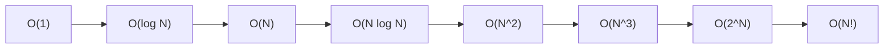

常用规则：

- 若 \(T_1(N)=O(f(N))\)，\(T_2(N)=O(g(N))\)，则 \(T_1+T_2=O(\max(f,g))\)。
- 若 \(T_1(N)=O(f(N))\)，\(T_2(N)=O(g(N))\)，则 \(T_1T_2=O(fg)\)。
- 多项式只保留最高次项：\(3N^2+10N+7=O(N^2)\)。
- 对数底数在渐进复杂度中只差常数：\(\log_a N=\Theta(\log_b N)\)。

### 1.4 最大子列和：同一问题的四种算法 { #note-sec-009 }

问题：给定可能含负数的整数序列 \(A_1,A_2,\ldots,A_N\)，求连续子列的最大和。如果所有数都为负，课件约定最大和为 0。

#### 算法 1：三重循环，枚举所有区间 { #note-sec-010 }

```c
int MaxSubsequenceSum(const int A[], int N) {
    int ThisSum, MaxSum = 0;
    for (int i = 0; i < N; ++i) {
        for (int j = i; j < N; ++j) {
            ThisSum = 0;
            for (int k = i; k <= j; ++k)
                ThisSum += A[k];
            if (ThisSum > MaxSum)
                MaxSum = ThisSum;
        }
    }
    return MaxSum;
}
```

区间有 \(O(N^2)\) 个，每个区间求和又可能是 \(O(N)\)，总复杂度 \(O(N^3)\)。

#### 算法 2：枚举右端点时累加 { #note-sec-011 }

```c
int MaxSubsequenceSum(const int A[], int N) {
    int ThisSum, MaxSum = 0;
    for (int i = 0; i < N; ++i) {
        ThisSum = 0;
        for (int j = i; j < N; ++j) {
            ThisSum += A[j];
            if (ThisSum > MaxSum)
                MaxSum = ThisSum;
        }
    }
    return MaxSum;
}
```

内层不再重复求区间和，总复杂度降为 \(O(N^2)\)。这个优化的核心是复用前一次区间和。

#### 算法 3：分治 { #note-sec-012 }

最大子列要么完全在左半边，要么完全在右半边，要么跨过中点。

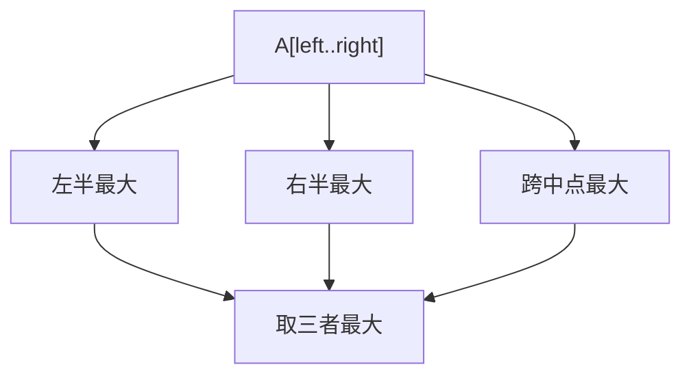

递推式为 \(T(N)=2T(N/2)+O(N)\)，因此复杂度为 \(O(N\log N)\)。

#### 算法 4：在线算法 { #note-sec-013 }

在线算法只扫描一遍，任何时刻都能给出当前前缀的答案。

```c
int MaxSubsequenceSum(const int A[], int N) {
    int ThisSum = 0, MaxSum = 0;
    for (int j = 0; j < N; ++j) {
        ThisSum += A[j];
        if (ThisSum > MaxSum)
            MaxSum = ThisSum;
        else if (ThisSum < 0)
            ThisSum = 0;
    }
    return MaxSum;
}
```

关键直觉：如果当前前缀和已经小于 0，那么它只会拖累后面的子列，应该丢弃并从下一个位置重新开始。复杂度 \(O(N)\)，额外空间 \(O(1)\)。

### 1.5 二分查找与对数复杂度 { #note-sec-014 }

二分查找要求数组有序。每次比较后，搜索区间至少减半。

```c
int BinarySearch(const ElementType A[], ElementType X, int N) {
    int Low = 0, High = N - 1;
    while (Low <= High) {
        int Mid = (Low + High) / 2;
        if (A[Mid] < X)
            Low = Mid + 1;
        else if (A[Mid] > X)
            High = Mid - 1;
        else
            return Mid;
    }
    return -1;
}
```

如果问题规模每次变为原来的一半，最多能减半 \(\log_2 N\) 次，所以时间复杂度为 \(O(\log N)\)。

### 1.6 检查复杂度分析 { #note-sec-015 }

课件给出一种很实用的实验检验方法：看输入翻倍时运行时间大约乘以多少。

| 假设复杂度 | 输入从 \(N\) 到 \(2N\) | 理论比值 |
|---|---:|---:|
| \(O(N)\) | \(T(2N)/T(N)\) | 约 2 |
| \(O(N^2)\) | \(T(2N)/T(N)\) | 约 4 |
| \(O(N^3)\) | \(T(2N)/T(N)\) | 约 8 |
| \(O(\log N)\) | 增长很慢 | 约 \(\log(2N)/\log N\) |

实验不能证明复杂度，但能发现明显错误。例如你以为算法是 \(O(N)\)，测出来翻倍后接近 4 倍，就要检查是否有隐藏的嵌套循环。

## 2. 抽象数据类型与线性表 { #note-sec-016 }

### 2.1 ADT：把“是什么”和“怎么做”分开 { #note-sec-017 }

数据类型可以看成 `{对象集合} + {操作集合}`。抽象数据类型 ADT 更强调接口和语义，而不是具体实现。

以线性表为例：

- 对象：\((item_0,item_1,\ldots,item_{N-1})\)。
- 操作：求长度、打印、查找第 k 个元素、查找某元素位置、插入、删除等。
- 实现：数组、链表、游标链表都可以实现同一个 List ADT。

这就是抽象的价值：用户只关心 `Insert`、`Delete`、`Find` 的行为；实现者负责选择结构并控制复杂度。

### 2.2 数组实现线性表 { #note-sec-018 }

数组实现使用连续内存，天然支持随机访问：

| 操作 | 复杂度 | 原因 |
|---|---:|---|
| `Find_Kth(k)` | \(O(1)\) | 地址可直接计算 |
| `Find(x)` | \(O(N)\) | 需要顺序扫描 |
| 在末尾插入 | 平均可为 \(O(1)\) | 若容量足够 |
| 在中间插入 | \(O(N)\) | 后续元素需要右移 |
| 删除中间元素 | \(O(N)\) | 后续元素需要左移 |

数组的主要问题是容量需要预估，扩容需要搬迁元素；中间插入删除代价高。

### 2.3 链表实现线性表 { #note-sec-019 }

链表由节点组成，每个节点保存数据和指向下一节点的指针。

```c
typedef struct Node *PtrToNode;
struct Node {
    ElementType Element;
    PtrToNode Next;
};
typedef PtrToNode List;
typedef PtrToNode Position;
```

使用头节点可以统一空表、首元节点插入和普通插入的处理。

#### 插入 { #note-sec-020 }

在位置 `P` 后插入 `X`：

```c
void Insert(ElementType X, List L, Position P) {
    Position TmpCell = malloc(sizeof(struct Node));
    if (TmpCell == NULL)
        FatalError("Out of space");
    TmpCell->Element = X;
    TmpCell->Next = P->Next;
    P->Next = TmpCell;
}
```

链表插入本身是 \(O(1)\)，但前提是已经拿到位置 `P`。如果还要先查找 `P`，总复杂度会包含查找的 \(O(N)\)。

#### 删除 { #note-sec-021 }

删除值为 `X` 的第一个节点：

```c
void Delete(ElementType X, List L) {
    Position P = FindPrevious(X, L);
    if (!IsLast(P, L)) {
        Position TmpCell = P->Next;
        P->Next = TmpCell->Next;
        free(TmpCell);
    }
}
```

删除需要找到前驱节点，因为单链表无法从当前节点直接回到前一个节点。

### 2.4 双向循环链表 { #note-sec-022 }

双向链表节点有 `Prev` 和 `Next` 两个方向。循环链表让尾节点指向头节点，使“从末尾回到开头”变成自然操作。

适合场景：

- 需要频繁向前、向后移动。
- 需要在已知节点前后插入删除。
- 需要轮转处理任务，例如循环调度。

代价：

- 每个节点多一个指针，空间增加。
- 插入删除时要维护两条链接，代码更容易写错。

### 2.5 多项式 ADT { #note-sec-023 }

多项式可表示为若干项 `<指数, 系数>`：

\(P(x)=a_1x^{e_1}+a_2x^{e_2}+\cdots+a_nx^{e_n}\)

两种常见表示：

| 表示 | 适合场景 | 缺点 |
|---|---|---|
| 系数数组 | 最高次数不大且较密集 | 稀疏多项式浪费空间 |
| 按指数有序链表 | 稀疏多项式 | 查找某次项较慢 |

多项式相加的核心是“归并”：

```c
while (P != NULL && Q != NULL) {
    if (P->Exponent > Q->Exponent) {
        Attach(P->Coefficient, P->Exponent, &Rear);
        P = P->Next;
    } else if (P->Exponent < Q->Exponent) {
        Attach(Q->Coefficient, Q->Exponent, &Rear);
        Q = Q->Next;
    } else {
        int sum = P->Coefficient + Q->Coefficient;
        if (sum != 0)
            Attach(sum, P->Exponent, &Rear);
        P = P->Next;
        Q = Q->Next;
    }
}
```

这和合并两个有序表类似，复杂度为两个多项式项数之和。

### 2.6 多重链表与稀疏矩阵 { #note-sec-024 }

多重链表用于一个节点同时属于多个逻辑链表。例如课程注册系统：

- 从课程角度：一门课连接所有选课学生。
- 从学生角度：一个学生连接所有已选课程。

同一个“选课关系”节点可以同时挂在课程链和学生链上，避免重复存储关系。

稀疏矩阵也常用类似思想：只存非零元素，并为行、列分别建立链接。若非零元素个数为 \(K\)，空间就能从 \(O(RC)\) 降到 \(O(K)\)。

### 2.7 游标实现链表 { #note-sec-025 }

某些语言或场景没有指针，可以用数组下标模拟指针。课件称为 cursor implementation。

```c
typedef int PtrToNode;
typedef PtrToNode List;
typedef PtrToNode Position;

struct Node {
    ElementType Element;
    Position Next;
};

struct Node CursorSpace[SpaceSize];
```

`CursorSpace[i].Next` 存下一个节点的下标。数组 0 号位置通常作为空闲链表头，模拟 `malloc` 和 `free`。

核心思想：指针本质上也是“地址”。当真实地址不可用时，下标也可以承担连接关系。

## 3. 栈与队列 { #note-sec-026 }

### 3.1 栈 ADT { #note-sec-027 }

栈是 LIFO 结构：Last-In-First-Out，后进先出。只允许在栈顶插入和删除。

| 操作 | 含义 |
|---|---|
| `IsEmpty(S)` | 判断是否为空 |
| `CreateStack()` | 创建栈 |
| `MakeEmpty(S)` | 清空 |
| `Push(X,S)` | 入栈 |
| `Top(S)` | 读取栈顶 |
| `Pop(S)` | 弹出栈顶 |

数组栈：

```c
struct StackRecord {
    int Capacity;
    int TopOfStack;
    ElementType *Array;
};

void Push(ElementType X, Stack S) {
    if (IsFull(S))
        Error("Full stack");
    else
        S->Array[++S->TopOfStack] = X;
}

ElementType TopAndPop(Stack S) {
    if (IsEmpty(S))
        Error("Empty stack");
    return S->Array[S->TopOfStack--];
}
```

链式栈也很常见，栈顶放在链表头部，`Push` 和 `Pop` 都是 \(O(1)\)。

### 3.2 栈应用一：括号匹配 { #note-sec-028 }

问题：检查 `()[]{}` 是否平衡。

算法：

1. 从左到右扫描。
2. 遇到左括号，压栈。
3. 遇到右括号，若栈空则失败；否则弹出栈顶并检查类型是否匹配。
4. 扫描结束后，栈必须为空。

```c
bool IsBalanced(const char *s) {
    Stack st = CreateStack();
    for (int i = 0; s[i] != '\0'; ++i) {
        if (s[i] == '(' || s[i] == '[' || s[i] == '{')
            Push(s[i], st);
        else if (s[i] == ')' || s[i] == ']' || s[i] == '}') {
            if (IsEmpty(st))
                return false;
            char t = TopAndPop(st);
            if (!Match(t, s[i]))
                return false;
        }
    }
    return IsEmpty(st);
}
```

栈保存的是“尚未被匹配的最近左括号”。

### 3.3 栈应用二：后缀表达式求值 { #note-sec-029 }

中缀表达式：`a + b * c - d / e`  
后缀表达式：`a b c * + d e / -`

后缀表达式没有括号也能表达优先级。求值规则：

- 遇到操作数，压栈。
- 遇到运算符，弹出所需数量的操作数，计算后把结果压回。

例：`6 5 2 3 + 8 * + 3 + *`

每个 token 进出栈常数次，复杂度 \(O(N)\)。

### 3.4 栈应用三：中缀转后缀 { #note-sec-030 }

核心原则：

- 操作数直接输出。
- 运算符进入栈前，要弹出所有优先级不低于它的栈顶运算符。
- 左括号直接入栈。
- 右括号触发弹栈，直到遇到左括号。

处理 `a * (b + c) / d`：

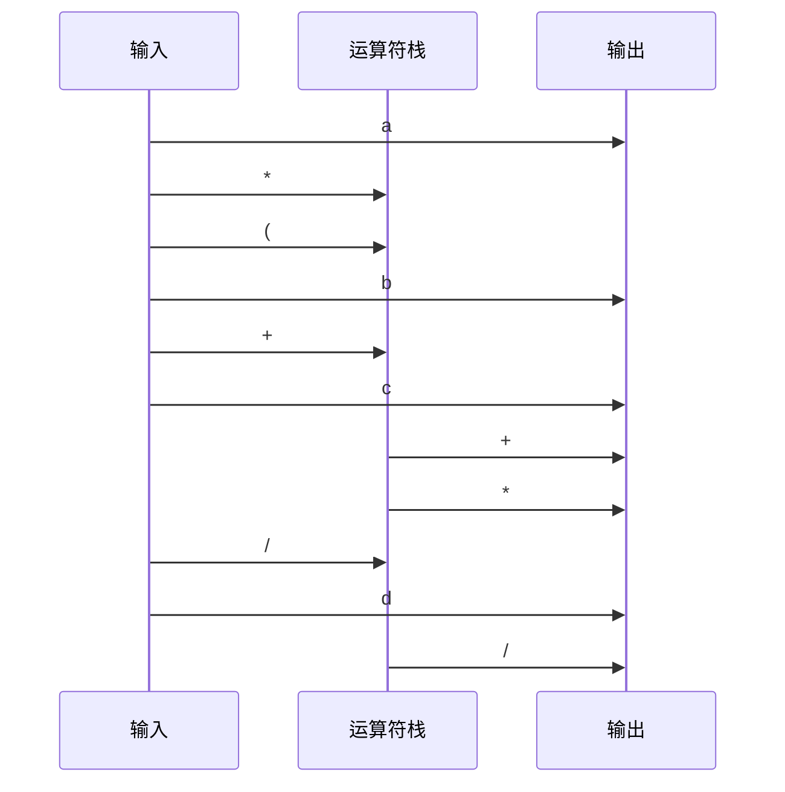

输出为 `a b c + * d /`。

### 3.5 系统栈与递归 { #note-sec-031 }

函数调用也依赖栈。每次调用都会形成一个栈帧，通常包含：

- 返回地址。
- 参数。
- 局部变量。
- 保存的寄存器或临时状态。

递归函数之所以能工作，是因为每一层调用都有自己的栈帧。递归过深时会栈溢出。

### 3.6 队列 ADT { #note-sec-032 }

队列是 FIFO 结构：First-In-First-Out，先进先出。插入发生在队尾，删除发生在队头。

| 操作 | 含义 |
|---|---|
| `IsEmpty(Q)` | 判断是否为空 |
| `CreateQueue()` | 创建队列 |
| `MakeEmpty(Q)` | 清空 |
| `Enqueue(X,Q)` | 入队 |
| `Front(Q)` | 读取队头 |
| `Dequeue(Q)` | 出队 |

队列常用于：

- 广度优先搜索。
- 操作系统任务排队。
- 拓扑排序中的零入度顶点集合。
- 缓冲区和生产者消费者模型。

### 3.7 循环队列 { #note-sec-033 }

数组队列如果每次出队都移动元素，会退化为 \(O(N)\)。循环队列用下标取模避免搬迁。

```c
struct QueueRecord {
    int Capacity;
    int Front;
    int Rear;
    int Size;
    ElementType *Array;
};

void Enqueue(ElementType X, Queue Q) {
    if (IsFull(Q))
        Error("Full queue");
    Q->Size++;
    Q->Rear = (Q->Rear + 1) % Q->Capacity;
    Q->Array[Q->Rear] = X;
}

ElementType Dequeue(Queue Q) {
    if (IsEmpty(Q))
        Error("Empty queue");
    Q->Size--;
    ElementType X = Q->Array[Q->Front];
    Q->Front = (Q->Front + 1) % Q->Capacity;
    return X;
}
```

是否使用 `Size` 是一个设计选择。如果不用 `Size`，需要牺牲一个数组位置来区分空和满。

## 4. 树与二叉树 { #note-sec-034 }

### 4.1 树的基本术语 { #note-sec-035 }

树是节点的集合。空集合是树；非空树由根节点和若干棵互不相交的子树组成。

常用术语：

| 术语 | 含义 |
|---|---|
| root | 根节点 |
| edge/branch | 边，父子节点之间的连接 |
| parent/child | 父节点/子节点 |
| sibling | 兄弟节点 |
| leaf | 叶节点，度为 0 |
| degree of node | 节点的子树个数 |
| degree of tree | 所有节点度数的最大值 |
| ancestors | 从节点到根路径上的所有祖先 |
| descendants | 节点子树中的所有后代 |
| depth | 从根到该节点的路径长度 |
| height | 从该节点到最深叶子的路径长度 |

树的核心特征是层次关系。很多递归问题天然适合树结构，因为每棵子树又是同类问题。

### 4.2 树的表示 { #note-sec-036 }

#### 括号表示 { #note-sec-037 }

例如：

```text
A(B(E,F), C(G), D(H,I,J))
```

这种形式适合展示结构，但不适合直接高效操作。

#### FirstChild-NextSibling 表示 { #note-sec-038 }

每个节点只保留两个指针：

- `FirstChild`：第一个孩子。
- `NextSibling`：下一个兄弟。

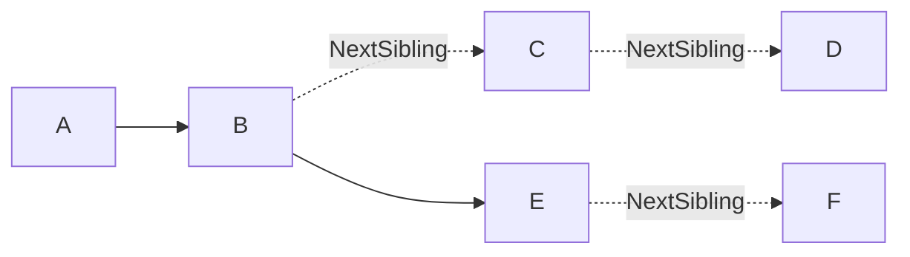

这个表示可以把任意树转化为二叉树形式：左指针指向第一个孩子，右指针指向下一个兄弟。

### 4.3 二叉树 { #note-sec-039 }

二叉树中每个节点最多有两个孩子，并且左右孩子有区别。

重要性质：

| 性质 | 说明 |
|---|---|
| 第 \(i\) 层最多有 \(2^{i-1}\) 个节点 | 根为第 1 层 |
| 深度为 \(k\) 的二叉树最多有 \(2^k-1\) 个节点 | 满二叉树达到上界 |
| 非空二叉树中 \(n_0=n_2+1\) | 叶节点数等于度为 2 的节点数加 1 |

\(n_0=n_2+1\) 的证明思路：

- 总节点数 \(n=n_0+n_1+n_2\)。
- 非根节点都有一条来自父节点的边，所以边数 \(B=n-1\)。
- 边也可以按父节点贡献数计算：\(B=n_1+2n_2\)。
- 联立得到 \(n_0=n_2+1\)。

### 4.4 表达式树 { #note-sec-040 }

表达式树中：

- 叶节点是操作数。
- 内部节点是运算符。
- 左右子树分别表示运算符的左右操作数。

表达式 `A + B * C / D` 可以理解为：

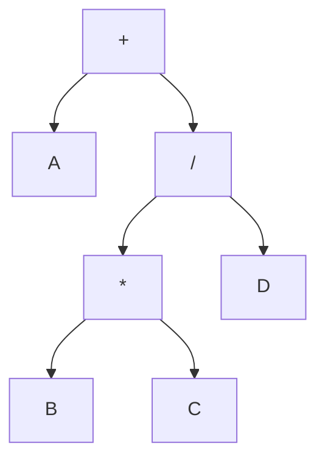

对表达式树做不同遍历，会得到不同表达式形式：

| 遍历 | 结果类型 |
|---|---|
| 先序 | 前缀表达式 |
| 中序 | 中缀表达式，需要括号辅助 |
| 后序 | 后缀表达式 |

### 4.5 树遍历 { #note-sec-041 }

遍历就是每个节点恰好访问一次。

#### 先序遍历 { #note-sec-042 }

根、左、右。

```c
void Preorder(Tree T) {
    if (T != NULL) {
        Visit(T);
        Preorder(T->Left);
        Preorder(T->Right);
    }
}
```

适合复制树、输出目录树结构。

#### 中序遍历 { #note-sec-043 }

左、根、右。

```c
void Inorder(Tree T) {
    if (T != NULL) {
        Inorder(T->Left);
        Visit(T);
        Inorder(T->Right);
    }
}
```

对二叉搜索树做中序遍历，会得到有序序列。

#### 后序遍历 { #note-sec-044 }

左、右、根。

```c
void Postorder(Tree T) {
    if (T != NULL) {
        Postorder(T->Left);
        Postorder(T->Right);
        Visit(T);
    }
}
```

适合释放树、计算目录大小，因为必须先处理子树再处理根。

#### 层序遍历 { #note-sec-045 }

使用队列：

```c
void Levelorder(Tree T) {
    Queue Q = CreateQueue();
    if (T != NULL)
        Enqueue(T, Q);
    while (!IsEmpty(Q)) {
        Tree X = Dequeue(Q);
        Visit(X);
        if (X->Left != NULL) Enqueue(X->Left, Q);
        if (X->Right != NULL) Enqueue(X->Right, Q);
    }
}
```

### 4.6 递归遍历与非递归遍历 { #note-sec-046 }

递归遍历依赖系统栈。中序遍历可以手动用栈实现：

```c
void IterativeInorder(Tree T) {
    Stack S = CreateStack();
    while (T != NULL || !IsEmpty(S)) {
        while (T != NULL) {
            Push(T, S);
            T = T->Left;
        }
        T = TopAndPop(S);
        Visit(T);
        T = T->Right;
    }
}
```

这个版本把“不断向左走并保存沿途节点”的动作显式化了。

### 4.7 线索二叉树 { #note-sec-047 }

普通二叉树有很多空指针。线索二叉树用这些空指针保存遍历意义下的前驱或后继：

- 如果 `Left` 为空，则指向中序前驱。
- 如果 `Right` 为空，则指向中序后继。

为了区分真实孩子和线索，节点需要额外标记位，例如 `LeftThread`、`RightThread`。

线索化的目的不是改变树的逻辑结构，而是让某种遍历可以在不递归、不显式栈的情况下进行。

## 5. 二叉搜索树 { #note-sec-048 }

### 5.1 定义 { #note-sec-049 }

二叉搜索树 BST 可以为空；若非空，则满足：

1. 每个节点有一个可比较的关键字。
2. 左子树中所有关键字小于该节点关键字。
3. 右子树中所有关键字大于该节点关键字。
4. 左右子树也都是二叉搜索树。

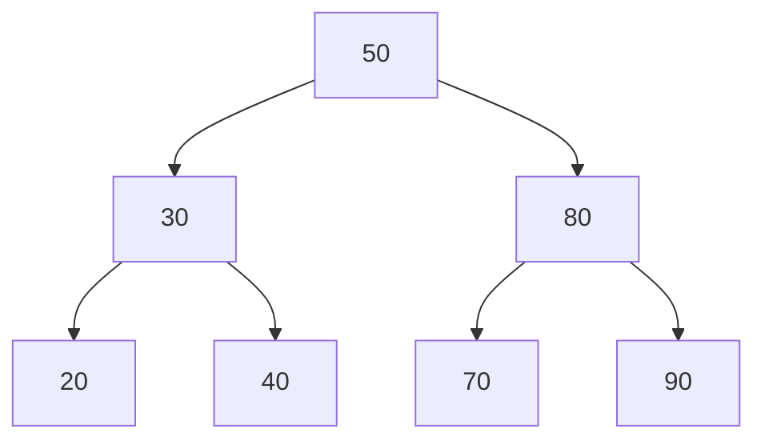

BST 的本质是把二分查找的思想从数组扩展到动态集合。

### 5.2 查找 { #note-sec-050 }

```c
Position Find(ElementType X, SearchTree T) {
    if (T == NULL)
        return NULL;
    if (X < T->Element)
        return Find(X, T->Left);
    else if (X > T->Element)
        return Find(X, T->Right);
    else
        return T;
}
```

每一步只进入一棵子树。复杂度为 \(O(h)\)，\(h\) 是树高。若树平衡，\(h=O(\log N)\)；若退化成链，\(h=O(N)\)。

### 5.3 查找最小值和最大值 { #note-sec-051 }

最小值一路向左，最大值一路向右。

```c
Position FindMin(SearchTree T) {
    if (T == NULL)
        return NULL;
    while (T->Left != NULL)
        T = T->Left;
    return T;
}

Position FindMax(SearchTree T) {
    if (T == NULL)
        return NULL;
    while (T->Right != NULL)
        T = T->Right;
    return T;
}
```

### 5.4 插入 { #note-sec-052 }

插入过程和查找类似，找到空位置后创建节点。

```c
SearchTree Insert(ElementType X, SearchTree T) {
    if (T == NULL) {
        T = malloc(sizeof(struct TreeNode));
        if (T == NULL)
            FatalError("Out of space");
        T->Element = X;
        T->Left = T->Right = NULL;
    } else if (X < T->Element) {
        T->Left = Insert(X, T->Left);
    } else if (X > T->Element) {
        T->Right = Insert(X, T->Right);
    }
    return T;
}
```

如果不允许重复关键字，`X == T->Element` 时什么也不做。若允许重复，需要约定重复元素放左边、右边或在节点中维护计数。

### 5.5 删除 { #note-sec-053 }

删除分三种情况：

| 情况 | 处理 |
|---|---|
| 叶节点 | 直接删除，父链接置空 |
| 只有一个孩子 | 用唯一孩子替代该节点 |
| 有两个孩子 | 用右子树最小值或左子树最大值替代，再删除替代节点 |

```c
SearchTree Delete(ElementType X, SearchTree T) {
    Position TmpCell;
    if (T == NULL)
        Error("Element not found");
    else if (X < T->Element)
        T->Left = Delete(X, T->Left);
    else if (X > T->Element)
        T->Right = Delete(X, T->Right);
    else if (T->Left && T->Right) {
        TmpCell = FindMin(T->Right);
        T->Element = TmpCell->Element;
        T->Right = Delete(T->Element, T->Right);
    } else {
        TmpCell = T;
        if (T->Left == NULL)
            T = T->Right;
        else if (T->Right == NULL)
            T = T->Left;
        free(TmpCell);
    }
    return T;
}
```

两个孩子时，用右子树最小值替换，是因为它刚好大于左子树所有节点、又不大于右子树其他节点，能保持 BST 不变量。

### 5.6 懒惰删除 { #note-sec-054 }

如果删除不频繁，或删除后仍可能再次插入同一关键字，可以给节点加一个 `Deleted` 标记：

- 删除时只标记为 inactive。
- 查找时忽略 inactive 节点。
- 插入时如果找到 inactive 同值节点，可以重新激活。

懒惰删除避免频繁调整指针，但会让树中无效节点越来越多，需要定期重建或清理。

### 5.7 平均情况与退化 { #note-sec-055 }

BST 的高度取决于插入顺序。

- 插入顺序随机时，平均高度通常为 \(O(\log N)\) 量级。
- 按递增顺序插入时，树退化为链，操作变成 \(O(N)\)。

这就是后续平衡树存在的原因。当前课件主要讲 BST，但理解退化风险非常重要。

## 6. 优先队列与二叉堆 { #note-sec-056 }

### 6.1 优先队列 ADT { #note-sec-057 }

优先队列维护一组元素，每次可以取出优先级最高或最低的元素。课件以 `DeleteMin` 为主，即最小堆。

| 操作 | 含义 |
|---|---|
| `Initialize(MaxElements)` | 初始化 |
| `Insert(X,H)` | 插入 |
| `DeleteMin(H)` | 删除并返回最小元素 |
| `FindMin(H)` | 返回最小元素但不删除 |

### 6.2 简单实现对比 { #note-sec-058 }

| 实现 | 插入 | 删除最小值 | 评价 |
|---|---:|---:|---|
| 无序数组/链表 | \(O(1)\) | \(O(N)\) | 插入快，删除慢 |
| 有序数组/链表 | \(O(N)\) | \(O(1)\) | 删除快，插入慢 |
| 二叉搜索树 | 平均 \(O(\log N)\) | 平均 \(O(\log N)\) | 依赖平衡性 |
| 二叉堆 | \(O(\log N)\) | \(O(\log N)\) | 实现简单，常数小 |

### 6.3 二叉堆的两个性质 { #note-sec-059 }

二叉堆是满足两个性质的二叉树：

1. 结构性质：完全二叉树。
2. 堆序性质：最小堆中，每个节点的关键字不大于其孩子。

完全二叉树适合用数组存储。若节点下标从 1 开始：

| 节点 | 下标 |
|---|---|
| 父节点 | `i / 2` |
| 左孩子 | `2 * i` |
| 右孩子 | `2 * i + 1` |

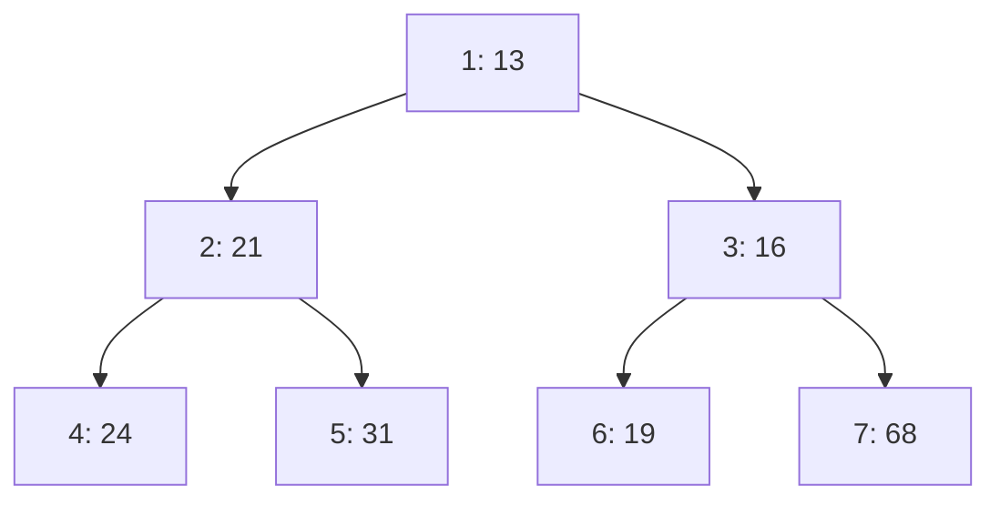

数组表示避免了指针，并且能用简单下标计算父子关系。

### 6.4 插入：上滤 { #note-sec-060 }

插入时先把新元素放在完全二叉树的下一个空位，然后一路与父节点比较，必要时上移。

```c
void Insert(ElementType X, PriorityQueue H) {
    int i;
    if (IsFull(H))
        Error("Priority queue is full");
    for (i = ++H->Size; H->Elements[i / 2] > X; i /= 2)
        H->Elements[i] = H->Elements[i / 2];
    H->Elements[i] = X;
}
```

`Elements[0]` 常作为哨兵，放一个小于所有合法元素的值，避免循环中反复判断 `i > 1`。

插入复杂度为树高 \(O(\log N)\)。

### 6.5 删除最小值：下滤 { #note-sec-061 }

最小值在根节点。删除根后，为了保持完全二叉树，必须拿最后一个元素来填根，再把它下滤到合适位置。

```c
ElementType DeleteMin(PriorityQueue H) {
    int i, Child;
    ElementType MinElement, LastElement;
    if (IsEmpty(H))
        Error("Priority queue is empty");

    MinElement = H->Elements[1];
    LastElement = H->Elements[H->Size--];

    for (i = 1; i * 2 <= H->Size; i = Child) {
        Child = i * 2;
        if (Child != H->Size &&
            H->Elements[Child + 1] < H->Elements[Child])
            Child++;
        if (LastElement > H->Elements[Child])
            H->Elements[i] = H->Elements[Child];
        else
            break;
    }
    H->Elements[i] = LastElement;
    return MinElement;
}
```

下滤每层选择较小孩子，保证被移动上来的孩子仍不大于它原本的子树。复杂度 \(O(\log N)\)。

### 6.6 建堆 { #note-sec-062 }

如果有 \(N\) 个元素，逐个插入是 \(O(N\log N)\)。更快的方法是从最后一个非叶节点开始，向前逐个下滤。

```c
void BuildHeap(PriorityQueue H) {
    for (int i = H->Size / 2; i > 0; --i)
        PercolateDown(i, H);
}
```

虽然单次下滤最坏是 \(O(\log N)\)，但多数节点高度很低，总成本为 \(O(N)\)。

### 6.7 其他操作和应用 { #note-sec-063 }

堆还支持：

- `DecreaseKey(P, Delta, H)`：降低某位置关键字后上滤。
- `IncreaseKey(P, Delta, H)`：增加某位置关键字后下滤。
- `Delete(P,H)`：把位置 `P` 的关键字降到负无穷，再 `DeleteMin`。

典型应用：

- 找第 k 大/第 k 小元素。
- 操作系统按优先级调度任务。
- 图算法中的 Dijkstra、Prim。
- 事件模拟中按时间取下一个事件。

### 6.8 d-堆 { #note-sec-064 }

d-堆是每个节点有 d 个孩子的堆。

- 高度变为 \(O(\log_d N)\)，插入可能更快。
- `DeleteMin` 每层需要在 d 个孩子中找最小，比较次数增加。

所以 d 不是越大越好，要根据插入和删除比例选择。

## 7. 并查集 { #note-sec-065 }

### 7.1 等价关系 { #note-sec-066 }

关系 `~` 是集合 `S` 上的等价关系，当且仅当满足：

| 性质 | 形式 | 解释 |
|---|---|---|
| 自反性 | \(a \sim a\) | 自己与自己等价 |
| 对称性 | 若 \(a\sim b\)，则 \(b\sim a\) | 等价不分方向 |
| 传递性 | 若 \(a\sim b\) 且 \(b\sim c\)，则 \(a\sim c\) | 等价可以串起来 |

等价关系会把集合划分为若干互不相交的等价类。

### 7.2 动态等价问题 { #note-sec-067 }

给定若干元素，持续接收两类操作：

- `Union(a,b)`：声明 `a` 与 `b` 等价，合并所在集合。
- `Find(a)`：返回 `a` 所在集合的代表元，用于判断两个元素是否等价。

如果 `Find(a) == Find(b)`，说明两者在同一集合中。

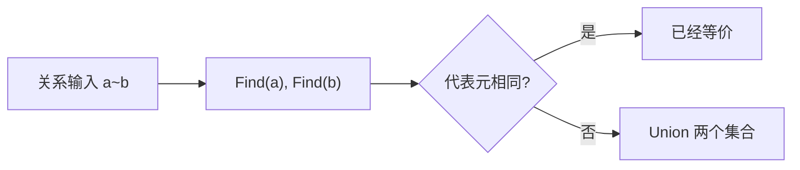

### 7.3 基本表示 { #note-sec-068 }

并查集用一片森林表示若干集合。每棵树的根是集合代表元。数组 `S[x]` 保存父节点：

- 若 `S[x] < 0`，`x` 是根。
- 若 `S[x] >= 0`，`S[x]` 是 `x` 的父节点。

```c
typedef int DisjSet[NumSets + 1];
typedef int SetType;
typedef int ElementType;
```

朴素 `Find`：

```c
SetType Find(ElementType X, DisjSet S) {
    if (S[X] <= 0)
        return X;
    else
        return Find(S[X], S);
}
```

朴素 `Union` 只需让一个根指向另一个根：

```c
void SetUnion(DisjSet S, SetType Root1, SetType Root2) {
    S[Root2] = Root1;
}
```

问题是如果总把大树挂到小树下面，树可能退化成链，`Find` 变成 \(O(N)\)。

### 7.4 按大小合并与按高度合并 { #note-sec-069 }

按大小合并：让小树挂到大树下面。根节点存负数，其绝对值表示集合大小。

```c
void SetUnion(DisjSet S, SetType Root1, SetType Root2) {
    if (S[Root2] < S[Root1]) {
        S[Root1] = Root2;
    } else {
        if (S[Root1] == S[Root2])
            S[Root1]--;
        S[Root2] = Root1;
    }
}
```

上面代码更接近按高度合并：根节点负值表示高度或秩。若两棵树高度相同，合并后高度加 1；否则矮树挂到高树下，高度不变。

这类策略的共同目标是控制树高。

### 7.5 路径压缩 { #note-sec-070 }

路径压缩在 `Find` 过程中，把沿途节点直接挂到根上。

```c
SetType Find(ElementType X, DisjSet S) {
    if (S[X] <= 0)
        return X;
    else
        return S[X] = Find(S[X], S);
}
```

一次 `Find` 可能仍会走较长路径，但它会顺手把路径拍平，让后续查询更快。

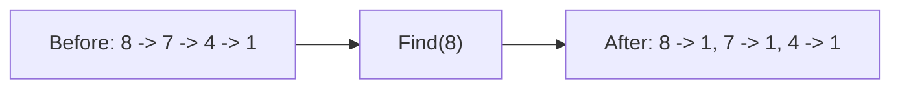

### 7.6 复杂度 { #note-sec-071 }

按秩合并加路径压缩后，`M` 次混合操作的总时间近似线性，严格界与反 Ackermann 函数 \(\alpha(M,N)\) 有关。

实际理解时可以记住：

> 对任何现实规模的数据，\(\alpha(N)\) 都小得像常数，因此并查集操作几乎可以看成均摊 \(O(1)\)。

但这不是普通常数时间，而是强优化策略共同作用的均摊结果。

### 7.7 典型应用 { #note-sec-072 }

- 判断无向图连通分量。
- Kruskal 最小生成树中判断加边是否成环。
- 网络连接问题。
- 等价类归并，例如账户合并、朋友关系合并。

## 8. 线段树 { #note-sec-073 }

### 8.1 动机 { #note-sec-074 }

给定数组 `A[0..N-1]`，需要频繁回答区间 `[L,R]` 的和、最大值或最小值。

朴素查询：

```c
ElementType Query(ElementType A[], int L, int R) {
    ElementType sum = 0;
    for (int i = L; i <= R; ++i)
        sum += A[i];
    return sum;
}
```

一次 \(O(N)\)。如果查询很多，就会非常慢。

线段树把数组区间递归拆成左右两半，每个节点维护一个区间的聚合值。

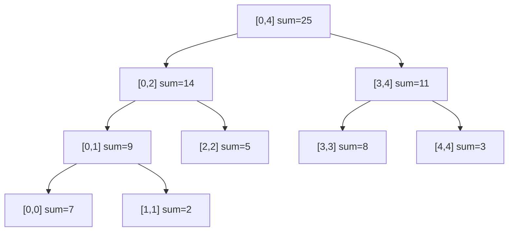

### 8.2 适用的“算子” { #note-sec-075 }

线段树不只适用于求和。只要区间答案可以由左右子区间答案合并，就可以考虑线段树。

常见算子：

| 查询 | 合并算子 | 单位元 |
|---|---|---|
| 区间和 | `+` | 0 |
| 区间最大值 | `max` | 负无穷 |
| 区间最小值 | `min` | 正无穷 |
| 区间 gcd | `gcd` | 0 |

核心要求通常是结合律：\((a \circ b)\circ c = a\circ(b\circ c)\)。这样区间可以被拆成若干段后再合并。

### 8.3 建树 { #note-sec-076 }

数组实现时，节点编号 `node` 的左右孩子常用 `2*node` 和 `2*node+1`。若原数组长度为 `N`，线段树数组通常开 `4*N` 足够。

```c
struct SegmentNode {
    int start, end;
    int sum;
    int lazy;
} tree[MAXN * 4];

void Build(int node, int start, int end) {
    tree[node].start = start;
    tree[node].end = end;
    tree[node].lazy = 0;
    if (start == end) {
        tree[node].sum = A[start];
        return;
    }
    int mid = (start + end) / 2;
    Build(node * 2, start, mid);
    Build(node * 2 + 1, mid + 1, end);
    tree[node].sum = tree[node * 2].sum + tree[node * 2 + 1].sum;
}
```

建树访问每个节点一次，复杂度 \(O(N)\)。

### 8.4 区间查询 { #note-sec-077 }

查询 `[L,R]` 与当前节点区间 `[start,end]` 有三种关系：

| 情况 | 处理 |
|---|---|
| 完全覆盖 | 直接返回当前节点值 |
| 完全不相交 | 返回单位元 |
| 部分重叠 | 递归查询左右孩子并合并 |

```c
int Query(int node, int L, int R) {
    int start = tree[node].start;
    int end = tree[node].end;
    if (L <= start && end <= R)
        return tree[node].sum;
    if (end < L || R < start)
        return 0;
    PushDown(node);
    return Query(node * 2, L, R) + Query(node * 2 + 1, L, R);
}
```

查询复杂度 \(O(\log N)\)。直觉是一个区间最多被拆成少量覆盖节点，每层只会访问有限个相关节点。

### 8.5 点更新 { #note-sec-078 }

把 `A[idx]` 改成 `val`，只影响从叶子到根的一条路径。

```c
void Update(int node, int idx, int val) {
    int start = tree[node].start;
    int end = tree[node].end;
    if (start == end) {
        tree[node].sum = val;
        return;
    }
    PushDown(node);
    int mid = (start + end) / 2;
    if (idx <= mid)
        Update(node * 2, idx, val);
    else
        Update(node * 2 + 1, idx, val);
    tree[node].sum = tree[node * 2].sum + tree[node * 2 + 1].sum;
}
```

复杂度 \(O(\log N)\)。

### 8.6 区间更新与懒标记 { #note-sec-079 }

若要把 `[L,R]` 中每个元素都加上 `val`，逐点更新会变成 \(O(K\log N)\)。懒标记的思想是：

> 当某个节点区间被完全覆盖时，先更新该节点答案并记录一个标记，不立刻下传到孩子。等未来真的需要访问孩子时再下传。

```c
void Apply(int node, int val) {
    int len = tree[node].end - tree[node].start + 1;
    tree[node].sum += val * len;
    tree[node].lazy += val;
}

void PushDown(int node) {
    if (tree[node].lazy != 0) {
        Apply(node * 2, tree[node].lazy);
        Apply(node * 2 + 1, tree[node].lazy);
        tree[node].lazy = 0;
    }
}

void RangeUpdate(int node, int L, int R, int val) {
    int start = tree[node].start;
    int end = tree[node].end;
    if (L <= start && end <= R) {
        Apply(node, val);
        return;
    }
    if (end < L || R < start)
        return;
    PushDown(node);
    RangeUpdate(node * 2, L, R, val);
    RangeUpdate(node * 2 + 1, L, R, val);
    tree[node].sum = tree[node * 2].sum + tree[node * 2 + 1].sum;
}
```

区间更新和区间查询都保持 \(O(\log N)\)。

### 8.7 线段树常见错误 { #note-sec-080 }

- 查询区间和节点区间的边界判断写反。
- 忘记在访问孩子前 `PushDown`。
- `mid` 分割不一致，导致死递归。
- 开数组太小，建议 `4*N`。
- 对最大值、最小值查询时，完全不相交返回了错误单位元。

## 9. 图与拓扑排序 { #note-sec-081 }

### 9.1 图的基本定义 { #note-sec-082 }

图记为 \(G(V,E)\)：

- `V(G)` 是有限非空顶点集合。
- `E(G)` 是边集合。

无向边通常写作 `(v_i,v_j)`，有向边通常写作 `<v_i,v_j>`。

常用概念：

| 概念 | 含义 |
|---|---|
| adjacent | 两个顶点由边相连 |
| incident | 边与顶点关联 |
| subgraph | 顶点和边都是原图子集的图 |
| path | 顶点与边交替组成的可达序列 |
| cycle | 起点和终点相同的路径 |
| connected graph | 无向图中任意两点连通 |
| component | 无向图的极大连通子图 |
| strongly connected | 有向图中任意两点互相可达 |
| DAG | 有向无环图 |

树也可以看作特殊图：连通且无环的无向图。

### 9.2 图的存储 { #note-sec-083 }

#### 邻接矩阵 { #note-sec-084 }

用 `adj[n][n]` 存边。

| 操作 | 复杂度 |
|---|---:|
| 判断边 `(i,j)` 是否存在 | \(O(1)\) |
| 枚举某顶点所有邻接点 | \(O(N)\) |
| 空间 | \(O(N^2)\) |

适合稠密图或需要频繁判断两点是否相邻的场景。

#### 邻接表 { #note-sec-085 }

每个顶点维护一个链表，存它指向的邻接点。

| 操作 | 复杂度 |
|---|---:|
| 枚举某顶点所有邻接点 | 与该点度数成正比 |
| 判断某条边是否存在 | 最坏 \(O(d)\)，其中 \(d\) 为该点度数 |
| 空间 | \(O(V+E)\) |

适合稀疏图，是多数图算法的默认选择。

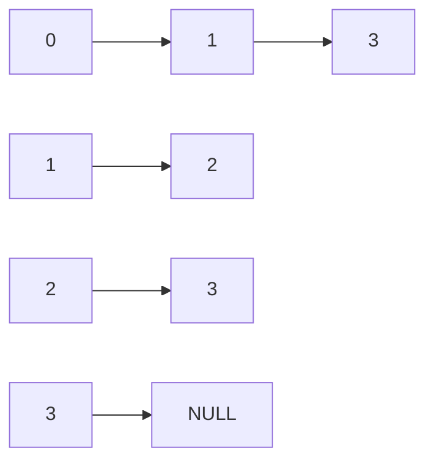

有向图中，邻接表天然方便统计出边；如果频繁需要入边，可以建立逆邻接表，或单独维护入度数组。

### 9.3 AOV 网络 { #note-sec-086 }

AOV Network 是用顶点表示活动、用有向边表示先后约束的图。

例如课程先修关系：

- 顶点：课程。
- 边 `<C1,C3>`：`C1` 是 `C3` 的先修课。

如果图中存在有向环，说明约束矛盾：课程 A 要先于 B，B 又间接要求先于 A。

### 9.4 拓扑序 { #note-sec-087 }

拓扑序是 DAG 顶点的一种线性排列，使得对每条有向边 `<u,v>`，`u` 都出现在 `v` 前面。

拓扑序可能不唯一。

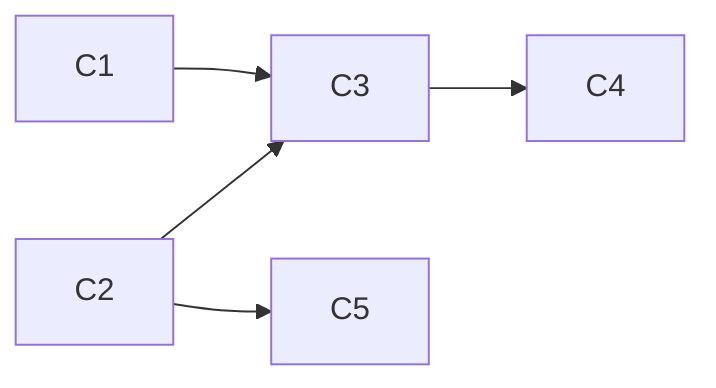

上图中，`C1, C2, C3, C5, C4` 和 `C2, C1, C5, C3, C4` 都可能是合法拓扑序。

### 9.5 朴素拓扑排序 { #note-sec-088 }

重复执行：

1. 找一个入度为 0 的未输出顶点。
2. 输出它。
3. 删除它及其出边。

如果每次都重新扫描所有顶点找入度 0，总复杂度可能达到 \(O(V^2)\)。

### 9.6 队列优化拓扑排序 { #note-sec-089 }

改进：用队列保存当前所有入度为 0 的顶点。

```c
void Topsort(Graph G) {
    Queue Q = CreateQueue(NumVertex);
    int Counter = 0;

    for (Vertex V = 0; V < G->NumVertex; ++V)
        if (Indegree[V] == 0)
            Enqueue(V, Q);

    while (!IsEmpty(Q)) {
        Vertex V = Dequeue(Q);
        TopNum[V] = ++Counter;
        for each W adjacent to V {
            if (--Indegree[W] == 0)
                Enqueue(W, Q);
        }
    }

    if (Counter != G->NumVertex)
        Error("Graph has a cycle");
}
```

使用邻接表时，每个顶点入队出队一次，每条边被检查一次，复杂度 \(O(V+E)\)。

### 9.7 拓扑排序的本质 { #note-sec-090 }

拓扑排序每次选择“当前没有前置依赖”的任务。它不是单纯排序，而是在逐步剥离依赖关系。

失败条件也很有意义：如果最后仍有顶点没有输出，说明剩余顶点都互相等待，图中存在环。

典型应用：

- 课程先修安排。
- 编译依赖。
- 构建系统任务排序。
- 数据处理流水线调度。
- 判断有向图是否存在环。

## 10. 全课复杂度速查 { #note-sec-091 }

| 结构/算法 | 关键操作 | 时间复杂度 | 备注 |
|---|---|---:|---|
| 数组表 | 第 k 个元素 | \(O(1)\) | 随机访问 |
| 数组表 | 中间插入/删除 | \(O(N)\) | 需要移动元素 |
| 单链表 | 已知位置后插入 | \(O(1)\) | 查找位置另算 |
| 单链表 | 查找元素 | \(O(N)\) | 顺序扫描 |
| 栈 | `Push/Pop/Top` | \(O(1)\) | 数组或链表均可 |
| 队列 | `Enqueue/Dequeue` | \(O(1)\) | 循环数组或链表 |
| 二叉树遍历 | 访问所有节点 | \(O(N)\) | 每节点一次 |
| BST | 查找/插入/删除 | \(O(h)\) | 平衡时 \(O(\log N)\)，退化时 \(O(N)\) |
| 二叉堆 | `FindMin` | \(O(1)\) | 根节点 |
| 二叉堆 | `Insert/DeleteMin` | \(O(\log N)\) | 上滤/下滤 |
| 二叉堆 | `BuildHeap` | \(O(N)\) | 自底向上下滤 |
| 并查集 | `Union/Find` | 近似均摊 \(O(1)\) | 按秩合并 + 路径压缩 |
| 线段树 | 建树 | \(O(N)\) | 节点数线性 |
| 线段树 | 区间查询/点更新 | \(O(\log N)\) | 查询可拆成少量节点 |
| 线段树 | 区间更新 | \(O(\log N)\) | 需要懒标记 |
| 邻接矩阵 | 判断边 | \(O(1)\) | 空间 \(O(V^2)\) |
| 邻接表 | 遍历边 | \(O(V+E)\) | 适合稀疏图 |
| 拓扑排序 | 输出拓扑序 | \(O(V+E)\) | 队列维护零入度点 |

## 11. 选结构的思考模板 { #note-sec-092 }

面对一道数据结构题，可以按以下顺序拆解：

1. 明确对象：数据是序列、集合、树、图，还是区间？
2. 明确操作频率：查询多、修改多、插入删除多，还是合并多？
3. 找不变量：结构要维护有序性、堆序性、连通代表元，还是区间聚合值？
4. 估复杂度：最频繁操作必须足够快，偶尔操作可以慢一些。
5. 处理边界：空结构、单元素、重复值、越界、负数、环、懒标记下传。

几个典型匹配：

| 需求 | 首选结构 |
|---|---|
| 频繁按下标访问 | 数组 |
| 频繁在已知位置插入删除 | 链表 |
| 最近未匹配对象 | 栈 |
| 先来先服务 | 队列 |
| 动态最小/最大优先级 | 堆 |
| 动态连通性/等价类 | 并查集 |
| 动态区间聚合查询 | 线段树 |
| 依赖顺序安排 | 图 + 拓扑排序 |

## 12. 增量补充区 { #note-sec-093 }

后续新增 FDS 课件时，建议按这个流程维护本文：

1. 在“资料来源索引”新增文件、主题和页数。
2. 判断它属于已有章节还是新章节。
3. 如果属于已有章节，在对应小节中追加“定义、算法、复杂度、例子、易错点”。
4. 如果是新主题，先在本节登记，再扩展为正式章节。
5. 若新增算法有代码，优先补充 C 风格模板和复杂度表。

### 待补充登记表 { #note-sec-094 }

| 新文件 | 主题 | 处理状态 | 应补章节 |
|---|---|---|---|
| 待新增 | 待填写 | 待整理 | 待填写 |

### 新章节模板 { #note-sec-095 }

```markdown
## X. 主题名称

### X.1 问题背景

说明这个结构/算法解决什么问题，朴素做法为什么不够好。

### X.2 核心定义

列出对象、操作、不变量。

### X.3 算法过程

给出步骤、图示和必要伪代码。

### X.4 复杂度分析

说明时间、空间复杂度，以及复杂度来自哪里。

### X.5 实现例子与易错点

补充代码模板、边界条件和常见错误。
```
