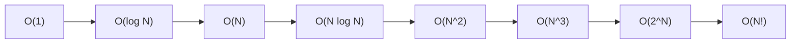
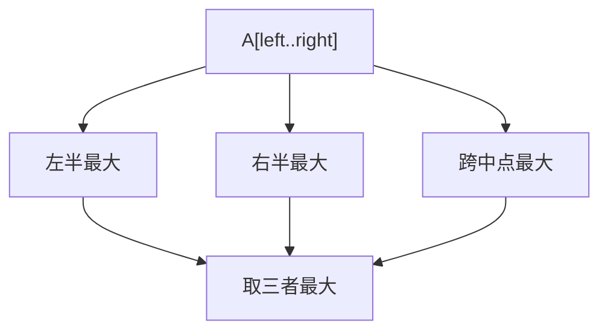

# 1. 算法分析 { #note-sec-005 }

!!! info "章节导引"
    本页从《FDS 数据结构基础讲义》拆分而来，保留原章节锚点，方便从旧总览页和旧链接跳转。

## 学习目标

能判断算法成本来自哪里，并用渐进记号描述主要增长项。

## 前置知识

基础 C/伪代码、循环、数组和简单函数增长。

## 建议用时

建议 4–5 小时：渐进记号 2 小时，最大子列和 1–2 小时，二分查找 1 小时。

## 练习建议

分析 4 段循环复杂度；比较最大子列和四种算法；手写二分查找并说明循环不变量。

## 参考资料与引用边界

- 整理者：Lumner。
- 课程来源：根据 `FDS/` 目录下的课件整理；本章对应课件：`FDS/DS01_Ch02_Algorithm Analysis(a)-2026.pdf, FDS/DS02_Ch02_Algorithm Analysis(b).ppt`。
- 原始讲义文件：`note/FDS_数据结构基础讲义.md`。
- 引用边界：这是公开学习笔记，不替代课程正式教材、教师课件或考试要求；外部引用时请注明来自本网站整理版。

### 1.1 算法与程序 { #note-sec-006 }

算法是有限条指令的集合，按照这些指令执行可以完成特定任务。课件给出的五个条件非常重要：

| 条件 | 含义 | 通俗解释 |
|---|---|---|
| Input | 有零个或多个外部输入 | 算法可以没有输入，例如打印固定字符串 |
| Output | 至少产生一个输出 | 必须给出结果，否则任务没有完成 |
| Definiteness | 每条指令清楚无歧义 | “适当处理一下”不是算法步骤 |
| Finiteness | 对所有情况都在有限步后终止 | 死循环程序不是算法 |
| Effectiveness | 每条指令足够基本且可执行 | 步骤不能要求无法实际完成的魔法操作 |

程序是某种编程语言写出的实现，它不一定有限，例如操作系统长期运行；算法是解决问题的抽象步骤，必须保证有限终止。

### 1.2 分析什么 { #note-sec-007 }

实际运行时间依赖机器、编译器、语言、缓存、输入分布等因素。算法课通常关心与机器无关的增长趋势：

- 时间复杂度：基本操作执行次数随输入规模 \(N\) 如何增长。
- 空间复杂度：额外内存随 \(N\) 如何增长。
- 最坏情况：所有输入中代价最大的情况，常用于保证上界。
- 平均情况：在输入分布已知或可假设时的期望代价。
- 最好情况：一般只作参考，不能代表算法稳健性。

对循环的基本判断：

| 代码形态 | 复杂度 |
|---|---:|
| 单层循环执行 \(N\) 次 | \(O(N)\) |
| 双层独立嵌套循环 | \(O(N^2)\) |
| 每轮问题规模减半 | \(O(\log N)\) |
| 外层 \(N\) 次，内层每轮减半 | \(O(N\log N)\) |
| 递归分成两个规模为 \(N/2\) 的子问题并线性合并 | \(O(N\log N)\) |

### 1.3 渐进记号 { #note-sec-008 }

渐进记号忽略常数和低阶项，保留增长级别。它解决的问题是：当输入规模很大时，哪个算法更能撑住。

| 记号 | 定义直觉 | 常用说法 |
|---|---|---|
| \(T(N)=O(f(N))\) | \(T\) 最多按 \(f\) 的级别增长 | 上界 |
| \(T(N)=\Omega(g(N))\) | \(T\) 至少按 \(g\) 的级别增长 | 下界 |
| \(T(N)=\Theta(h(N))\) | \(T\) 与 \(h\) 同阶 | 紧确界 |
| \(T(N)=o(p(N))\) | \(T\) 比 \(p\) 低一阶 | 严格小阶 |

典型增长顺序：



常用规则：

- 若 \(T_1(N)=O(f(N))\)，\(T_2(N)=O(g(N))\)，则 \(T_1+T_2=O(\max(f,g))\)。
- 若 \(T_1(N)=O(f(N))\)，\(T_2(N)=O(g(N))\)，则 \(T_1T_2=O(fg)\)。
- 多项式只保留最高次项：\(3N^2+10N+7=O(N^2)\)。
- 对数底数在渐进复杂度中只差常数：\(\log_a N=\Theta(\log_b N)\)。

### 1.4 最大子列和：同一问题的四种算法 { #note-sec-009 }

问题：给定可能含负数的整数序列 \(A_1,A_2,\ldots,A_N\)，求连续子列的最大和。如果所有数都为负，课件约定最大和为 0。

#### 算法 1：三重循环，枚举所有区间 { #note-sec-010 }

```c
int MaxSubsequenceSum(const int A[], int N) {
    int ThisSum, MaxSum = 0;
    for (int i = 0; i < N; ++i) {
        for (int j = i; j < N; ++j) {
            ThisSum = 0;
            for (int k = i; k <= j; ++k)
                ThisSum += A[k];
            if (ThisSum > MaxSum)
                MaxSum = ThisSum;
        }
    }
    return MaxSum;
}
```

区间有 \(O(N^2)\) 个，每个区间求和又可能是 \(O(N)\)，总复杂度 \(O(N^3)\)。

#### 算法 2：枚举右端点时累加 { #note-sec-011 }

```c
int MaxSubsequenceSum(const int A[], int N) {
    int ThisSum, MaxSum = 0;
    for (int i = 0; i < N; ++i) {
        ThisSum = 0;
        for (int j = i; j < N; ++j) {
            ThisSum += A[j];
            if (ThisSum > MaxSum)
                MaxSum = ThisSum;
        }
    }
    return MaxSum;
}
```

内层不再重复求区间和，总复杂度降为 \(O(N^2)\)。这个优化的核心是复用前一次区间和。

#### 算法 3：分治 { #note-sec-012 }

最大子列要么完全在左半边，要么完全在右半边，要么跨过中点。



递推式为 \(T(N)=2T(N/2)+O(N)\)，因此复杂度为 \(O(N\log N)\)。

#### 算法 4：在线算法 { #note-sec-013 }

在线算法只扫描一遍，任何时刻都能给出当前前缀的答案。

```c
int MaxSubsequenceSum(const int A[], int N) {
    int ThisSum = 0, MaxSum = 0;
    for (int j = 0; j < N; ++j) {
        ThisSum += A[j];
        if (ThisSum > MaxSum)
            MaxSum = ThisSum;
        else if (ThisSum < 0)
            ThisSum = 0;
    }
    return MaxSum;
}
```

关键直觉：如果当前前缀和已经小于 0，那么它只会拖累后面的子列，应该丢弃并从下一个位置重新开始。复杂度 \(O(N)\)，额外空间 \(O(1)\)。

### 1.5 二分查找与对数复杂度 { #note-sec-014 }

二分查找要求数组有序。每次比较后，搜索区间至少减半。

```c
int BinarySearch(const ElementType A[], ElementType X, int N) {
    int Low = 0, High = N - 1;
    while (Low <= High) {
        int Mid = (Low + High) / 2;
        if (A[Mid] < X)
            Low = Mid + 1;
        else if (A[Mid] > X)
            High = Mid - 1;
        else
            return Mid;
    }
    return -1;
}
```

如果问题规模每次变为原来的一半，最多能减半 \(\log_2 N\) 次，所以时间复杂度为 \(O(\log N)\)。

### 1.6 检查复杂度分析 { #note-sec-015 }

课件给出一种很实用的实验检验方法：看输入翻倍时运行时间大约乘以多少。

| 假设复杂度 | 输入从 \(N\) 到 \(2N\) | 理论比值 |
|---|---:|---:|
| \(O(N)\) | \(T(2N)/T(N)\) | 约 2 |
| \(O(N^2)\) | \(T(2N)/T(N)\) | 约 4 |
| \(O(N^3)\) | \(T(2N)/T(N)\) | 约 8 |
| \(O(\log N)\) | 增长很慢 | 约 \(\log(2N)/\log N\) |

实验不能证明复杂度，但能发现明显错误。例如你以为算法是 \(O(N)\)，测出来翻倍后接近 4 倍，就要检查是否有隐藏的嵌套循环。
