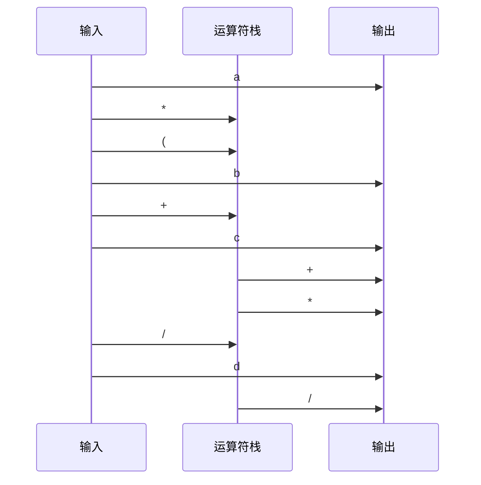

# 3. 栈与队列 { #note-sec-026 }

!!! info "章节导引"
    本页从《FDS 数据结构基础讲义》拆分而来，保留原章节锚点，方便从旧总览页和旧链接跳转。

## 学习目标

掌握 LIFO/FIFO 结构如何约束访问顺序，并能把表达式、递归、排队问题映射到栈或队列。

## 前置知识

线性表、数组/链表实现和基础表达式求值。

## 建议用时

建议 4–5 小时：栈应用 2–3 小时，队列与循环队列 1–2 小时。

## 练习建议

实现括号匹配；手算后缀表达式求值；设计一个循环队列并解释判空/判满。

## 参考资料与引用边界

- 整理者：Lumner。
- 课程来源：根据 `FDS/` 目录下的课件整理；本章对应课件：`FDS/DS03_Ch03_Stack and Queue.ppt`。
- 原始讲义文件：`note/FDS_数据结构基础讲义.md`。
- 引用边界：这是公开学习笔记，不替代课程正式教材、教师课件或考试要求；外部引用时请注明来自本网站整理版。

### 3.1 栈 ADT { #note-sec-027 }

栈是 LIFO 结构：Last-In-First-Out，后进先出。只允许在栈顶插入和删除。

| 操作 | 含义 |
|---|---|
| `IsEmpty(S)` | 判断是否为空 |
| `CreateStack()` | 创建栈 |
| `MakeEmpty(S)` | 清空 |
| `Push(X,S)` | 入栈 |
| `Top(S)` | 读取栈顶 |
| `Pop(S)` | 弹出栈顶 |

数组栈：

```c
struct StackRecord {
    int Capacity;
    int TopOfStack;
    ElementType *Array;
};

void Push(ElementType X, Stack S) {
    if (IsFull(S))
        Error("Full stack");
    else
        S->Array[++S->TopOfStack] = X;
}

ElementType TopAndPop(Stack S) {
    if (IsEmpty(S))
        Error("Empty stack");
    return S->Array[S->TopOfStack--];
}
```

链式栈也很常见，栈顶放在链表头部，`Push` 和 `Pop` 都是 \(O(1)\)。

### 3.2 栈应用一：括号匹配 { #note-sec-028 }

问题：检查 `()[]{}` 是否平衡。

算法：

1. 从左到右扫描。
2. 遇到左括号，压栈。
3. 遇到右括号，若栈空则失败；否则弹出栈顶并检查类型是否匹配。
4. 扫描结束后，栈必须为空。

```c
bool IsBalanced(const char *s) {
    Stack st = CreateStack();
    for (int i = 0; s[i] != '\0'; ++i) {
        if (s[i] == '(' || s[i] == '[' || s[i] == '{')
            Push(s[i], st);
        else if (s[i] == ')' || s[i] == ']' || s[i] == '}') {
            if (IsEmpty(st))
                return false;
            char t = TopAndPop(st);
            if (!Match(t, s[i]))
                return false;
        }
    }
    return IsEmpty(st);
}
```

栈保存的是“尚未被匹配的最近左括号”。

### 3.3 栈应用二：后缀表达式求值 { #note-sec-029 }

中缀表达式：`a + b * c - d / e`  
后缀表达式：`a b c * + d e / -`

后缀表达式没有括号也能表达优先级。求值规则：

- 遇到操作数，压栈。
- 遇到运算符，弹出所需数量的操作数，计算后把结果压回。

例：`6 5 2 3 + 8 * + 3 + *`

每个 token 进出栈常数次，复杂度 \(O(N)\)。

### 3.4 栈应用三：中缀转后缀 { #note-sec-030 }

核心原则：

- 操作数直接输出。
- 运算符进入栈前，要弹出所有优先级不低于它的栈顶运算符。
- 左括号直接入栈。
- 右括号触发弹栈，直到遇到左括号。

处理 `a * (b + c) / d`：



输出为 `a b c + * d /`。

### 3.5 系统栈与递归 { #note-sec-031 }

函数调用也依赖栈。每次调用都会形成一个栈帧，通常包含：

- 返回地址。
- 参数。
- 局部变量。
- 保存的寄存器或临时状态。

递归函数之所以能工作，是因为每一层调用都有自己的栈帧。递归过深时会栈溢出。

### 3.6 队列 ADT { #note-sec-032 }

队列是 FIFO 结构：First-In-First-Out，先进先出。插入发生在队尾，删除发生在队头。

| 操作 | 含义 |
|---|---|
| `IsEmpty(Q)` | 判断是否为空 |
| `CreateQueue()` | 创建队列 |
| `MakeEmpty(Q)` | 清空 |
| `Enqueue(X,Q)` | 入队 |
| `Front(Q)` | 读取队头 |
| `Dequeue(Q)` | 出队 |

队列常用于：

- 广度优先搜索。
- 操作系统任务排队。
- 拓扑排序中的零入度顶点集合。
- 缓冲区和生产者消费者模型。

### 3.7 循环队列 { #note-sec-033 }

数组队列如果每次出队都移动元素，会退化为 \(O(N)\)。循环队列用下标取模避免搬迁。

```c
struct QueueRecord {
    int Capacity;
    int Front;
    int Rear;
    int Size;
    ElementType *Array;
};

void Enqueue(ElementType X, Queue Q) {
    if (IsFull(Q))
        Error("Full queue");
    Q->Size++;
    Q->Rear = (Q->Rear + 1) % Q->Capacity;
    Q->Array[Q->Rear] = X;
}

ElementType Dequeue(Queue Q) {
    if (IsEmpty(Q))
        Error("Empty queue");
    Q->Size--;
    ElementType X = Q->Array[Q->Front];
    Q->Front = (Q->Front + 1) % Q->Capacity;
    return X;
}
```

是否使用 `Size` 是一个设计选择。如果不用 `Size`，需要牺牲一个数组位置来区分空和满。
