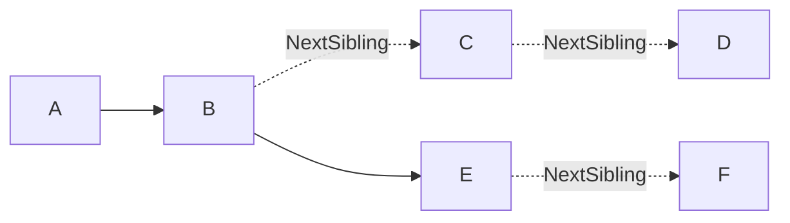
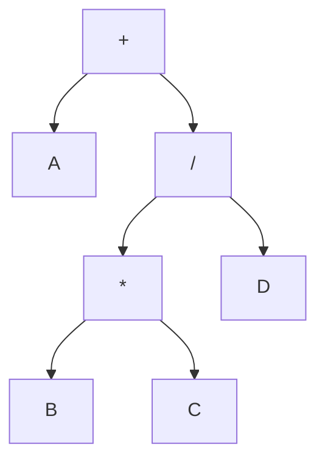

# 4. 树与二叉树 { #note-sec-034 }

!!! info "章节导引"
    本页从《FDS 数据结构基础讲义》拆分而来，保留原章节锚点，方便从旧总览页和旧链接跳转。

## 学习目标

理解层次结构、递归定义和遍历顺序，并能把树结构转成存储表示。

## 前置知识

递归、栈、链式结构和基本数学归纳直觉。

## 建议用时

建议 5–6 小时：树/二叉树 2 小时，遍历 2–3 小时，线索二叉树 1 小时。

## 练习建议

画三种遍历序列；用栈模拟非递归遍历；把一棵普通树转成孩子兄弟表示。

## 参考资料与引用边界

- 整理者：Lumner。
- 课程来源：根据 `FDS/` 目录下的课件整理；本章对应课件：`FDS/DS04_Ch04_Binary Trees.ppt`。
- 原始讲义文件：`note/FDS_数据结构基础讲义.md`。
- 引用边界：这是公开学习笔记，不替代课程正式教材、教师课件或考试要求；外部引用时请注明来自本网站整理版。

### 4.1 树的基本术语 { #note-sec-035 }

树是节点的集合。空集合是树；非空树由根节点和若干棵互不相交的子树组成。

常用术语：

| 术语 | 含义 |
|---|---|
| root | 根节点 |
| edge/branch | 边，父子节点之间的连接 |
| parent/child | 父节点/子节点 |
| sibling | 兄弟节点 |
| leaf | 叶节点，度为 0 |
| degree of node | 节点的子树个数 |
| degree of tree | 所有节点度数的最大值 |
| ancestors | 从节点到根路径上的所有祖先 |
| descendants | 节点子树中的所有后代 |
| depth | 从根到该节点的路径长度 |
| height | 从该节点到最深叶子的路径长度 |

树的核心特征是层次关系。很多递归问题天然适合树结构，因为每棵子树又是同类问题。

### 4.2 树的表示 { #note-sec-036 }

#### 括号表示 { #note-sec-037 }

例如：

```text
A(B(E,F), C(G), D(H,I,J))
```

这种形式适合展示结构，但不适合直接高效操作。

#### FirstChild-NextSibling 表示 { #note-sec-038 }

每个节点只保留两个指针：

- `FirstChild`：第一个孩子。
- `NextSibling`：下一个兄弟。



这个表示可以把任意树转化为二叉树形式：左指针指向第一个孩子，右指针指向下一个兄弟。

### 4.3 二叉树 { #note-sec-039 }

二叉树中每个节点最多有两个孩子，并且左右孩子有区别。

重要性质：

| 性质 | 说明 |
|---|---|
| 第 \(i\) 层最多有 \(2^{i-1}\) 个节点 | 根为第 1 层 |
| 深度为 \(k\) 的二叉树最多有 \(2^k-1\) 个节点 | 满二叉树达到上界 |
| 非空二叉树中 \(n_0=n_2+1\) | 叶节点数等于度为 2 的节点数加 1 |

\(n_0=n_2+1\) 的证明思路：

- 总节点数 \(n=n_0+n_1+n_2\)。
- 非根节点都有一条来自父节点的边，所以边数 \(B=n-1\)。
- 边也可以按父节点贡献数计算：\(B=n_1+2n_2\)。
- 联立得到 \(n_0=n_2+1\)。

### 4.4 表达式树 { #note-sec-040 }

表达式树中：

- 叶节点是操作数。
- 内部节点是运算符。
- 左右子树分别表示运算符的左右操作数。

表达式 `A + B * C / D` 可以理解为：



对表达式树做不同遍历，会得到不同表达式形式：

| 遍历 | 结果类型 |
|---|---|
| 先序 | 前缀表达式 |
| 中序 | 中缀表达式，需要括号辅助 |
| 后序 | 后缀表达式 |

### 4.5 树遍历 { #note-sec-041 }

遍历就是每个节点恰好访问一次。

#### 先序遍历 { #note-sec-042 }

根、左、右。

```c
void Preorder(Tree T) {
    if (T != NULL) {
        Visit(T);
        Preorder(T->Left);
        Preorder(T->Right);
    }
}
```

适合复制树、输出目录树结构。

#### 中序遍历 { #note-sec-043 }

左、根、右。

```c
void Inorder(Tree T) {
    if (T != NULL) {
        Inorder(T->Left);
        Visit(T);
        Inorder(T->Right);
    }
}
```

对二叉搜索树做中序遍历，会得到有序序列。

#### 后序遍历 { #note-sec-044 }

左、右、根。

```c
void Postorder(Tree T) {
    if (T != NULL) {
        Postorder(T->Left);
        Postorder(T->Right);
        Visit(T);
    }
}
```

适合释放树、计算目录大小，因为必须先处理子树再处理根。

#### 层序遍历 { #note-sec-045 }

使用队列：

```c
void Levelorder(Tree T) {
    Queue Q = CreateQueue();
    if (T != NULL)
        Enqueue(T, Q);
    while (!IsEmpty(Q)) {
        Tree X = Dequeue(Q);
        Visit(X);
        if (X->Left != NULL) Enqueue(X->Left, Q);
        if (X->Right != NULL) Enqueue(X->Right, Q);
    }
}
```

### 4.6 递归遍历与非递归遍历 { #note-sec-046 }

递归遍历依赖系统栈。中序遍历可以手动用栈实现：

```c
void IterativeInorder(Tree T) {
    Stack S = CreateStack();
    while (T != NULL || !IsEmpty(S)) {
        while (T != NULL) {
            Push(T, S);
            T = T->Left;
        }
        T = TopAndPop(S);
        Visit(T);
        T = T->Right;
    }
}
```

这个版本把“不断向左走并保存沿途节点”的动作显式化了。

### 4.7 线索二叉树 { #note-sec-047 }

普通二叉树有很多空指针。线索二叉树用这些空指针保存遍历意义下的前驱或后继：

- 如果 `Left` 为空，则指向中序前驱。
- 如果 `Right` 为空，则指向中序后继。

为了区分真实孩子和线索，节点需要额外标记位，例如 `LeftThread`、`RightThread`。

线索化的目的不是改变树的逻辑结构，而是让某种遍历可以在不递归、不显式栈的情况下进行。
