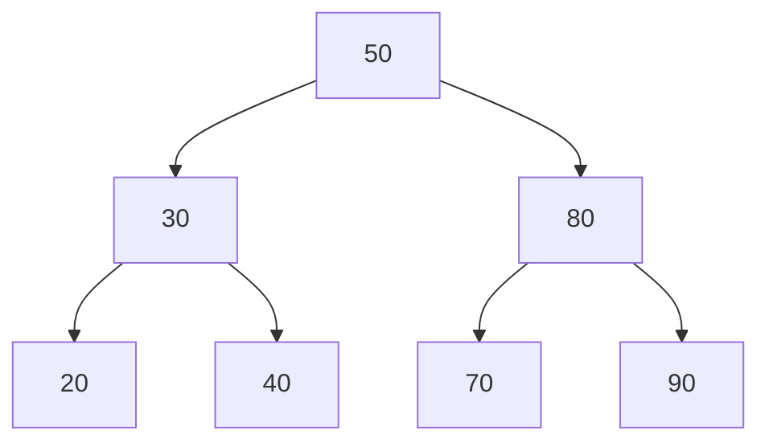

# 5. 二叉搜索树 { #note-sec-048 }

!!! info "章节导引"
    本页从《FDS 数据结构基础讲义》拆分而来，保留原章节锚点，方便从旧总览页和旧链接跳转。

## 学习目标

理解有序性如何支持查找，并掌握 BST 删除和退化风险。

## 前置知识

二叉树、递归和比较大小的有序集合。

## 建议用时

建议 3–4 小时：查找/插入 1 小时，删除 1–2 小时，复杂度讨论 1 小时。

## 练习建议

手插一组键形成 BST；删除叶子/单子树/双子树节点；解释为什么可能退化为链表。

## 参考资料与引用边界

- 整理者：Lumner。
- 课程来源：根据 `FDS/` 目录下的课件整理；本章对应课件：`FDS/DS05_Ch04_Search Tree.pdf`。
- 原始讲义文件：`note/FDS_数据结构基础讲义.md`。
- 引用边界：这是公开学习笔记，不替代课程正式教材、教师课件或考试要求；外部引用时请注明来自本网站整理版。

### 5.1 定义 { #note-sec-049 }

二叉搜索树 BST 可以为空；若非空，则满足：

1. 每个节点有一个可比较的关键字。
2. 左子树中所有关键字小于该节点关键字。
3. 右子树中所有关键字大于该节点关键字。
4. 左右子树也都是二叉搜索树。



BST 的本质是把二分查找的思想从数组扩展到动态集合。

### 5.2 查找 { #note-sec-050 }

```c
Position Find(ElementType X, SearchTree T) {
    if (T == NULL)
        return NULL;
    if (X < T->Element)
        return Find(X, T->Left);
    else if (X > T->Element)
        return Find(X, T->Right);
    else
        return T;
}
```

每一步只进入一棵子树。复杂度为 \(O(h)\)，\(h\) 是树高。若树平衡，\(h=O(\log N)\)；若退化成链，\(h=O(N)\)。

### 5.3 查找最小值和最大值 { #note-sec-051 }

最小值一路向左，最大值一路向右。

```c
Position FindMin(SearchTree T) {
    if (T == NULL)
        return NULL;
    while (T->Left != NULL)
        T = T->Left;
    return T;
}

Position FindMax(SearchTree T) {
    if (T == NULL)
        return NULL;
    while (T->Right != NULL)
        T = T->Right;
    return T;
}
```

### 5.4 插入 { #note-sec-052 }

插入过程和查找类似，找到空位置后创建节点。

```c
SearchTree Insert(ElementType X, SearchTree T) {
    if (T == NULL) {
        T = malloc(sizeof(struct TreeNode));
        if (T == NULL)
            FatalError("Out of space");
        T->Element = X;
        T->Left = T->Right = NULL;
    } else if (X < T->Element) {
        T->Left = Insert(X, T->Left);
    } else if (X > T->Element) {
        T->Right = Insert(X, T->Right);
    }
    return T;
}
```

如果不允许重复关键字，`X == T->Element` 时什么也不做。若允许重复，需要约定重复元素放左边、右边或在节点中维护计数。

### 5.5 删除 { #note-sec-053 }

删除分三种情况：

| 情况 | 处理 |
|---|---|
| 叶节点 | 直接删除，父链接置空 |
| 只有一个孩子 | 用唯一孩子替代该节点 |
| 有两个孩子 | 用右子树最小值或左子树最大值替代，再删除替代节点 |

```c
SearchTree Delete(ElementType X, SearchTree T) {
    Position TmpCell;
    if (T == NULL)
        Error("Element not found");
    else if (X < T->Element)
        T->Left = Delete(X, T->Left);
    else if (X > T->Element)
        T->Right = Delete(X, T->Right);
    else if (T->Left && T->Right) {
        TmpCell = FindMin(T->Right);
        T->Element = TmpCell->Element;
        T->Right = Delete(T->Element, T->Right);
    } else {
        TmpCell = T;
        if (T->Left == NULL)
            T = T->Right;
        else if (T->Right == NULL)
            T = T->Left;
        free(TmpCell);
    }
    return T;
}
```

两个孩子时，用右子树最小值替换，是因为它刚好大于左子树所有节点、又不大于右子树其他节点，能保持 BST 不变量。

### 5.6 懒惰删除 { #note-sec-054 }

如果删除不频繁，或删除后仍可能再次插入同一关键字，可以给节点加一个 `Deleted` 标记：

- 删除时只标记为 inactive。
- 查找时忽略 inactive 节点。
- 插入时如果找到 inactive 同值节点，可以重新激活。

懒惰删除避免频繁调整指针，但会让树中无效节点越来越多，需要定期重建或清理。

### 5.7 平均情况与退化 { #note-sec-055 }

BST 的高度取决于插入顺序。

- 插入顺序随机时，平均高度通常为 \(O(\log N)\) 量级。
- 按递增顺序插入时，树退化为链，操作变成 \(O(N)\)。

这就是后续平衡树存在的原因。当前课件主要讲 BST，但理解退化风险非常重要。
