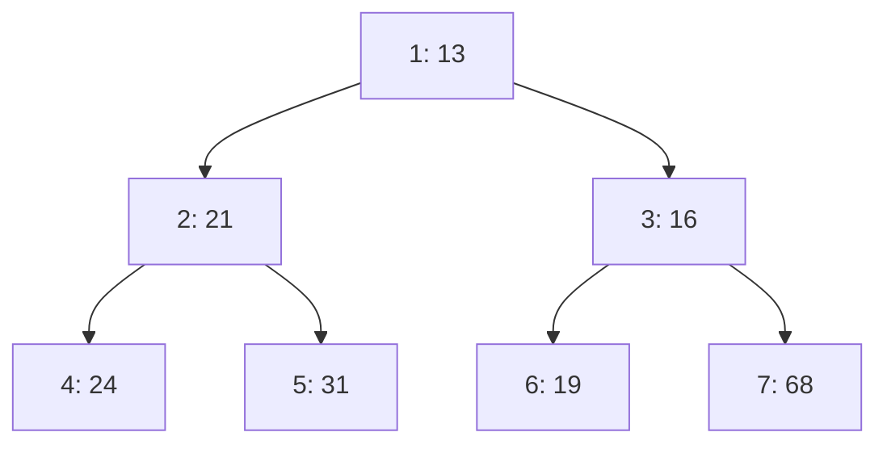

# 6. 优先队列与二叉堆 { #note-sec-056 }

!!! info "章节导引"
    本页从《FDS 数据结构基础讲义》拆分而来，保留原章节锚点，方便从旧总览页和旧链接跳转。

## 学习目标

理解堆用近似完全二叉树支持高效优先级操作，并掌握上滤/下滤。

## 前置知识

数组、二叉树层序编号和复杂度分析。

## 建议用时

建议 4–5 小时：堆性质 1 小时，上滤/下滤 2 小时，建堆与应用 1–2 小时。

## 练习建议

手算一组插入和 DeleteMin；比较 BuildHeap 与连续 Insert；说明 d-堆取舍。

## 参考资料与引用边界

- 整理者：Lumner。
- 课程来源：根据 `FDS/` 目录下的课件整理；本章对应课件：`FDS/DS06_Ch05_Priority Queues.ppt`。
- 原始讲义文件：`note/FDS_数据结构基础讲义.md`。
- 引用边界：这是公开学习笔记，不替代课程正式教材、教师课件或考试要求；外部引用时请注明来自本网站整理版。

### 6.1 优先队列 ADT { #note-sec-057 }

优先队列维护一组元素，每次可以取出优先级最高或最低的元素。课件以 `DeleteMin` 为主，即最小堆。

| 操作 | 含义 |
|---|---|
| `Initialize(MaxElements)` | 初始化 |
| `Insert(X,H)` | 插入 |
| `DeleteMin(H)` | 删除并返回最小元素 |
| `FindMin(H)` | 返回最小元素但不删除 |

### 6.2 简单实现对比 { #note-sec-058 }

| 实现 | 插入 | 删除最小值 | 评价 |
|---|---:|---:|---|
| 无序数组/链表 | \(O(1)\) | \(O(N)\) | 插入快，删除慢 |
| 有序数组/链表 | \(O(N)\) | \(O(1)\) | 删除快，插入慢 |
| 二叉搜索树 | 平均 \(O(\log N)\) | 平均 \(O(\log N)\) | 依赖平衡性 |
| 二叉堆 | \(O(\log N)\) | \(O(\log N)\) | 实现简单，常数小 |

### 6.3 二叉堆的两个性质 { #note-sec-059 }

二叉堆是满足两个性质的二叉树：

1. 结构性质：完全二叉树。
2. 堆序性质：最小堆中，每个节点的关键字不大于其孩子。

完全二叉树适合用数组存储。若节点下标从 1 开始：

| 节点 | 下标 |
|---|---|
| 父节点 | `i / 2` |
| 左孩子 | `2 * i` |
| 右孩子 | `2 * i + 1` |



数组表示避免了指针，并且能用简单下标计算父子关系。

### 6.4 插入：上滤 { #note-sec-060 }

插入时先把新元素放在完全二叉树的下一个空位，然后一路与父节点比较，必要时上移。

```c
void Insert(ElementType X, PriorityQueue H) {
    int i;
    if (IsFull(H))
        Error("Priority queue is full");
    for (i = ++H->Size; H->Elements[i / 2] > X; i /= 2)
        H->Elements[i] = H->Elements[i / 2];
    H->Elements[i] = X;
}
```

`Elements[0]` 常作为哨兵，放一个小于所有合法元素的值，避免循环中反复判断 `i > 1`。

插入复杂度为树高 \(O(\log N)\)。

### 6.5 删除最小值：下滤 { #note-sec-061 }

最小值在根节点。删除根后，为了保持完全二叉树，必须拿最后一个元素来填根，再把它下滤到合适位置。

```c
ElementType DeleteMin(PriorityQueue H) {
    int i, Child;
    ElementType MinElement, LastElement;
    if (IsEmpty(H))
        Error("Priority queue is empty");

    MinElement = H->Elements[1];
    LastElement = H->Elements[H->Size--];

    for (i = 1; i * 2 <= H->Size; i = Child) {
        Child = i * 2;
        if (Child != H->Size &&
            H->Elements[Child + 1] < H->Elements[Child])
            Child++;
        if (LastElement > H->Elements[Child])
            H->Elements[i] = H->Elements[Child];
        else
            break;
    }
    H->Elements[i] = LastElement;
    return MinElement;
}
```

下滤每层选择较小孩子，保证被移动上来的孩子仍不大于它原本的子树。复杂度 \(O(\log N)\)。

### 6.6 建堆 { #note-sec-062 }

如果有 \(N\) 个元素，逐个插入是 \(O(N\log N)\)。更快的方法是从最后一个非叶节点开始，向前逐个下滤。

```c
void BuildHeap(PriorityQueue H) {
    for (int i = H->Size / 2; i > 0; --i)
        PercolateDown(i, H);
}
```

虽然单次下滤最坏是 \(O(\log N)\)，但多数节点高度很低，总成本为 \(O(N)\)。

### 6.7 其他操作和应用 { #note-sec-063 }

堆还支持：

- `DecreaseKey(P, Delta, H)`：降低某位置关键字后上滤。
- `IncreaseKey(P, Delta, H)`：增加某位置关键字后下滤。
- `Delete(P,H)`：把位置 `P` 的关键字降到负无穷，再 `DeleteMin`。

典型应用：

- 找第 k 大/第 k 小元素。
- 操作系统按优先级调度任务。
- 图算法中的 Dijkstra、Prim。
- 事件模拟中按时间取下一个事件。

### 6.8 d-堆 { #note-sec-064 }

d-堆是每个节点有 d 个孩子的堆。

- 高度变为 \(O(\log_d N)\)，插入可能更快。
- `DeleteMin` 每层需要在 d 个孩子中找最小，比较次数增加。

所以 d 不是越大越好，要根据插入和删除比例选择。
