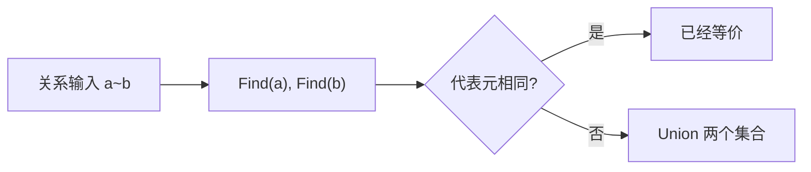
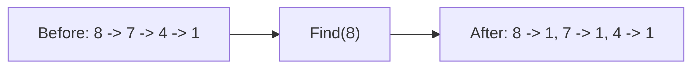

# 7. 并查集 { #note-sec-065 }

!!! info "章节导引"
    本页从《FDS 数据结构基础讲义》拆分而来，保留原章节锚点，方便从旧总览页和旧链接跳转。

## 学习目标

掌握动态连通性问题的代表元思想，并理解路径压缩为何接近常数均摊。

## 前置知识

树、数组、等价关系和基本复杂度分析。

## 建议用时

建议 3–4 小时：基本表示 1 小时，合并策略 1 小时，路径压缩与应用 1–2 小时。

## 练习建议

手算一串 Union/Find；比较未优化与路径压缩后的树高；写出连通性应用。

## 参考资料与引用边界

- 整理者：Lumner。
- 课程来源：根据 `FDS/` 目录下的课件整理；本章对应课件：`FDS/DS07_Ch08_Union and Find.ppt`。
- 原始讲义文件：`note/FDS_数据结构基础讲义.md`。
- 引用边界：这是公开学习笔记，不替代课程正式教材、教师课件或考试要求；外部引用时请注明来自本网站整理版。

### 7.1 等价关系 { #note-sec-066 }

关系 `~` 是集合 `S` 上的等价关系，当且仅当满足：

| 性质 | 形式 | 解释 |
|---|---|---|
| 自反性 | \(a \sim a\) | 自己与自己等价 |
| 对称性 | 若 \(a\sim b\)，则 \(b\sim a\) | 等价不分方向 |
| 传递性 | 若 \(a\sim b\) 且 \(b\sim c\)，则 \(a\sim c\) | 等价可以串起来 |

等价关系会把集合划分为若干互不相交的等价类。

### 7.2 动态等价问题 { #note-sec-067 }

给定若干元素，持续接收两类操作：

- `Union(a,b)`：声明 `a` 与 `b` 等价，合并所在集合。
- `Find(a)`：返回 `a` 所在集合的代表元，用于判断两个元素是否等价。

如果 `Find(a) == Find(b)`，说明两者在同一集合中。



### 7.3 基本表示 { #note-sec-068 }

并查集用一片森林表示若干集合。每棵树的根是集合代表元。数组 `S[x]` 保存父节点：

- 若 `S[x] < 0`，`x` 是根。
- 若 `S[x] >= 0`，`S[x]` 是 `x` 的父节点。

```c
typedef int DisjSet[NumSets + 1];
typedef int SetType;
typedef int ElementType;
```

朴素 `Find`：

```c
SetType Find(ElementType X, DisjSet S) {
    if (S[X] <= 0)
        return X;
    else
        return Find(S[X], S);
}
```

朴素 `Union` 只需让一个根指向另一个根：

```c
void SetUnion(DisjSet S, SetType Root1, SetType Root2) {
    S[Root2] = Root1;
}
```

问题是如果总把大树挂到小树下面，树可能退化成链，`Find` 变成 \(O(N)\)。

### 7.4 按大小合并与按高度合并 { #note-sec-069 }

按大小合并：让小树挂到大树下面。根节点存负数，其绝对值表示集合大小。

```c
void SetUnion(DisjSet S, SetType Root1, SetType Root2) {
    if (S[Root2] < S[Root1]) {
        S[Root1] = Root2;
    } else {
        if (S[Root1] == S[Root2])
            S[Root1]--;
        S[Root2] = Root1;
    }
}
```

上面代码更接近按高度合并：根节点负值表示高度或秩。若两棵树高度相同，合并后高度加 1；否则矮树挂到高树下，高度不变。

这类策略的共同目标是控制树高。

### 7.5 路径压缩 { #note-sec-070 }

路径压缩在 `Find` 过程中，把沿途节点直接挂到根上。

```c
SetType Find(ElementType X, DisjSet S) {
    if (S[X] <= 0)
        return X;
    else
        return S[X] = Find(S[X], S);
}
```

一次 `Find` 可能仍会走较长路径，但它会顺手把路径拍平，让后续查询更快。



### 7.6 复杂度 { #note-sec-071 }

按秩合并加路径压缩后，`M` 次混合操作的总时间近似线性，严格界与反 Ackermann 函数 \(\alpha(M,N)\) 有关。

实际理解时可以记住：

> 对任何现实规模的数据，\(\alpha(N)\) 都小得像常数，因此并查集操作几乎可以看成均摊 \(O(1)\)。

但这不是普通常数时间，而是强优化策略共同作用的均摊结果。

### 7.7 典型应用 { #note-sec-072 }

- 判断无向图连通分量。
- Kruskal 最小生成树中判断加边是否成环。
- 网络连接问题。
- 等价类归并，例如账户合并、朋友关系合并。
