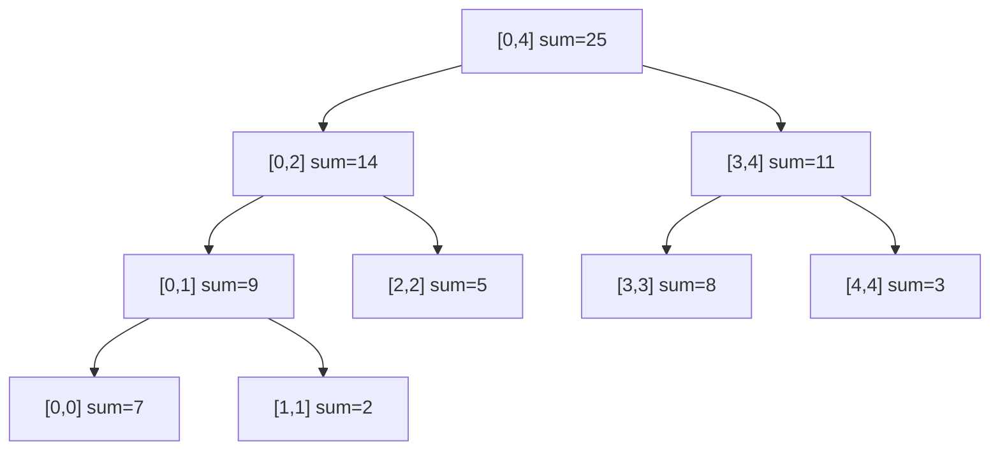

# 8. 线段树 { #note-sec-073 }

!!! info "章节导引"
    本页从《FDS 数据结构基础讲义》拆分而来，保留原章节锚点，方便从旧总览页和旧链接跳转。

## 学习目标

理解线段树如何把区间问题拆成少量节点，并掌握懒标记的边界。

## 前置知识

递归、数组树表示、二分区间和常见聚合算子。

## 建议用时

建议 5–6 小时：建树/查询 2 小时，点更新 1 小时，区间更新与懒标记 2–3 小时。

## 练习建议

手建一棵线段树；执行一次区间查询和点更新；解释懒标记何时下传。

## 参考资料与引用边界

- 整理者：Lumner。
- 课程来源：根据 `FDS/` 目录下的课件整理；本章对应课件：`FDS/DS07_Segment Tree.pdf`。
- 原始讲义文件：`note/FDS_数据结构基础讲义.md`。
- 引用边界：这是公开学习笔记，不替代课程正式教材、教师课件或考试要求；外部引用时请注明来自本网站整理版。

### 8.1 动机 { #note-sec-074 }

给定数组 `A[0..N-1]`，需要频繁回答区间 `[L,R]` 的和、最大值或最小值。

朴素查询：

```c
ElementType Query(ElementType A[], int L, int R) {
    ElementType sum = 0;
    for (int i = L; i <= R; ++i)
        sum += A[i];
    return sum;
}
```

一次 \(O(N)\)。如果查询很多，就会非常慢。

线段树把数组区间递归拆成左右两半，每个节点维护一个区间的聚合值。



### 8.2 适用的“算子” { #note-sec-075 }

线段树不只适用于求和。只要区间答案可以由左右子区间答案合并，就可以考虑线段树。

常见算子：

| 查询 | 合并算子 | 单位元 |
|---|---|---|
| 区间和 | `+` | 0 |
| 区间最大值 | `max` | 负无穷 |
| 区间最小值 | `min` | 正无穷 |
| 区间 gcd | `gcd` | 0 |

核心要求通常是结合律：\((a \circ b)\circ c = a\circ(b\circ c)\)。这样区间可以被拆成若干段后再合并。

### 8.3 建树 { #note-sec-076 }

数组实现时，节点编号 `node` 的左右孩子常用 `2*node` 和 `2*node+1`。若原数组长度为 `N`，线段树数组通常开 `4*N` 足够。

```c
struct SegmentNode {
    int start, end;
    int sum;
    int lazy;
} tree[MAXN * 4];

void Build(int node, int start, int end) {
    tree[node].start = start;
    tree[node].end = end;
    tree[node].lazy = 0;
    if (start == end) {
        tree[node].sum = A[start];
        return;
    }
    int mid = (start + end) / 2;
    Build(node * 2, start, mid);
    Build(node * 2 + 1, mid + 1, end);
    tree[node].sum = tree[node * 2].sum + tree[node * 2 + 1].sum;
}
```

建树访问每个节点一次，复杂度 \(O(N)\)。

### 8.4 区间查询 { #note-sec-077 }

查询 `[L,R]` 与当前节点区间 `[start,end]` 有三种关系：

| 情况 | 处理 |
|---|---|
| 完全覆盖 | 直接返回当前节点值 |
| 完全不相交 | 返回单位元 |
| 部分重叠 | 递归查询左右孩子并合并 |

```c
int Query(int node, int L, int R) {
    int start = tree[node].start;
    int end = tree[node].end;
    if (L <= start && end <= R)
        return tree[node].sum;
    if (end < L || R < start)
        return 0;
    PushDown(node);
    return Query(node * 2, L, R) + Query(node * 2 + 1, L, R);
}
```

查询复杂度 \(O(\log N)\)。直觉是一个区间最多被拆成少量覆盖节点，每层只会访问有限个相关节点。

### 8.5 点更新 { #note-sec-078 }

把 `A[idx]` 改成 `val`，只影响从叶子到根的一条路径。

```c
void Update(int node, int idx, int val) {
    int start = tree[node].start;
    int end = tree[node].end;
    if (start == end) {
        tree[node].sum = val;
        return;
    }
    PushDown(node);
    int mid = (start + end) / 2;
    if (idx <= mid)
        Update(node * 2, idx, val);
    else
        Update(node * 2 + 1, idx, val);
    tree[node].sum = tree[node * 2].sum + tree[node * 2 + 1].sum;
}
```

复杂度 \(O(\log N)\)。

### 8.6 区间更新与懒标记 { #note-sec-079 }

若要把 `[L,R]` 中每个元素都加上 `val`，逐点更新会变成 \(O(K\log N)\)。懒标记的思想是：

> 当某个节点区间被完全覆盖时，先更新该节点答案并记录一个标记，不立刻下传到孩子。等未来真的需要访问孩子时再下传。

```c
void Apply(int node, int val) {
    int len = tree[node].end - tree[node].start + 1;
    tree[node].sum += val * len;
    tree[node].lazy += val;
}

void PushDown(int node) {
    if (tree[node].lazy != 0) {
        Apply(node * 2, tree[node].lazy);
        Apply(node * 2 + 1, tree[node].lazy);
        tree[node].lazy = 0;
    }
}

void RangeUpdate(int node, int L, int R, int val) {
    int start = tree[node].start;
    int end = tree[node].end;
    if (L <= start && end <= R) {
        Apply(node, val);
        return;
    }
    if (end < L || R < start)
        return;
    PushDown(node);
    RangeUpdate(node * 2, L, R, val);
    RangeUpdate(node * 2 + 1, L, R, val);
    tree[node].sum = tree[node * 2].sum + tree[node * 2 + 1].sum;
}
```

区间更新和区间查询都保持 \(O(\log N)\)。

### 8.7 线段树常见错误 { #note-sec-080 }

- 查询区间和节点区间的边界判断写反。
- 忘记在访问孩子前 `PushDown`。
- `mid` 分割不一致，导致死递归。
- 开数组太小，建议 `4*N`。
- 对最大值、最小值查询时，完全不相交返回了错误单位元。
