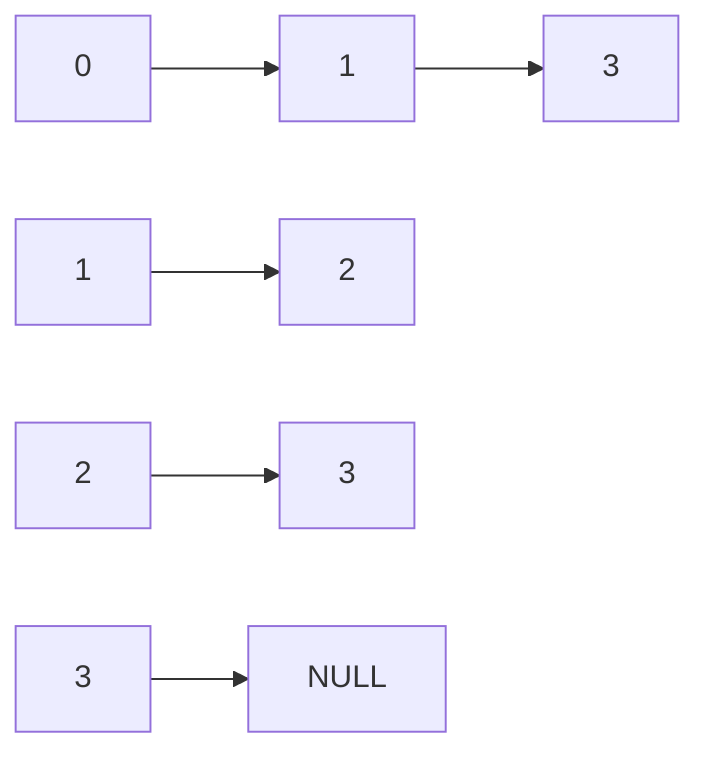
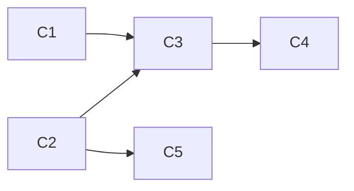

# 9. 图与拓扑排序 { #note-sec-081 }

!!! info "章节导引"
    本页从《FDS 数据结构基础讲义》拆分而来，保留原章节锚点，方便从旧总览页和旧链接跳转。

## 学习目标

掌握图的基本表示，并能用入度维护拓扑排序过程。

## 前置知识

队列、集合、数组/链表存储和复杂度分析。

## 建议用时

建议 4–5 小时：图定义/存储 1–2 小时，AOV/拓扑排序 2–3 小时。

## 练习建议

为一个有向图写邻接表；手算拓扑序；判断一个依赖图是否有环。

## 参考资料与引用边界

- 整理者：Lumner。
- 课程来源：根据 `FDS/` 目录下的课件整理；本章对应课件：`FDS/DS08_Ch09_Graph Definition_Topological Sort.ppt`。
- 原始讲义文件：`note/FDS_数据结构基础讲义.md`。
- 引用边界：这是公开学习笔记，不替代课程正式教材、教师课件或考试要求；外部引用时请注明来自本网站整理版。

### 9.1 图的基本定义 { #note-sec-082 }

图记为 \(G(V,E)\)：

- `V(G)` 是有限非空顶点集合。
- `E(G)` 是边集合。

无向边通常写作 `(v_i,v_j)`，有向边通常写作 `<v_i,v_j>`。

常用概念：

| 概念 | 含义 |
|---|---|
| adjacent | 两个顶点由边相连 |
| incident | 边与顶点关联 |
| subgraph | 顶点和边都是原图子集的图 |
| path | 顶点与边交替组成的可达序列 |
| cycle | 起点和终点相同的路径 |
| connected graph | 无向图中任意两点连通 |
| component | 无向图的极大连通子图 |
| strongly connected | 有向图中任意两点互相可达 |
| DAG | 有向无环图 |

树也可以看作特殊图：连通且无环的无向图。

### 9.2 图的存储 { #note-sec-083 }

#### 邻接矩阵 { #note-sec-084 }

用 `adj[n][n]` 存边。

| 操作 | 复杂度 |
|---|---:|
| 判断边 `(i,j)` 是否存在 | \(O(1)\) |
| 枚举某顶点所有邻接点 | \(O(N)\) |
| 空间 | \(O(N^2)\) |

适合稠密图或需要频繁判断两点是否相邻的场景。

#### 邻接表 { #note-sec-085 }

每个顶点维护一个链表，存它指向的邻接点。

| 操作 | 复杂度 |
|---|---:|
| 枚举某顶点所有邻接点 | 与该点度数成正比 |
| 判断某条边是否存在 | 最坏 \(O(d)\)，其中 \(d\) 为该点度数 |
| 空间 | \(O(V+E)\) |

适合稀疏图，是多数图算法的默认选择。



有向图中，邻接表天然方便统计出边；如果频繁需要入边，可以建立逆邻接表，或单独维护入度数组。

### 9.3 AOV 网络 { #note-sec-086 }

AOV Network 是用顶点表示活动、用有向边表示先后约束的图。

例如课程先修关系：

- 顶点：课程。
- 边 `<C1,C3>`：`C1` 是 `C3` 的先修课。

如果图中存在有向环，说明约束矛盾：课程 A 要先于 B，B 又间接要求先于 A。

### 9.4 拓扑序 { #note-sec-087 }

拓扑序是 DAG 顶点的一种线性排列，使得对每条有向边 `<u,v>`，`u` 都出现在 `v` 前面。

拓扑序可能不唯一。



上图中，`C1, C2, C3, C5, C4` 和 `C2, C1, C5, C3, C4` 都可能是合法拓扑序。

### 9.5 朴素拓扑排序 { #note-sec-088 }

重复执行：

1. 找一个入度为 0 的未输出顶点。
2. 输出它。
3. 删除它及其出边。

如果每次都重新扫描所有顶点找入度 0，总复杂度可能达到 \(O(V^2)\)。

### 9.6 队列优化拓扑排序 { #note-sec-089 }

改进：用队列保存当前所有入度为 0 的顶点。

```c
void Topsort(Graph G) {
    Queue Q = CreateQueue(NumVertex);
    int Counter = 0;

    for (Vertex V = 0; V < G->NumVertex; ++V)
        if (Indegree[V] == 0)
            Enqueue(V, Q);

    while (!IsEmpty(Q)) {
        Vertex V = Dequeue(Q);
        TopNum[V] = ++Counter;
        for each W adjacent to V {
            if (--Indegree[W] == 0)
                Enqueue(W, Q);
        }
    }

    if (Counter != G->NumVertex)
        Error("Graph has a cycle");
}
```

使用邻接表时，每个顶点入队出队一次，每条边被检查一次，复杂度 \(O(V+E)\)。

### 9.7 拓扑排序的本质 { #note-sec-090 }

拓扑排序每次选择“当前没有前置依赖”的任务。它不是单纯排序，而是在逐步剥离依赖关系。

失败条件也很有意义：如果最后仍有顶点没有输出，说明剩余顶点都互相等待，图中存在环。

典型应用：

- 课程先修安排。
- 编译依赖。
- 构建系统任务排序。
- 数据处理流水线调度。
- 判断有向图是否存在环。
